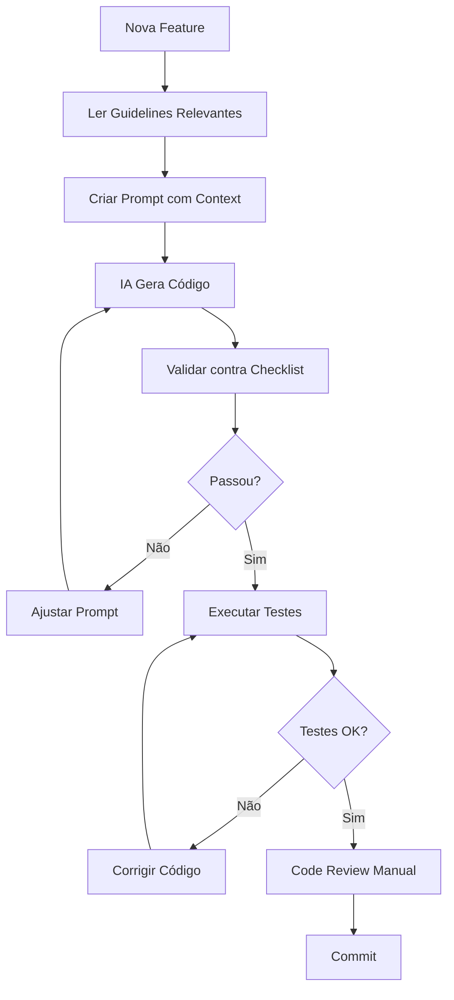

# AI-Assisted Development Configuration

## 📋 Visão Geral

Este diretório contém toda a configuração necessária para desenvolvimento assistido por IA (AI-Assisted Development) usando Model Context Protocol (MCP) no ERP Multitenant.

## 🎯 Objetivo

Garantir que **toda** interação com IA (Claude, GitHub Copilot, etc.) siga rigorosamente:

1. **Arquitetura DDD** definida no projeto
2. **Padrões de segurança multitenant** (RLS, isolamento)
3. **Compliance fiscal brasileiro** (NFS-e, IBSCBS, SPED)
4. **Padrões de qualidade** (testes, performance, documentação)

## 📁 Estrutura de Arquivos

```
.ai/
├── README.md                      # Este arquivo
├── boost.json                     # Configuração principal MCP
├── validation-checklist.yml       # Checklist de validação automática
├── guidelines/                    # Guidelines específicas por domínio
│   ├── erp-architecture.md       # Arquitetura DDD do ERP
│   ├── multitenant-patterns.md   # Padrões de multitenancy
│   ├── fiscal-compliance.md      # Compliance fiscal brasileiro
│   ├── security-standards.md     # Padrões de segurança
│   ├── testing-standards.md      # Padrões de testes
│   ├── performance-optimization.md
│   ├── api-conventions.md
│   └── deployment-guide.md
└── [prompt-templates/]            # Templates de prompts (futuro)
```

## 🚀 Como Usar

### 1. **Configuração Inicial (Uma vez)**

#### A. Carregar Variáveis de Ambiente MCP

```bash
# Adicione ao seu .env (ou crie .env.local)
source .env.mcp
```

#### B. Verificar Configuração

```bash
# Verifique se os arquivos estão corretos
cat .ai/boost.json
cat .ai/validation-checklist.yml
```

### 2. **Desenvolvimento Diário**

#### A. Antes de Iniciar uma Feature

1. **Identifique o domínio** (Identity, Company, Fiscal, etc.)
2. **Leia as guidelines relevantes**:
   ```bash
   # Exemplo para feature fiscal
   cat .ai/guidelines/fiscal-compliance.md
   cat .ai/guidelines/multitenant-patterns.md
   cat .ai/guidelines/security-standards.md
   ```

3. **Consulte a documentação MCP**:
   ```bash
   cat docs/MCP-GUIDELINES.md
   cat docs/ONBOARDING-MCP.md
   ```

#### B. Durante o Desenvolvimento com IA

**SEMPRE inclua no seu prompt:**

```markdown
Context: [Descreva o que está desenvolvendo]
Domain: [Identity|Company|Fiscal|Services|Orders|Financial]
Guidelines: [Liste os arquivos .md relevantes]

Requirements:
- Multitenancy: Isolamento total via RLS
- LGPD: Audit trail obrigatório
- Performance: < 200ms response time
- Testing: Pest com cenários multitenancy

Follow strictly:
- .ai/guidelines/[domínio-específico].md
- .ai/validation-checklist.yml
```

**Exemplo Prático:**

```markdown
Context: Implementar componente Livewire para emissão de NFS-e
Domain: Fiscal
Guidelines: fiscal-compliance.md, security-standards.md, multitenant-patterns.md

Requirements:
- NFS-e Nacional 2026 (DPS → ADN → NFS-e)
- IBSCBS campos informativos (não calcular localmente)
- Contingency protocol quando SEFAZ offline
- Multitenancy: Isolamento total via RLS
- LGPD: Audit trail para todas emissões
- Performance: Emissão < 5 segundos
- Testing: Pest com cenários fiscais reais

Output:
- Livewire component (class + blade separados)
- Service layer com business logic
- Repository pattern
- Pest tests com datasets fiscais
- Migration com RLS policies

Follow strictly:
- .ai/guidelines/fiscal-compliance.md
- .ai/guidelines/security-standards.md
- .ai/guidelines/multitenant-patterns.md
- .ai/validation-checklist.yml
```

#### C. Após Receber Código da IA

**Checklist de Validação Manual:**

```bash
# 1. Verificar se segue guidelines
✓ Código está no namespace correto (Domain/Application/Infrastructure)?
✓ Multitenancy aplicado (global scopes, RLS)?
✓ Audit trail implementado?
✓ Authorization checks presentes?

# 2. Executar testes
./vendor/bin/pest

# 3. Verificar qualidade
./vendor/bin/phpstan analyse
./vendor/bin/pint --test

# 4. Verificar performance
php artisan test --profile

# 5. Revisar contra validation-checklist.yml
cat .ai/validation-checklist.yml
```

### 3. **Garantindo que IA Sempre Siga as Guidelines**

#### Método 1: **Contexto Explícito em Cada Prompt**

Sempre inicie seus prompts com:

```markdown
⚠️ CRITICAL: Follow strictly all guidelines in .ai/guidelines/

Read before responding:
- .ai/guidelines/erp-architecture.md
- .ai/guidelines/multitenant-patterns.md
- .ai/guidelines/fiscal-compliance.md
- .ai/guidelines/security-standards.md
- .ai/validation-checklist.yml

[Seu prompt aqui]
```

#### Método 2: **Configuração de Sistema (Kiro/Claude)**

Se estiver usando Kiro ou Claude Desktop, adicione ao **system prompt**:

```markdown
You are an AI assistant for a Brazilian ERP multitenant system.

MANDATORY RULES:
1. ALWAYS read .ai/guidelines/ before generating code
2. ALWAYS follow .ai/validation-checklist.yml
3. ALWAYS apply multitenancy patterns (RLS + global scopes)
4. ALWAYS implement audit trail (LGPD compliance)
5. ALWAYS include Pest tests with multitenancy scenarios
6. ALWAYS validate fiscal compliance (NFS-e, IBSCBS)

Configuration files:
- .ai/boost.json (project context)
- .env.mcp (environment variables)
- docs/MCP-GUIDELINES.md (detailed patterns)
- docs/ONBOARDING-MCP.md (development roadmap)

NEVER generate code without reading relevant guidelines first.
```

#### Método 3: **Steering Files (Kiro Específico)**

Se estiver usando Kiro, crie steering files:

```bash
# Criar steering file para sempre incluir guidelines
mkdir -p .kiro/steering
```

Crie `.kiro/steering/mcp-guidelines.md`:

```markdown
---
inclusion: auto
---

# MCP Guidelines - Always Active

This steering file ensures all AI interactions follow project guidelines.

## Before Every Response

1. Read relevant files from .ai/guidelines/
2. Check .ai/validation-checklist.yml
3. Verify multitenancy patterns applied
4. Ensure fiscal compliance
5. Include comprehensive tests

## Project Context

- Type: ERP Multitenant Fiscal
- Domain: Brazilian Tax Compliance
- Architecture: DDD + Livewire + PostgreSQL RLS
- Compliance: LGPD, NFS-e Nacional, IBSCBS 2026

## Mandatory Patterns

### Security
- Row Level Security (RLS) on all tenant data
- Global scopes on all models
- Audit trail for all operations
- Authorization checks before actions

### Fiscal
- NFS-e Nacional 2026 standard
- IBSCBS informative fields only
- Tax calculation by regime
- Contingency protocols

### Testing
- Pest framework
- > 90% coverage
- Multitenancy scenarios
- Fiscal datasets

## Guidelines Priority

1. erp-architecture.md
2. multitenant-patterns.md
3. fiscal-compliance.md
4. security-standards.md
5. testing-standards.md
```

#### Método 4: **Git Hooks (Validação Automática)**

Crie um pre-commit hook para validar código:

```bash
# .git/hooks/pre-commit
#!/bin/bash

echo "🔍 Validating against MCP guidelines..."

# Check if guidelines were followed
if ! grep -r "Global scope" app/Models/*.php > /dev/null; then
    echo "❌ ERROR: Models must have global scopes for multitenancy"
    exit 1
fi

if ! grep -r "AuditLog::create" app/Services/*.php > /dev/null; then
    echo "⚠️  WARNING: Services should include audit trail"
fi

# Run tests
./vendor/bin/pest --bail
if [ $? -ne 0 ]; then
    echo "❌ ERROR: Tests failed"
    exit 1
fi

echo "✅ MCP validation passed"
```

### 4. **Workflow Completo de Desenvolvimento**



## 📚 Documentação Relacionada

### Documentos Principais

1. **docs/MCP-GUIDELINES.md** - Padrões detalhados de desenvolvimento com IA
2. **docs/ONBOARDING-MCP.md** - Roadmap e estratégia de desenvolvimento
3. **.ai/guidelines/** - Guidelines específicas por domínio

### Ordem de Leitura Recomendada

Para novos desenvolvedores:

1. `docs/ONBOARDING-MCP.md` (visão geral do projeto)
2. `.ai/guidelines/erp-architecture.md` (arquitetura)
3. `.ai/guidelines/multitenant-patterns.md` (multitenancy)
4. `.ai/guidelines/security-standards.md` (segurança)
5. `docs/MCP-GUIDELINES.md` (padrões de IA)
6. `.ai/validation-checklist.yml` (checklist)

## 🎯 Exemplos Práticos

### Exemplo 1: Criar Componente Livewire

```markdown
⚠️ CRITICAL: Follow .ai/guidelines/erp-architecture.md and security-standards.md

Context: Criar componente Livewire para listagem de empresas
Domain: Company Management
Guidelines: multitenant-patterns.md, security-standards.md

Requirements:
- Listar apenas empresas do tenant atual
- Filtros: nome, CNPJ, status
- Paginação (20 por página)
- Ações: editar, ativar/inativar, excluir
- Audit trail em todas ações
- Authorization checks

Output:
- app/Livewire/Empresas/Index.php
- resources/views/livewire/empresas/index.blade.php
- tests/Feature/Livewire/Empresas/IndexTest.php

Follow strictly:
- .ai/guidelines/multitenant-patterns.md
- .ai/guidelines/security-standards.md
- .ai/validation-checklist.yml
```

### Exemplo 2: Implementar Cálculo Fiscal

```markdown
⚠️ CRITICAL: Follow .ai/guidelines/fiscal-compliance.md

Context: Implementar calculadora de ISS por regime tributário
Domain: Fiscal Core
Guidelines: fiscal-compliance.md, performance-optimization.md

Requirements:
- Calcular ISS para Simples Nacional, Lucro Real, Lucro Presumido
- Considerar alíquota municipal
- Aplicar retenções quando aplicável
- Performance: < 100ms por cálculo
- Testes com datasets oficiais

Output:
- app/Domain/Fiscal/Calculators/ISSCalculator.php
- tests/Unit/Fiscal/Calculators/ISSCalculatorTest.php
- tests/Datasets/ISSCalculationDataset.php

Follow strictly:
- .ai/guidelines/fiscal-compliance.md
- .ai/guidelines/performance-optimization.md
- .ai/validation-checklist.yml (fiscal section)
```

## 🔧 Troubleshooting

### Problema: IA não está seguindo guidelines

**Solução:**
1. Seja mais explícito no prompt: "Read .ai/guidelines/X.md BEFORE responding"
2. Inclua trechos relevantes das guidelines no prompt
3. Use steering files (Kiro) ou system prompts (Claude)
4. Valide manualmente contra checklist após cada geração

### Problema: Código gerado não passa nos testes

**Solução:**
1. Verifique se testes estão corretos (seguem testing-standards.md)
2. Execute testes individualmente para identificar falha
3. Ajuste prompt para incluir cenários de teste específicos
4. Peça para IA corrigir baseado na mensagem de erro

### Problema: Performance ruim

**Solução:**
1. Revise contra performance-optimization.md
2. Execute EXPLAIN ANALYZE nas queries
3. Verifique N+1 queries (Laravel Debugbar)
4. Adicione índices necessários
5. Implemente caching onde apropriado

## 📊 Métricas de Sucesso

Acompanhe estas métricas para validar eficácia do MCP:

- **Guideline Adherence**: > 95% do código segue guidelines
- **Test Coverage**: > 90% coverage automático
- **Security**: Zero vazamentos entre tenants
- **Performance**: < 200ms response time (95% requests)
- **Bugs**: 60% redução em bugs de multitenancy
- **Productivity**: 40% redução em time-to-delivery

## 🔄 Manutenção

### Atualização de Guidelines

Quando atualizar guidelines:

1. Edite arquivo em `.ai/guidelines/`
2. Atualize versão em `boost.json`
3. Notifique equipe
4. Revise código existente se necessário

### Revisão Periódica

- **Semanal**: Revisar código gerado vs guidelines
- **Mensal**: Atualizar templates baseado em learnings
- **Trimestral**: Audit completo de compliance

## 📞 Suporte

Para dúvidas sobre MCP:

1. Consulte `docs/MCP-GUIDELINES.md`
2. Revise exemplos neste README
3. Verifique `validation-checklist.yml`
4. Consulte equipe de arquitetura

---

**🎯 Lembre-se: O objetivo do MCP é garantir qualidade, segurança e compliance em TODAS as interações com IA. Nunca pule as guidelines!**
