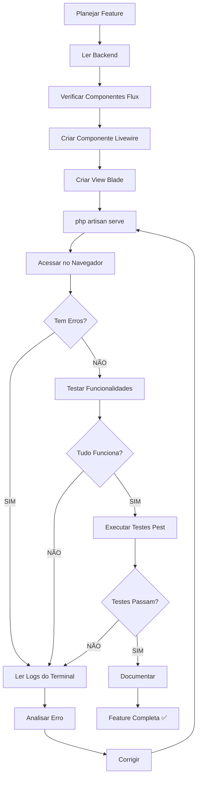

# 🔍 Frontend Validation Guidelines

## ⚠️ REGRA CRÍTICA: ZERO ERROS EM PRODUÇÃO

**NUNCA considere uma página como "pronta" sem validação completa de erros.**

---

## 📋 Processo Obrigatório de Validação

### 1. ANTES de Criar Qualquer Componente

#### 1.1 Verificar Componentes Flux UI
```bash
# Consultar lista de componentes disponíveis
cat .ai/FLUX-UI-FREE-COMPONENTS.md
```

**Regra**: Se o componente não está na lista "✅ Disponíveis (Free)", NÃO USAR.

#### 1.2 Verificar Dependências Backend
- Ler models, services, enums ANTES de criar frontend
- Verificar se métodos existem
- Verificar se relacionamentos estão corretos
- Verificar nomes de colunas no banco

---

### 2. DURANTE a Criação

#### 2.1 Usar Apenas Componentes Validados

**✅ PERMITIDO (Flux Free)**:
- `flux:card`, `flux:modal`, `flux:heading`, `flux:text`
- `flux:input`, `flux:select`, `flux:button`, `flux:badge`
- `flux:icon.*`, `flux:callout`, `flux:field`, `flux:label`, `flux:error`

**❌ PROIBIDO (Flux Pro)**:
- `flux:table`, `flux:columns`, `flux:rows`, `flux:row`, `flux:cell`
- `flux:dropdown`, `flux:menu`, `flux:sidebar`, `flux:navbar`
- `flux:pagination`, `flux:toast`, `flux:tooltip`, `flux:popover`

**Alternativa**: HTML + Tailwind CSS

#### 2.2 Validar Sintaxe Blade
```bash
# Verificar sintaxe antes de testar
php artisan view:clear
```

---

### 3. DEPOIS de Criar (OBRIGATÓRIO)

#### 3.1 Iniciar Servidor de Desenvolvimento
```bash
# Iniciar servidor Laravel
php artisan serve
```

#### 3.2 Acessar a Página no Navegador
```
http://127.0.0.1:8000/[rota-da-pagina]
```

#### 3.3 Capturar Logs do Terminal

**OBRIGATÓRIO**: Ler os logs do terminal onde `php artisan serve` está rodando.

**Erros Comuns a Procurar**:
```
❌ InvalidArgumentException: Unable to locate a class or view for component
❌ SQLSTATE[HY000]: ambiguous column name
❌ Symfony\Component\Routing\Exception\RouteNotFoundException
❌ ErrorException: Undefined variable
❌ BadMethodCallException: Method does not exist
❌ Class not found
❌ Call to undefined method
```

#### 3.4 Verificar Console do Navegador (F12)

**Erros JavaScript/Livewire**:
```
❌ Livewire: Method not found
❌ Uncaught ReferenceError
❌ Failed to load resource: 404
❌ Livewire component not found
```

#### 3.5 Testar Todas as Funcionalidades

**Checklist Mínimo**:
- [ ] Página carrega sem erros
- [ ] Dados aparecem corretamente
- [ ] Filtros funcionam (se houver)
- [ ] Botões respondem (se houver)
- [ ] Modal abre/fecha (se houver)
- [ ] Formulário valida (se houver)
- [ ] Mensagens de sucesso/erro aparecem
- [ ] Dark mode funciona
- [ ] Responsivo em mobile (F12 > Device Toolbar)

---

## 🚨 Protocolo de Erro

### Se Encontrar QUALQUER Erro:

1. **PARAR IMEDIATAMENTE**
   - Não continuar para próxima feature
   - Não marcar como "pronto"

2. **DOCUMENTAR O ERRO**
   ```
   Erro: [mensagem completa do erro]
   Arquivo: [caminho do arquivo]
   Linha: [número da linha]
   Causa: [análise da causa raiz]
   ```

3. **CORRIGIR O ERRO**
   - Ler documentação relevante
   - Verificar código backend
   - Aplicar correção
   - Testar novamente

4. **VALIDAR CORREÇÃO**
   - Recarregar página
   - Verificar logs novamente
   - Testar funcionalidade
   - Confirmar zero erros

5. **DOCUMENTAR CORREÇÃO**
   - Adicionar ao REGISTRO-IMPLEMENTACAO-FRONTEND.md
   - Explicar causa e solução
   - Estabelecer padrão para evitar repetição

---

## 🔄 Workflow Completo



---

## 📝 Template de Validação

Usar este template ao finalizar cada feature:

```markdown
## ✅ Validação: [Nome da Feature]

### 1. Componentes Verificados
- [ ] Todos os componentes Flux são da versão Free
- [ ] Alternativas HTML+Tailwind usadas quando necessário
- [ ] Nenhum componente Pro foi usado

### 2. Backend Verificado
- [ ] Models existem e têm os métodos usados
- [ ] Services existem e têm os métodos usados
- [ ] Enums existem e têm os métodos usados
- [ ] Relacionamentos estão corretos
- [ ] Queries não têm ambiguidade

### 3. Servidor Testado
- [ ] `php artisan serve` executado
- [ ] Página acessada no navegador
- [ ] Logs do terminal verificados
- [ ] ZERO erros no terminal
- [ ] ZERO erros no console do navegador

### 4. Funcionalidades Testadas
- [ ] Página carrega corretamente
- [ ] Dados aparecem
- [ ] Filtros funcionam
- [ ] Botões funcionam
- [ ] Formulários validam
- [ ] Mensagens aparecem
- [ ] Dark mode funciona
- [ ] Responsivo funciona

### 5. Testes Automatizados
- [ ] Testes Pest criados
- [ ] Testes executados
- [ ] Todos os testes passam
- [ ] Coverage > 80%

### 6. Documentação
- [ ] REGISTRO-IMPLEMENTACAO-FRONTEND.md atualizado
- [ ] Erros encontrados documentados
- [ ] Correções documentadas
- [ ] Padrões estabelecidos

### Resultado Final
- ✅ Feature 100% funcional
- ✅ Zero erros
- ✅ Documentada
- ✅ Testada
```

---

## 🎯 Métricas de Qualidade

### Inaceitável ❌
- Erros no terminal ao acessar página
- Erros no console do navegador
- Funcionalidades não funcionam
- Componentes Flux Pro usados
- Página não testada antes de marcar como pronta

### Aceitável ✅
- Zero erros no terminal
- Zero erros no console
- Todas funcionalidades testadas e funcionando
- Apenas componentes Flux Free usados
- Testes Pest passando
- Documentação completa

---

## 🚀 Comandos de Validação Rápida

### 1. Limpar Cache
```bash
php artisan view:clear
php artisan config:clear
php artisan cache:clear
```

### 2. Verificar Rotas
```bash
php artisan route:list | grep [nome-da-rota]
```

### 3. Verificar Componentes Livewire
```bash
php artisan livewire:list
```

### 4. Executar Testes
```bash
./vendor/bin/pest tests/Feature/Livewire/[ComponenteTest.php]
```

### 5. Verificar Sintaxe PHP
```bash
php -l app/Livewire/[Componente.php]
```

---

## 📚 Referências Obrigatórias

Antes de criar qualquer componente, LER:

1. **`.ai/FLUX-UI-FREE-COMPONENTS.md`**
   - Lista de componentes disponíveis
   - Alternativas para componentes Pro

2. **`.ai/guidelines/erp-architecture.md`**
   - Padrões de arquitetura DDD
   - Estrutura de pastas

3. **`.ai/guidelines/multitenant-patterns.md`**
   - Padrões de multitenancy
   - Isolamento de dados

4. **Backend relevante**
   - Models: `app/Models/[Model].php`
   - Services: `app/Services/[Service].php`
   - Enums: `app/Models/[Enum].php` ou `app/Domain/*/Enums/[Enum].php`

---

## ⚡ Atalhos de Validação

### Validação Rápida (1 minuto)
```bash
# 1. Limpar cache
php artisan view:clear

# 2. Iniciar servidor (em terminal separado)
php artisan serve

# 3. Acessar página no navegador
# http://127.0.0.1:8000/[rota]

# 4. Verificar logs do terminal
# Procurar por erros em vermelho

# 5. Verificar console do navegador (F12)
# Procurar por erros em vermelho
```

### Validação Completa (5 minutos)
```bash
# 1. Validação rápida (acima)

# 2. Testar todas funcionalidades
# - Clicar em todos os botões
# - Preencher todos os formulários
# - Testar todos os filtros
# - Testar dark mode (clicar no toggle)
# - Testar mobile (F12 > Device Toolbar)

# 3. Executar testes
./vendor/bin/pest tests/Feature/Livewire/[ComponenteTest.php]

# 4. Verificar coverage
./vendor/bin/pest --coverage
```

---

## 🎓 Lições Aprendidas

### Bug 1: Target class [current.company] does not exist
**Lição**: Sempre verificar se bindings do container existem antes de usar.

### Bug 2: SQLSTATE ambiguous column name: status
**Lição**: Usar `wherePivot()` em relacionamentos many-to-many.

### Bug 3: Route [empresas] not defined
**Lição**: Verificar conflitos entre rotas de API e UI.

### Bug 4: Unable to locate component [flux::columns]
**Lição**: Verificar se componente Flux existe na versão Free ANTES de usar.

---

## 🔒 Regra de Ouro

> **"Se não foi testado no navegador com servidor rodando, não está pronto."**

**NUNCA** considere uma feature completa sem:
1. ✅ Servidor Laravel rodando (`php artisan serve`)
2. ✅ Página acessada no navegador
3. ✅ Logs do terminal verificados (ZERO erros)
4. ✅ Console do navegador verificado (ZERO erros)
5. ✅ Todas funcionalidades testadas manualmente
6. ✅ Testes Pest executados e passando

---

**Última Atualização**: 27 de Abril de 2026  
**Versão**: 1.0  
**Status**: Obrigatório para todas as features frontend
