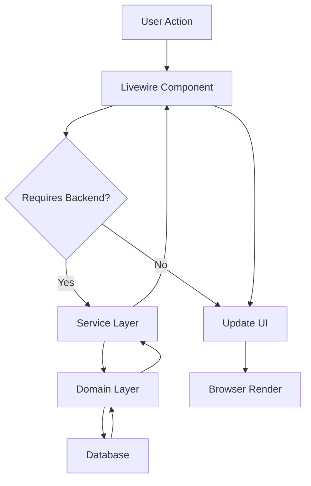

# Design Document - Interface Profissional ERP

## Overview

Este documento especifica o design técnico para o redesign completo da interface do ERP, transformando o dashboard básico atual em uma interface profissional de nível empresarial. O design segue os princípios de Domain-Driven Design (DDD), utiliza apenas componentes Flux UI Free Edition, e implementa padrões rigorosos de multitenancy e isolamento de dados.

### Objetivos do Design

1. **Experiência Profissional**: Interface moderna e intuitiva que reflita a qualidade de um sistema ERP empresarial
2. **Navegação Eficiente**: Sidebar hierárquica com acesso rápido a todos os módulos do sistema
3. **Contexto Visual Claro**: Topbar com informações da empresa atual e controles do usuário
4. **Dashboard Informativo**: Cards grandes com métricas principais e ações rápidas
5. **Tema Adaptável**: Suporte completo a dark mode com transições suaves
6. **Responsividade Total**: Interface funcional em desktop, tablet e mobile
7. **Multitenancy Seguro**: Isolamento completo de dados entre empresas
8. **Acessibilidade**: Conformidade com WCAG 2.1 Nível AA

### Princípios de Design

- **Mobile-First**: Design responsivo começando pelo mobile
- **Component-Based**: Componentes Livewire reutilizáveis e bem definidos
- **Flux UI Free Only**: Uso exclusivo de componentes da versão gratuita
- **Tailwind CSS**: Estilização com classes utilitárias e dark mode
- **Performance**: Carregamento rápido com lazy loading e caching
- **Segurança**: Validação de permissões e isolamento de dados

## Architecture

### Arquitetura de Componentes

A interface segue uma arquitetura em camadas com separação clara de responsabilidades:

```
┌─────────────────────────────────────────────────────────────┐
│                     Presentation Layer                       │
│  ┌──────────────┐  ┌──────────────┐  ┌──────────────┐      │
│  │   Layouts    │  │  Components  │  │    Views     │      │
│  │  (Blade)     │  │  (Livewire)  │  │   (Blade)    │      │
│  └──────────────┘  └──────────────┘  └──────────────┘      │
└─────────────────────────────────────────────────────────────┘
                            │
┌─────────────────────────────────────────────────────────────┐
│                    Application Layer                         │
│  ┌──────────────┐  ┌──────────────┐  ┌──────────────┐      │
│  │   Services   │  │    Events    │  │  Middleware  │      │
│  └──────────────┘  └──────────────┘  └──────────────┘      │
└─────────────────────────────────────────────────────────────┘
                            │
┌─────────────────────────────────────────────────────────────┐
│                      Domain Layer                            │
│  ┌──────────────┐  ┌──────────────┐  ┌──────────────┐      │
│  │   Models     │  │  Repositories│  │    Enums     │      │
│  └──────────────┘  └──────────────┘  └──────────────┘      │
└─────────────────────────────────────────────────────────────┘
```

### Estrutura de Diretórios

```
app/
├── Livewire/
│   ├── Layout/
│   │   ├── Sidebar.php              # Componente de navegação lateral
│   │   ├── Topbar.php               # Componente de barra superior
│   │   ├── SidebarMenuItem.php      # Item de menu da sidebar
│   │   └── CompanySelector.php      # Seletor de empresa
│   ├── Dashboard/
│   │   ├── Index.php                # Dashboard principal
│   │   ├── StatCard.php             # Card de estatística
│   │   ├── QuickActionCard.php      # Card de ação rápida
│   │   ├── RevenueChart.php         # Gráfico de faturamento
│   │   └── ActivityTimeline.php     # Timeline de atividades
│   ├── Notifications/
│   │   ├── NotificationDropdown.php # Dropdown de notificações
│   │   └── NotificationItem.php     # Item de notificação
│   └── User/
│       ├── ProfileDropdown.php      # Dropdown do perfil
│       └── DarkModeToggle.php       # Toggle de dark mode
│
resources/
├── views/
│   ├── layouts/
│   │   └── app.blade.php            # Layout base (sidebar + topbar + content)
│   ├── livewire/
│   │   ├── layout/
│   │   │   ├── sidebar.blade.php
│   │   │   ├── topbar.blade.php
│   │   │   ├── sidebar-menu-item.blade.php
│   │   │   └── company-selector.blade.php
│   │   ├── dashboard/
│   │   │   ├── index.blade.php
│   │   │   ├── stat-card.blade.php
│   │   │   ├── quick-action-card.blade.php
│   │   │   ├── revenue-chart.blade.php
│   │   │   └── activity-timeline.blade.php
│   │   ├── notifications/
│   │   │   ├── notification-dropdown.blade.php
│   │   │   └── notification-item.blade.php
│   │   └── user/
│   │       ├── profile-dropdown.blade.php
│   │       └── dark-mode-toggle.blade.php
│   └── components/
│       ├── breadcrumbs.blade.php    # Componente de breadcrumbs
│       ├── empty-state.blade.php    # Estado vazio
│       └── skeleton-loader.blade.php # Loading skeleton
│
public/
├── css/
│   └── app.css                      # Tailwind CSS compilado
└── js/
    └── app.js                       # Alpine.js e scripts
```

### Fluxo de Dados



### Padrões de Multitenancy

**CRITICAL**: Todos os componentes DEVEM respeitar o contexto de multitenancy conforme `.ai/guidelines/multitenant-patterns.md`.

#### Tenant Context Resolution

```php
// Middleware aplicado em todas as rotas autenticadas
class ResolveTenantContext
{
    public function handle(Request $request, Closure $next): Response
    {
        $company = auth()->user()->company;
        
        if (!$company) {
            throw new InvalidTenantException('Invalid or missing tenant context');
        }
        
        // Set database session variable for RLS
        DB::statement("SET app.current_company_id = ?", [$company->id]);
        
        // Store in application context
        app()->instance('current.company', $company);
        
        return $next($request);
    }
}
```

#### Component-Level Tenant Isolation

Todos os componentes Livewire que acessam dados DEVEM:

1. **Usar Global Scopes**: Aplicar `CompanyScope` em todos os models
2. **Validar Permissões**: Verificar acesso à company antes de trocar contexto
3. **Limpar Cache**: Flush cache específico da company ao trocar
4. **Registrar Auditoria**: Log de todas as trocas de company

```php
// Exemplo: Dashboard Index com tenant isolation
class Index extends Component
{
    #[Computed]
    public function stats()
    {
        // SEMPRE usar company do usuário autenticado
        $company = auth()->user()->company;
        
        // Global scope aplicado automaticamente
        return [
            'revenue' => Invoice::where('company_id', $company->id)
                ->where('created_at', '>=', $this->getStartDate())
                ->sum('total_amount'),
            // ...
        ];
    }
}
```

#### Company Switching Security

```php
public function selectCompany($companyId)
{
    // 1. Validar que company existe na lista de companies do usuário
    $company = auth()->user()->companies()->find($companyId);
    
    if (!$company) {
        $this->dispatch('notify', [
            'type' => 'error',
            'message' => 'Empresa não encontrada ou sem permissão de acesso.',
        ]);
        return;
    }
    
    // 2. Atualizar company do usuário
    auth()->user()->update(['company_id' => $companyId]);
    
    // 3. Limpar cache específico da company anterior
    cache()->tags(['company:' . auth()->user()->id])->flush();
    
    // 4. Registrar evento de auditoria
    activity()
        ->causedBy(auth()->user())
        ->performedOn($company)
        ->event('company_switched')
        ->log('Usuário trocou para empresa: ' . $company->nome_fantasia);
    
    // 5. Notificar componentes
    $this->dispatch('company-changed', companyId: $companyId);
    
    // 6. Recarregar página para aplicar novo contexto
    return redirect()->route('dashboard');
}
```

## Components and Interfaces

### 1. Layout Base (LayoutBase)

**Responsabilidade**: Estrutura principal da aplicação com sidebar, topbar e área de conteúdo.

**Arquivo**: `resources/views/layouts/app.blade.php`

**Estrutura HTML**:
```blade
<!DOCTYPE html>
<html lang="{{ str_replace('_', '-', app()->getLocale()) }}" 
      x-data="{ darkMode: localStorage.getItem('darkMode') === 'true' }"
      x-init="$watch('darkMode', val => localStorage.setItem('darkMode', val))"
      :class="{ 'dark': darkMode }">
<head>
    <meta charset="utf-8">
    <meta name="viewport" content="width=device-width, initial-scale=1">
    <meta name="csrf-token" content="{{ csrf_token() }}">
    <title>{{ $title ?? config('app.name') }}</title>
    @vite(['resources/css/app.css', 'resources/js/app.js'])
    @livewireStyles
</head>
<body class="bg-white dark:bg-gray-900 text-gray-900 dark:text-gray-100 antialiased">
    <div class="flex h-screen overflow-hidden">
        <!-- Sidebar -->
        <livewire:layout.sidebar />
        
        <!-- Main Content Area -->
        <div class="flex flex-1 flex-col overflow-hidden">
            <!-- Topbar -->
            <livewire:layout.topbar />
            
            <!-- Page Content -->
            <main class="flex-1 overflow-y-auto p-4 md:p-6 lg:p-8">
                {{ $slot }}
            </main>
        </div>
    </div>
    
    <!-- Toast Notifications -->
    <div x-data="toastManager()" 
         @notify.window="show($event.detail)"
         class="fixed bottom-4 right-4 z-50 space-y-2">
        <template x-for="toast in toasts" :key="toast.id">
            <div x-show="toast.visible"
                 x-transition
                 class="rounded-lg px-4 py-3 shadow-lg"
                 :class="{
                     'bg-green-500 text-white': toast.type === 'success',
                     'bg-red-500 text-white': toast.type === 'error',
                     'bg-blue-500 text-white': toast.type === 'info',
                     'bg-yellow-500 text-white': toast.type === 'warning'
                 }">
                <div class="flex items-center gap-2">
                    <span x-text="toast.message"></span>
                    <button @click="remove(toast.id)" class="ml-2">
                        <svg class="h-4 w-4" fill="currentColor" viewBox="0 0 20 20">
                            <path fill-rule="evenodd" d="M4.293 4.293a1 1 0 011.414 0L10 8.586l4.293-4.293a1 1 0 111.414 1.414L11.414 10l4.293 4.293a1 1 0 01-1.414 1.414L10 11.414l-4.293 4.293a1 1 0 01-1.414-1.414L8.586 10 4.293 5.707a1 1 0 010-1.414z" clip-rule="evenodd"/>
                        </svg>
                    </button>
                </div>
            </div>
        </template>
    </div>
    
    @livewireScripts
    <script>
        function toastManager() {
            return {
                toasts: [],
                nextId: 1,
                show(detail) {
                    const id = this.nextId++;
                    const toast = { id, ...detail, visible: true };
                    this.toasts.push(toast);
                    setTimeout(() => this.remove(id), detail.duration || 3000);
                },
                remove(id) {
                    const index = this.toasts.findIndex(t => t.id === id);
                    if (index > -1) {
                        this.toasts[index].visible = false;
                        setTimeout(() => {
                            this.toasts.splice(index, 1);
                        }, 300);
                    }
                }
            }
        }
    </script>
</body>
</html>
```

**Classes Tailwind**:
- Container: `flex h-screen overflow-hidden`
- Background: `bg-white dark:bg-gray-900`
- Text: `text-gray-900 dark:text-gray-100`

### 2. Sidebar Component

**Responsabilidade**: Navegação lateral com menu hierárquico e estado colapsável.

**Arquivo**: `app/Livewire/Layout/Sidebar.php`

```php
<?php

namespace App\Livewire\Layout;

use Livewire\Component;
use Livewire\Attributes\On;

class Sidebar extends Component
{
    public bool $collapsed = false;
    public array $expandedMenus = [];
    
    public function mount()
    {
        // Restaurar estado do localStorage via Alpine
        $this->collapsed = false;
    }
    
    public function toggleCollapse()
    {
        $this->collapsed = !$this->collapsed;
        $this->dispatch('sidebar-toggled', collapsed: $this->collapsed);
    }
    
    public function toggleMenu(string $menuId)
    {
        if (in_array($menuId, $this->expandedMenus)) {
            $this->expandedMenus = array_diff($this->expandedMenus, [$menuId]);
        } else {
            $this->expandedMenus[] = $menuId;
        }
    }
    
    public function getMenuItems(): array
    {
        return [
            [
                'id' => 'dashboard',
                'label' => 'Dashboard',
                'icon' => 'home',
                'route' => 'dashboard',
                'active' => request()->routeIs('dashboard'),
            ],
            [
                'id' => 'cadastros',
                'label' => 'Cadastros',
                'icon' => 'folder',
                'children' => [
                    [
                        'label' => 'Empresas',
                        'route' => 'empresas.index',
                        'active' => request()->routeIs('empresas.*'),
                    ],
                    [
                        'label' => 'Pessoas',
                        'route' => 'pessoas.index',
                        'active' => request()->routeIs('pessoas.*'),
                    ],
                    [
                        'label' => 'Serviços',
                        'route' => 'servicos.index',
                        'active' => request()->routeIs('servicos.*'),
                    ],
                ],
            ],
            [
                'id' => 'vendas',
                'label' => 'Vendas',
                'icon' => 'shopping-cart',
                'children' => [
                    [
                        'label' => 'Ordens de Serviço',
                        'route' => 'ordens-servico.index',
                        'active' => request()->routeIs('ordens-servico.*'),
                    ],
                    [
                        'label' => 'Propostas',
                        'route' => 'propostas.index',
                        'active' => request()->routeIs('propostas.*'),
                    ],
                ],
            ],
            [
                'id' => 'financeiro',
                'label' => 'Financeiro',
                'icon' => 'currency-dollar',
                'children' => [
                    [
                        'label' => 'Contas a Receber',
                        'route' => 'contas-receber.index',
                        'active' => request()->routeIs('contas-receber.*'),
                    ],
                    [
                        'label' => 'Contas a Pagar',
                        'route' => 'contas-pagar.index',
                        'active' => request()->routeIs('contas-pagar.*'),
                    ],
                    [
                        'label' => 'Fluxo de Caixa',
                        'route' => 'fluxo-caixa.index',
                        'active' => request()->routeIs('fluxo-caixa.*'),
                    ],
                ],
            ],
            [
                'id' => 'fiscal',
                'label' => 'Fiscal',
                'icon' => 'document-text',
                'children' => [
                    [
                        'label' => 'NFS-e',
                        'route' => 'nfse.index',
                        'active' => request()->routeIs('nfse.*'),
                    ],
                    [
                        'label' => 'RPS',
                        'route' => 'rps.index',
                        'active' => request()->routeIs('rps.*'),
                    ],
                    [
                        'label' => 'Lotes',
                        'route' => 'lotes.index',
                        'active' => request()->routeIs('lotes.*'),
                    ],
                ],
            ],
            [
                'id' => 'relatorios',
                'label' => 'Relatórios',
                'icon' => 'chart-bar',
                'route' => 'relatorios.index',
                'active' => request()->routeIs('relatorios.*'),
            ],
        ];
    }
    
    public function render()
    {
        return view('livewire.layout.sidebar', [
            'menuItems' => $this->getMenuItems(),
        ]);
    }
}
```

**View**: `resources/views/livewire/layout/sidebar.blade.php`

```blade
<aside x-data="{ 
    collapsed: @entangle('collapsed'),
    expandedMenus: @entangle('expandedMenus')
}"
    :class="collapsed ? 'w-16' : 'w-64'"
    class="flex flex-col border-r border-gray-200 bg-white transition-all duration-300 dark:border-gray-700 dark:bg-gray-800">
    
    <!-- Logo -->
    <div class="flex h-16 items-center justify-center border-b border-gray-200 dark:border-gray-700">
        <a href="{{ route('dashboard') }}" class="flex items-center">
            
            <span x-show="!collapsed" 
                  x-transition
                  class="ml-2 text-xl font-bold text-gray-900 dark:text-white">
                ERP
            </span>
        </a>
    </div>
    
    <!-- Menu Items -->
    <nav class="flex-1 overflow-y-auto p-4">
        <ul class="space-y-1">
            @foreach($menuItems as $item)
                <livewire:layout.sidebar-menu-item 
                    :item="$item" 
                    :collapsed="$collapsed"
                    :key="$item['id']" />
            @endforeach
        </ul>
    </nav>
    
    <!-- Collapse Toggle -->
    <div class="border-t border-gray-200 p-4 dark:border-gray-700">
        <button wire:click="toggleCollapse"
                class="flex w-full items-center justify-center rounded-lg p-2 text-gray-600 hover:bg-gray-100 dark:text-gray-400 dark:hover:bg-gray-700">
            <svg x-show="!collapsed" class="h-5 w-5" fill="none" stroke="currentColor" viewBox="0 0 24 24">
                <path stroke-linecap="round" stroke-linejoin="round" stroke-width="2" d="M11 19l-7-7 7-7m8 14l-7-7 7-7"/>
            </svg>
            <svg x-show="collapsed" class="h-5 w-5" fill="none" stroke="currentColor" viewBox="0 0 24 24">
                <path stroke-linecap="round" stroke-linejoin="round" stroke-width="2" d="M13 5l7 7-7 7M5 5l7 7-7 7"/>
            </svg>
        </button>
    </div>
</aside>
```

**Classes Tailwind**:
- Container: `w-64` (expandido) / `w-16` (colapsado)
- Background: `bg-white dark:bg-gray-800`
- Border: `border-r border-gray-200 dark:border-gray-700`
- Transition: `transition-all duration-300`


### 3. Sidebar Menu Item Component

**Responsabilidade**: Item individual do menu com suporte a submenu e estado ativo.

**Arquivo**: `app/Livewire/Layout/SidebarMenuItem.php`

```php
<?php

namespace App\Livewire\Layout;

use Livewire\Component;

class SidebarMenuItem extends Component
{
    public array $item;
    public bool $collapsed;
    public bool $expanded = false;
    
    public function mount()
    {
        // Auto-expandir se algum filho estiver ativo
        if (isset($this->item['children'])) {
            foreach ($this->item['children'] as $child) {
                if ($child['active'] ?? false) {
                    $this->expanded = true;
                    break;
                }
            }
        }
    }
    
    public function toggle()
    {
        if (isset($this->item['children'])) {
            $this->expanded = !$this->expanded;
        }
    }
    
    public function render()
    {
        return view('livewire.layout.sidebar-menu-item');
    }
}
```

**View**: `resources/views/livewire/layout/sidebar-menu-item.blade.php`

```blade
<li>
    @if(isset($item['children']))
        <!-- Menu com submenu -->
        <button wire:click="toggle"
                class="flex w-full items-center justify-between rounded-lg p-2 text-gray-700 hover:bg-gray-100 dark:text-gray-300 dark:hover:bg-gray-700"
                :class="{ 'justify-center': collapsed }">
            <div class="flex items-center gap-3">
                <flux:icon.{{ $item['icon'] }} class="h-5 w-5 flex-shrink-0" />
                <span x-show="!collapsed" x-transition class="text-sm font-medium">
                    {{ $item['label'] }}
                </span>
            </div>
            <svg x-show="!collapsed && !$wire.expanded" 
                 class="h-4 w-4 transition-transform" 
                 fill="none" 
                 stroke="currentColor" 
                 viewBox="0 0 24 24">
                <path stroke-linecap="round" stroke-linejoin="round" stroke-width="2" d="M9 5l7 7-7 7"/>
            </svg>
            <svg x-show="!collapsed && $wire.expanded" 
                 class="h-4 w-4 transition-transform" 
                 fill="none" 
                 stroke="currentColor" 
                 viewBox="0 0 24 24">
                <path stroke-linecap="round" stroke-linejoin="round" stroke-width="2" d="M19 9l-7 7-7-7"/>
            </svg>
        </button>
        
        <!-- Submenu -->
        <ul x-show="!collapsed && $wire.expanded" 
            x-transition
            class="ml-8 mt-1 space-y-1">
            @foreach($item['children'] as $child)
                <li>
                    <a href="{{ route($child['route']) }}"
                       class="block rounded-lg p-2 text-sm text-gray-600 hover:bg-gray-100 dark:text-gray-400 dark:hover:bg-gray-700"
                       :class="{ 'bg-blue-50 text-blue-600 dark:bg-blue-900 dark:text-blue-300': {{ $child['active'] ? 'true' : 'false' }} }">
                        {{ $child['label'] }}
                    </a>
                </li>
            @endforeach
        </ul>
        
        <!-- Tooltip para sidebar colapsada -->
        <div x-show="collapsed" 
             x-data="{ show: false }"
             @mouseenter="show = true"
             @mouseleave="show = false"
             class="relative">
            <div x-show="show"
                 x-transition
                 class="absolute left-full top-0 z-50 ml-2 whitespace-nowrap rounded-lg bg-gray-900 px-3 py-2 text-sm text-white shadow-lg">
                {{ $item['label'] }}
                <div class="absolute left-0 top-1/2 -ml-1 -translate-y-1/2">
                    <div class="h-2 w-2 rotate-45 bg-gray-900"></div>
                </div>
            </div>
        </div>
    @else
        <!-- Menu simples (sem submenu) -->
        <a href="{{ route($item['route']) }}"
           class="flex items-center gap-3 rounded-lg p-2 text-gray-700 hover:bg-gray-100 dark:text-gray-300 dark:hover:bg-gray-700"
           :class="{ 
               'justify-center': collapsed,
               'bg-blue-600 text-white hover:bg-blue-700 dark:bg-blue-600 dark:hover:bg-blue-700': {{ $item['active'] ? 'true' : 'false' }}
           }">
            <flux:icon.{{ $item['icon'] }} class="h-5 w-5 flex-shrink-0" />
            <span x-show="!collapsed" x-transition class="text-sm font-medium">
                {{ $item['label'] }}
            </span>
        </a>
        
        <!-- Tooltip para sidebar colapsada -->
        <div x-show="collapsed" 
             x-data="{ show: false }"
             @mouseenter="show = true"
             @mouseleave="show = false"
             class="relative">
            <div x-show="show"
                 x-transition
                 class="absolute left-full top-0 z-50 ml-2 whitespace-nowrap rounded-lg bg-gray-900 px-3 py-2 text-sm text-white shadow-lg">
                {{ $item['label'] }}
                <div class="absolute left-0 top-1/2 -ml-1 -translate-y-1/2">
                    <div class="h-2 w-2 rotate-45 bg-gray-900"></div>
                </div>
            </div>
        </div>
    @endif
</li>
```

### 4. Topbar Component

**Responsabilidade**: Barra superior com breadcrumbs, seletor de empresa e controles do usuário.

**Arquivo**: `app/Livewire/Layout/Topbar.php`

```php
<?php

namespace App\Livewire\Layout;

use Livewire\Component;
use Livewire\Attributes\Computed;

class Topbar extends Component
{
    #[Computed]
    public function currentCompany()
    {
        return auth()->user()->company;
    }
    
    #[Computed]
    public function breadcrumbs()
    {
        $route = request()->route();
        $routeName = $route->getName();
        
        // Mapear rotas para breadcrumbs
        $breadcrumbMap = [
            'dashboard' => [
                ['label' => 'Dashboard', 'route' => null],
            ],
            'empresas.index' => [
                ['label' => 'Cadastros', 'route' => null],
                ['label' => 'Empresas', 'route' => null],
            ],
            'empresas.create' => [
                ['label' => 'Cadastros', 'route' => null],
                ['label' => 'Empresas', 'route' => 'empresas.index'],
                ['label' => 'Nova Empresa', 'route' => null],
            ],
            // Adicionar mais rotas conforme necessário
        ];
        
        return $breadcrumbMap[$routeName] ?? [
            ['label' => 'Dashboard', 'route' => 'dashboard'],
        ];
    }
    
    public function render()
    {
        return view('livewire.layout.topbar');
    }
}
```

**View**: `resources/views/livewire/layout/topbar.blade.php`

```blade
<header class="flex h-16 items-center justify-between border-b border-gray-200 bg-white px-4 dark:border-gray-700 dark:bg-gray-800 md:px-6">
    <!-- Left: Company Name & Breadcrumbs -->
    <div class="flex items-center gap-4">
        <!-- Mobile Menu Toggle -->
        <button @click="$dispatch('toggle-sidebar')"
                class="rounded-lg p-2 text-gray-600 hover:bg-gray-100 dark:text-gray-400 dark:hover:bg-gray-700 md:hidden">
            <svg class="h-6 w-6" fill="none" stroke="currentColor" viewBox="0 0 24 24">
                <path stroke-linecap="round" stroke-linejoin="round" stroke-width="2" d="M4 6h16M4 12h16M4 18h16"/>
            </svg>
        </button>
        
        <!-- Company Selector -->
        <livewire:layout.company-selector />
        
        <!-- Breadcrumbs (hidden on mobile) -->
        <nav class="hidden md:flex items-center gap-2 text-sm">
            @foreach($this->breadcrumbs as $index => $crumb)
                @if($index > 0)
                    <svg class="h-4 w-4 text-gray-400" fill="none" stroke="currentColor" viewBox="0 0 24 24">
                        <path stroke-linecap="round" stroke-linejoin="round" stroke-width="2" d="M9 5l7 7-7 7"/>
                    </svg>
                @endif
                
                @if($crumb['route'])
                    <a href="{{ route($crumb['route']) }}" 
                       class="text-gray-600 hover:text-gray-900 dark:text-gray-400 dark:hover:text-gray-100">
                        {{ $crumb['label'] }}
                    </a>
                @else
                    <span class="font-medium text-gray-900 dark:text-gray-100">
                        {{ $crumb['label'] }}
                    </span>
                @endif
            @endforeach
        </nav>
    </div>
    
    <!-- Right: User Controls -->
    <div class="flex items-center gap-2">
        <!-- Notifications -->
        <livewire:notifications.notification-dropdown />
        
        <!-- Dark Mode Toggle -->
        <livewire:user.dark-mode-toggle />
        
        <!-- User Profile -->
        <livewire:user.profile-dropdown />
    </div>
</header>
```

### 5. Company Selector Component

**Responsabilidade**: Seletor de empresa com dropdown para usuários multi-tenant.

**Arquivo**: `app/Livewire/Layout/CompanySelector.php`

```php
<?php

namespace App\Livewire\Layout;

use Livewire\Component;
use Livewire\Attributes\Computed;
use App\Models\Company;

class CompanySelector extends Component
{
    public bool $open = false;
    
    #[Computed]
    public function currentCompany()
    {
        return auth()->user()->company;
    }
    
    #[Computed]
    public function availableCompanies()
    {
        return auth()->user()->companies()->active()->get();
    }
    
    #[Computed]
    public function hasMultipleCompanies()
    {
        return $this->availableCompanies->count() > 1;
    }
    
    public function selectCompany($companyId)
    {
        $company = $this->availableCompanies->find($companyId);
        
        if (!$company) {
            $this->dispatch('notify', [
                'type' => 'error',
                'message' => 'Empresa não encontrada ou sem permissão de acesso.',
            ]);
            return;
        }
        
        // Atualizar empresa do usuário
        auth()->user()->update(['company_id' => $companyId]);
        
        // Limpar cache
        cache()->tags(['company:' . auth()->user()->id])->flush();
        
        // Registrar evento de auditoria
        activity()
            ->causedBy(auth()->user())
            ->performedOn($company)
            ->event('company_switched')
            ->log('Usuário trocou para empresa: ' . $company->nome_fantasia);
        
        // Notificar componentes
        $this->dispatch('company-changed', companyId: $companyId);
        
        // Recarregar página
        return redirect()->route('dashboard');
    }
    
    public function render()
    {
        return view('livewire.layout.company-selector');
    }
}
```

**View**: `resources/views/livewire/layout/company-selector.blade.php`

```blade
<div x-data="{ open: @entangle('open') }" 
     @click.away="open = false"
     class="relative">
    
    @if($this->hasMultipleCompanies)
        <!-- Dropdown Trigger -->
        <button @click="open = !open"
                class="flex items-center gap-2 rounded-lg border border-gray-300 bg-white px-3 py-2 text-sm font-medium text-gray-700 hover:bg-gray-50 dark:border-gray-600 dark:bg-gray-700 dark:text-gray-300 dark:hover:bg-gray-600">
            <flux:icon.building-office class="h-5 w-5" />
            <span class="hidden md:inline">{{ $this->currentCompany->nome_fantasia }}</span>
            <svg class="h-4 w-4" fill="none" stroke="currentColor" viewBox="0 0 24 24">
                <path stroke-linecap="round" stroke-linejoin="round" stroke-width="2" d="M19 9l-7 7-7-7"/>
            </svg>
        </button>
        
        <!-- Dropdown Menu -->
        <div x-show="open"
             x-transition
             class="absolute left-0 top-full z-50 mt-2 w-64 rounded-lg border border-gray-200 bg-white shadow-lg dark:border-gray-700 dark:bg-gray-800">
            <div class="p-2">
                <div class="mb-2 px-3 py-2 text-xs font-semibold uppercase text-gray-500 dark:text-gray-400">
                    Selecionar Empresa
                </div>
                <ul class="space-y-1">
                    @foreach($this->availableCompanies as $company)
                        <li>
                            <button wire:click="selectCompany({{ $company->id }})"
                                    class="flex w-full items-center gap-3 rounded-lg px-3 py-2 text-left text-sm hover:bg-gray-100 dark:hover:bg-gray-700"
                                    :class="{ 'bg-blue-50 text-blue-600 dark:bg-blue-900 dark:text-blue-300': {{ $company->id === $this->currentCompany->id ? 'true' : 'false' }} }">
                                <flux:icon.building-office class="h-5 w-5 flex-shrink-0" />
                                <div class="flex-1 min-w-0">
                                    <div class="font-medium truncate">{{ $company->nome_fantasia }}</div>
                                    <div class="text-xs text-gray-500 dark:text-gray-400 truncate">
                                        {{ $company->razao_social }}
                                    </div>
                                </div>
                                @if($company->id === $this->currentCompany->id)
                                    <flux:icon.check-circle class="h-5 w-5 flex-shrink-0 text-blue-600 dark:text-blue-300" />
                                @endif
                            </button>
                        </li>
                    @endforeach
                </ul>
            </div>
        </div>
    @else
        <!-- Single Company Display -->
        <div class="flex items-center gap-2 text-sm font-medium text-gray-700 dark:text-gray-300">
            <flux:icon.building-office class="h-5 w-5" />
            <span class="hidden md:inline">{{ $this->currentCompany->nome_fantasia }}</span>
        </div>
    @endif
</div>
```

### 6. Notification Dropdown Component

**Responsabilidade**: Dropdown de notificações com badge de contagem.

**Arquivo**: `app/Livewire/Notifications/NotificationDropdown.php`

```php
<?php

namespace App\Livewire\Notifications;

use Livewire\Component;
use Livewire\Attributes\Computed;

class NotificationDropdown extends Component
{
    public bool $open = false;
    
    #[Computed]
    public function notifications()
    {
        return auth()->user()
            ->notifications()
            ->latest()
            ->take(10)
            ->get();
    }
    
    #[Computed]
    public function unreadCount()
    {
        return auth()->user()
            ->unreadNotifications()
            ->count();
    }
    
    public function markAsRead($notificationId)
    {
        $notification = auth()->user()
            ->notifications()
            ->find($notificationId);
        
        if ($notification) {
            $notification->markAsRead();
            $this->dispatch('notification-read');
        }
    }
    
    public function markAllAsRead()
    {
        auth()->user()->unreadNotifications->markAsRead();
        $this->dispatch('notifications-read');
    }
    
    public function render()
    {
        return view('livewire.notifications.notification-dropdown');
    }
}
```

**View**: `resources/views/livewire/notifications/notification-dropdown.blade.php`

```blade
<div x-data="{ open: @entangle('open') }" 
     @click.away="open = false"
     class="relative">
    
    <!-- Notification Bell -->
    <button @click="open = !open"
            class="relative rounded-lg p-2 text-gray-600 hover:bg-gray-100 dark:text-gray-400 dark:hover:bg-gray-700">
        <flux:icon.bell class="h-6 w-6" />
        
        @if($this->unreadCount > 0)
            <span class="absolute right-1 top-1 flex h-5 w-5 items-center justify-center rounded-full bg-red-500 text-xs font-bold text-white">
                {{ $this->unreadCount > 99 ? '99+' : $this->unreadCount }}
            </span>
        @endif
    </button>
    
    <!-- Dropdown -->
    <div x-show="open"
         x-transition
         class="absolute right-0 top-full z-50 mt-2 w-80 rounded-lg border border-gray-200 bg-white shadow-lg dark:border-gray-700 dark:bg-gray-800">
        
        <!-- Header -->
        <div class="flex items-center justify-between border-b border-gray-200 px-4 py-3 dark:border-gray-700">
            <h3 class="font-semibold text-gray-900 dark:text-gray-100">
                Notificações
            </h3>
            @if($this->unreadCount > 0)
                <button wire:click="markAllAsRead"
                        class="text-xs text-blue-600 hover:text-blue-700 dark:text-blue-400 dark:hover:text-blue-300">
                    Marcar todas como lidas
                </button>
            @endif
        </div>
        
        <!-- Notifications List -->
        <div class="max-h-96 overflow-y-auto">
            @forelse($this->notifications as $notification)
                <livewire:notifications.notification-item 
                    :notification="$notification" 
                    :key="$notification->id" />
            @empty
                <div class="flex flex-col items-center justify-center py-8 text-center">
                    <flux:icon.bell-slash class="h-12 w-12 text-gray-400" />
                    <p class="mt-2 text-sm text-gray-500 dark:text-gray-400">
                        Nenhuma notificação
                    </p>
                </div>
            @endforelse
        </div>
        
        <!-- Footer -->
        @if($this->notifications->isNotEmpty())
            <div class="border-t border-gray-200 p-2 dark:border-gray-700">
                <a href="{{ route('notifications.index') }}"
                   class="block rounded-lg px-4 py-2 text-center text-sm text-blue-600 hover:bg-gray-100 dark:text-blue-400 dark:hover:bg-gray-700">
                    Ver todas as notificações
                </a>
            </div>
        @endif
    </div>
</div>
```

### 7. Dark Mode Toggle Component

**Responsabilidade**: Toggle para alternar entre modo claro e escuro.

**Arquivo**: `app/Livewire/User/DarkModeToggle.php`

```php
<?php

namespace App\Livewire\User;

use Livewire\Component;

class DarkModeToggle extends Component
{
    public function render()
    {
        return view('livewire.user.dark-mode-toggle');
    }
}
```

**View**: `resources/views/livewire/user/dark-mode-toggle.blade.php`

```blade
<button @click="darkMode = !darkMode"
        class="rounded-lg p-2 text-gray-600 hover:bg-gray-100 dark:text-gray-400 dark:hover:bg-gray-700">
    <!-- Sun Icon (shown in dark mode) -->
    <svg x-show="darkMode" 
         class="h-6 w-6" 
         fill="none" 
         stroke="currentColor" 
         viewBox="0 0 24 24">
        <path stroke-linecap="round" 
              stroke-linejoin="round" 
              stroke-width="2" 
              d="M12 3v1m0 16v1m9-9h-1M4 12H3m15.364 6.364l-.707-.707M6.343 6.343l-.707-.707m12.728 0l-.707.707M6.343 17.657l-.707.707M16 12a4 4 0 11-8 0 4 4 0 018 0z"/>
    </svg>
    
    <!-- Moon Icon (shown in light mode) -->
    <svg x-show="!darkMode" 
         class="h-6 w-6" 
         fill="none" 
         stroke="currentColor" 
         viewBox="0 0 24 24">
        <path stroke-linecap="round" 
              stroke-linejoin="round" 
              stroke-width="2" 
              d="M20.354 15.354A9 9 0 018.646 3.646 9.003 9.003 0 0012 21a9.003 9.003 0 008.354-5.646z"/>
    </svg>
</button>
```


### 8. Dashboard Components

#### 8.1 Dashboard Index

**Arquivo**: `app/Livewire/Dashboard/Index.php`

```php
<?php

namespace App\Livewire\Dashboard;

use Livewire\Component;
use Livewire\Attributes\Computed;
use App\Models\Order;
use App\Models\Invoice;
use Carbon\Carbon;

class Index extends Component
{
    public string $period = '30days'; // 7days, 30days, 12months
    
    #[Computed]
    public function stats()
    {
        $company = auth()->user()->company;
        $startDate = $this->getStartDate();
        
        return [
            'revenue' => [
                'value' => Invoice::where('company_id', $company->id)
                    ->where('created_at', '>=', $startDate)
                    ->sum('total_amount'),
                'change' => 12.5, // Calcular variação percentual
                'trend' => 'up',
            ],
            'sales' => [
                'value' => Order::where('company_id', $company->id)
                    ->where('created_at', '>=', $startDate)
                    ->count(),
                'change' => 8.3,
                'trend' => 'up',
            ],
            'receivables' => [
                'value' => Invoice::where('company_id', $company->id)
                    ->where('status', 'pending')
                    ->sum('total_amount'),
                'change' => -5.2,
                'trend' => 'down',
            ],
            'payables' => [
                'value' => 0, // Implementar quando módulo financeiro estiver pronto
                'change' => 0,
                'trend' => 'neutral',
            ],
        ];
    }
    
    private function getStartDate(): Carbon
    {
        return match($this->period) {
            '7days' => now()->subDays(7),
            '30days' => now()->subDays(30),
            '12months' => now()->subMonths(12),
            default => now()->subDays(30),
        };
    }
    
    public function render()
    {
        return view('livewire.dashboard.index');
    }
}
```

**View**: `resources/views/livewire/dashboard/index.blade.php`

```blade
<div class="space-y-6">
    <!-- Page Header -->
    <div class="flex items-center justify-between">
        <div>
            <h1 class="text-2xl font-bold text-gray-900 dark:text-gray-100">
                Dashboard
            </h1>
            <p class="mt-1 text-sm text-gray-600 dark:text-gray-400">
                Visão geral do seu negócio
            </p>
        </div>
        
        <!-- Period Filter -->
        <flux:select wire:model.live="period" class="w-40">
            <option value="7days">Últimos 7 dias</option>
            <option value="30days">Últimos 30 dias</option>
            <option value="12months">Últimos 12 meses</option>
        </flux:select>
    </div>
    
    <!-- Stats Cards -->
    <div class="grid gap-4 sm:grid-cols-2 lg:grid-cols-4">
        <livewire:dashboard.stat-card
            title="Faturamento"
            :value="$this->stats['revenue']['value']"
            :change="$this->stats['revenue']['change']"
            :trend="$this->stats['revenue']['trend']"
            icon="currency-dollar"
            format="currency" />
        
        <livewire:dashboard.stat-card
            title="Vendas"
            :value="$this->stats['sales']['value']"
            :change="$this->stats['sales']['change']"
            :trend="$this->stats['sales']['trend']"
            icon="shopping-cart"
            format="number" />
        
        <livewire:dashboard.stat-card
            title="A Receber"
            :value="$this->stats['receivables']['value']"
            :change="$this->stats['receivables']['change']"
            :trend="$this->stats['receivables']['trend']"
            icon="arrow-trending-up"
            format="currency" />
        
        <livewire:dashboard.stat-card
            title="A Pagar"
            :value="$this->stats['payables']['value']"
            :change="$this->stats['payables']['change']"
            :trend="$this->stats['payables']['trend']"
            icon="arrow-trending-down"
            format="currency" />
    </div>
    
    <!-- Quick Actions -->
    <flux:card>
        <flux:heading size="lg">Ações Rápidas</flux:heading>
        <div class="mt-4 grid gap-4 sm:grid-cols-2 lg:grid-cols-4">
            <livewire:dashboard.quick-action-card
                title="Nova Ordem de Serviço"
                description="Criar uma nova OS"
                icon="clipboard-document-list"
                route="ordens-servico.create" />
            
            <livewire:dashboard.quick-action-card
                title="Emitir NFS-e"
                description="Emitir nota fiscal"
                icon="document-text"
                route="nfse.create" />
            
            <livewire:dashboard.quick-action-card
                title="Cadastrar Cliente"
                description="Adicionar novo cliente"
                icon="user-plus"
                route="pessoas.create" />
            
            <livewire:dashboard.quick-action-card
                title="Lançar Pagamento"
                description="Registrar pagamento"
                icon="banknotes"
                route="pagamentos.create" />
        </div>
    </flux:card>
    
    <!-- Revenue Chart -->
    <flux:card>
        <flux:heading size="lg">Faturamento</flux:heading>
        <div class="mt-4">
            <livewire:dashboard.revenue-chart :period="$period" />
        </div>
    </flux:card>
    
    <!-- Recent Activity -->
    <flux:card>
        <flux:heading size="lg">Atividades Recentes</flux:heading>
        <div class="mt-4">
            <livewire:dashboard.activity-timeline />
        </div>
    </flux:card>
</div>
```

#### 8.2 Stat Card Component

**Arquivo**: `app/Livewire/Dashboard/StatCard.php`

```php
<?php

namespace App\Livewire\Dashboard;

use Livewire\Component;

class StatCard extends Component
{
    public string $title;
    public float $value;
    public float $change;
    public string $trend; // up, down, neutral
    public string $icon;
    public string $format = 'number'; // number, currency, percentage
    
    public function getFormattedValue(): string
    {
        return match($this->format) {
            'currency' => 'R$ ' . number_format($this->value, 2, ',', '.'),
            'percentage' => number_format($this->value, 1, ',', '.') . '%',
            default => number_format($this->value, 0, ',', '.'),
        };
    }
    
    public function render()
    {
        return view('livewire.dashboard.stat-card');
    }
}
```

**View**: `resources/views/livewire/dashboard/stat-card.blade.php`

```blade
<flux:card class="relative overflow-hidden">
    <!-- Background Pattern -->
    <div class="absolute right-0 top-0 -mr-4 -mt-4 h-24 w-24 opacity-10">
        <flux:icon.{{ $icon }} class="h-full w-full" />
    </div>
    
    <!-- Content -->
    <div class="relative">
        <!-- Icon -->
        <div class="flex h-12 w-12 items-center justify-center rounded-lg bg-blue-100 dark:bg-blue-900">
            <flux:icon.{{ $icon }} class="h-6 w-6 text-blue-600 dark:text-blue-300" />
        </div>
        
        <!-- Value -->
        <div class="mt-4">
            <div class="text-3xl font-bold text-gray-900 dark:text-gray-100">
                {{ $this->getFormattedValue() }}
            </div>
            <div class="mt-1 text-sm text-gray-600 dark:text-gray-400">
                {{ $title }}
            </div>
        </div>
        
        <!-- Change Indicator -->
        <div class="mt-4 flex items-center gap-1 text-sm">
            @if($trend === 'up')
                <flux:icon.arrow-trending-up class="h-4 w-4 text-green-600 dark:text-green-400" />
                <span class="font-medium text-green-600 dark:text-green-400">
                    +{{ number_format($change, 1) }}%
                </span>
            @elseif($trend === 'down')
                <flux:icon.arrow-trending-down class="h-4 w-4 text-red-600 dark:text-red-400" />
                <span class="font-medium text-red-600 dark:text-red-400">
                    {{ number_format($change, 1) }}%
                </span>
            @else
                <flux:icon.minus class="h-4 w-4 text-gray-600 dark:text-gray-400" />
                <span class="font-medium text-gray-600 dark:text-gray-400">
                    {{ number_format($change, 1) }}%
                </span>
            @endif
            <span class="text-gray-600 dark:text-gray-400">vs. período anterior</span>
        </div>
    </div>
</flux:card>
```

#### 8.3 Quick Action Card Component

**Arquivo**: `app/Livewire/Dashboard/QuickActionCard.php`

```php
<?php

namespace App\Livewire\Dashboard;

use Livewire\Component;

class QuickActionCard extends Component
{
    public string $title;
    public string $description;
    public string $icon;
    public string $route;
    
    public function render()
    {
        return view('livewire.dashboard.quick-action-card');
    }
}
```

**View**: `resources/views/livewire/dashboard/quick-action-card.blade.php`

```blade
<a href="{{ route($route) }}"
   class="group block rounded-lg border-2 border-dashed border-gray-300 p-6 text-center transition-all hover:border-blue-500 hover:bg-blue-50 dark:border-gray-600 dark:hover:border-blue-500 dark:hover:bg-blue-900/20">
    
    <!-- Icon -->
    <div class="mx-auto flex h-16 w-16 items-center justify-center rounded-full bg-gray-100 transition-colors group-hover:bg-blue-100 dark:bg-gray-700 dark:group-hover:bg-blue-900">
        <flux:icon.{{ $icon }} class="h-8 w-8 text-gray-600 transition-colors group-hover:text-blue-600 dark:text-gray-400 dark:group-hover:text-blue-300" />
    </div>
    
    <!-- Title -->
    <div class="mt-4 font-semibold text-gray-900 dark:text-gray-100">
        {{ $title }}
    </div>
    
    <!-- Description -->
    <div class="mt-1 text-sm text-gray-600 dark:text-gray-400">
        {{ $description }}
    </div>
</a>
```

#### 8.4 Revenue Chart Component

**Arquivo**: `app/Livewire/Dashboard/RevenueChart.php`

```php
<?php

namespace App\Livewire\Dashboard;

use Livewire\Component;
use Livewire\Attributes\Computed;
use App\Models\Invoice;
use Carbon\Carbon;

class RevenueChart extends Component
{
    public string $period;
    
    #[Computed]
    public function chartData()
    {
        $company = auth()->user()->company;
        $data = [];
        
        if ($this->period === '12months') {
            // Últimos 12 meses
            for ($i = 11; $i >= 0; $i--) {
                $date = now()->subMonths($i);
                $value = Invoice::where('company_id', $company->id)
                    ->whereYear('created_at', $date->year)
                    ->whereMonth('created_at', $date->month)
                    ->sum('total_amount');
                
                $data[] = [
                    'label' => $date->format('M/Y'),
                    'value' => $value,
                ];
            }
        } else {
            // Últimos 7 ou 30 dias
            $days = $this->period === '7days' ? 7 : 30;
            for ($i = $days - 1; $i >= 0; $i--) {
                $date = now()->subDays($i);
                $value = Invoice::where('company_id', $company->id)
                    ->whereDate('created_at', $date)
                    ->sum('total_amount');
                
                $data[] = [
                    'label' => $date->format('d/m'),
                    'value' => $value,
                ];
            }
        }
        
        return $data;
    }
    
    public function render()
    {
        return view('livewire.dashboard.revenue-chart');
    }
}
```

**View**: `resources/views/livewire/dashboard/revenue-chart.blade.php`

```blade
<div wire:loading.class="opacity-50">
    <canvas id="revenueChart" class="h-64 w-full"></canvas>
</div>

@script
<script>
    const ctx = document.getElementById('revenueChart').getContext('2d');
    const isDark = document.documentElement.classList.contains('dark');
    
    const chartData = @json($this->chartData);
    
    new Chart(ctx, {
        type: 'line',
        data: {
            labels: chartData.map(d => d.label),
            datasets: [{
                label: 'Faturamento',
                data: chartData.map(d => d.value),
                borderColor: isDark ? 'rgb(96, 165, 250)' : 'rgb(37, 99, 235)',
                backgroundColor: isDark ? 'rgba(96, 165, 250, 0.1)' : 'rgba(37, 99, 235, 0.1)',
                tension: 0.4,
                fill: true,
            }]
        },
        options: {
            responsive: true,
            maintainAspectRatio: false,
            plugins: {
                legend: {
                    display: false
                },
                tooltip: {
                    callbacks: {
                        label: function(context) {
                            return 'R$ ' + context.parsed.y.toLocaleString('pt-BR', {
                                minimumFractionDigits: 2,
                                maximumFractionDigits: 2
                            });
                        }
                    }
                }
            },
            scales: {
                y: {
                    beginAtZero: true,
                    ticks: {
                        callback: function(value) {
                            return 'R$ ' + value.toLocaleString('pt-BR');
                        },
                        color: isDark ? 'rgb(156, 163, 175)' : 'rgb(107, 114, 128)'
                    },
                    grid: {
                        color: isDark ? 'rgba(75, 85, 99, 0.3)' : 'rgba(229, 231, 235, 0.5)'
                    }
                },
                x: {
                    ticks: {
                        color: isDark ? 'rgb(156, 163, 175)' : 'rgb(107, 114, 128)'
                    },
                    grid: {
                        display: false
                    }
                }
            }
        }
    });
</script>
@endscript
```

## Performance and Caching Strategy

### Caching Layers

#### 1. Browser-Level Caching (LocalStorage)

```javascript
// Dark mode preference
localStorage.setItem('darkMode', 'true');

// Sidebar collapse state
localStorage.setItem('sidebarCollapsed', 'false');

// User preferences
localStorage.setItem('dashboardPeriod', '30days');
```

#### 2. Application-Level Caching (Redis)

```php
// Menu items cache (per user)
$menuItems = cache()->remember(
    'menu:user:' . auth()->id(),
    now()->addHours(24),
    fn() => $this->buildMenuItems()
);

// Dashboard stats cache (per company, per period)
$stats = cache()->tags(['company:' . $company->id, 'dashboard'])
    ->remember(
        'dashboard:stats:' . $company->id . ':' . $period,
        now()->addMinutes(5),
        fn() => $this->calculateStats($company, $period)
    );

// Company data cache
$company = cache()->tags(['company:' . $companyId])
    ->remember(
        'company:' . $companyId,
        now()->addHours(1),
        fn() => Company::with(['settings', 'users'])->find($companyId)
    );
```

#### 3. Cache Invalidation Strategy

```php
// When company data changes
class CompanyObserver
{
    public function updated(Company $company): void
    {
        cache()->tags(['company:' . $company->id])->flush();
    }
}

// When user switches company
public function selectCompany($companyId)
{
    // Clear user-specific cache
    cache()->tags(['user:' . auth()->id()])->flush();
    
    // Clear old company cache
    cache()->tags(['company:' . auth()->user()->company_id])->flush();
    
    // Update company
    auth()->user()->update(['company_id' => $companyId]);
}

// When invoice is created (affects dashboard stats)
class InvoiceObserver
{
    public function created(Invoice $invoice): void
    {
        cache()->tags(['company:' . $invoice->company_id, 'dashboard'])->flush();
    }
}
```

### Lazy Loading Strategy

#### 1. Component-Level Lazy Loading

```blade
<!-- Lazy load chart component -->
<div x-data="{ loaded: false }" 
     x-intersect="loaded = true">
    <div x-show="!loaded" class="h-64 animate-pulse bg-gray-200 dark:bg-gray-700"></div>
    <div x-show="loaded" x-cloak>
        <livewire:dashboard.revenue-chart lazy />
    </div>
</div>

<!-- Lazy load activity timeline -->
<livewire:dashboard.activity-timeline 
    lazy 
    placeholder="<div class='animate-pulse space-y-4'>
        <div class='h-16 bg-gray-200 rounded'></div>
        <div class='h-16 bg-gray-200 rounded'></div>
    </div>" />
```

#### 2. Image Lazy Loading

```blade
<!-- Logo with lazy loading -->


<!-- User avatar with lazy loading -->
user()->avatar_url }}" 
     alt="{{ auth()->user()->name }}"
     loading="lazy"
     class="h-8 w-8 rounded-full">
```

### Database Query Optimization

#### 1. Eager Loading

```php
// Dashboard Index - Eager load relationships
public function stats()
{
    $company = auth()->user()->load('company.settings');
    
    // Use eager loading for related data
    $invoices = Invoice::with(['items', 'customer'])
        ->where('company_id', $company->id)
        ->where('created_at', '>=', $this->getStartDate())
        ->get();
}
```

#### 2. Query Caching

```php
// Cache expensive queries
$topCustomers = cache()->tags(['company:' . $company->id, 'customers'])
    ->remember(
        'top-customers:' . $company->id,
        now()->addHours(1),
        fn() => Customer::where('company_id', $company->id)
            ->withCount('orders')
            ->orderByDesc('orders_count')
            ->take(10)
            ->get()
    );
```

#### 3. Database Indexes

```php
// Migration for performance indexes
Schema::table('invoices', function (Blueprint $table) {
    $table->index(['company_id', 'created_at']);
    $table->index(['company_id', 'status']);
});

Schema::table('orders', function (Blueprint $table) {
    $table->index(['company_id', 'created_at']);
    $table->index(['company_id', 'status']);
});
```

### Asset Optimization

#### 1. Vite Configuration

```javascript
// vite.config.js
export default defineConfig({
    plugins: [
        laravel({
            input: ['resources/css/app.css', 'resources/js/app.js'],
            refresh: true,
        }),
    ],
    build: {
        rollupOptions: {
            output: {
                manualChunks: {
                    'vendor': ['alpinejs', 'livewire'],
                    'charts': ['chart.js'],
                },
            },
        },
        chunkSizeWarningLimit: 1000,
    },
});
```

#### 2. CSS Optimization

```css
/* Purge unused Tailwind classes in production */
/* tailwind.config.js */
module.exports = {
    content: [
        './resources/**/*.blade.php',
        './resources/**/*.js',
        './app/Livewire/**/*.php',
    ],
    // ... rest of config
}
```

### Livewire Performance

#### 1. Debouncing

```blade
<!-- Debounce search input -->
<flux:input 
    wire:model.live.debounce.500ms="search" 
    placeholder="Buscar..." />

<!-- Throttle button clicks -->
<flux:button 
    wire:click.throttle.1000ms="loadMore">
    Carregar Mais
</flux:button>
```

#### 2. Lazy Loading

```php
// Lazy load expensive computed properties
#[Computed]
#[Lazy]
public function expensiveData()
{
    return $this->service->getExpensiveData();
}
```

#### 3. Polling Optimization

```blade
<!-- Poll only when tab is active -->
<div wire:poll.5s.visible="refreshNotifications">
    <!-- Notifications -->
</div>

<!-- Stop polling after certain condition -->
<div wire:poll.5s="checkStatus" 
     wire:poll.stop="status === 'completed'">
    <!-- Status -->
</div>
```

### Performance Monitoring

#### 1. Core Web Vitals Tracking

```javascript
// resources/js/performance.js
import {getCLS, getFID, getFCP, getLCP, getTTFB} from 'web-vitals';

function sendToAnalytics(metric) {
    // Send to your analytics endpoint
    fetch('/api/analytics/web-vitals', {
        method: 'POST',
        body: JSON.stringify(metric),
        headers: {'Content-Type': 'application/json'},
    });
}

getCLS(sendToAnalytics);
getFID(sendToAnalytics);
getFCP(sendToAnalytics);
getLCP(sendToAnalytics);
getTTFB(sendToAnalytics);
```

#### 2. Laravel Telescope (Development)

```php
// Monitor slow queries
Telescope::filter(function (IncomingEntry $entry) {
    if ($entry->type === 'query' && $entry->content['time'] > 100) {
        Log::warning('Slow query detected', [
            'sql' => $entry->content['sql'],
            'time' => $entry->content['time'],
        ]);
    }
    
    return true;
});
```

### Performance Targets

| Metric | Target | Critical |
|--------|--------|----------|
| First Contentful Paint (FCP) | < 1.8s | < 3.0s |
| Largest Contentful Paint (LCP) | < 2.5s | < 4.0s |
| First Input Delay (FID) | < 100ms | < 300ms |
| Cumulative Layout Shift (CLS) | < 0.1 | < 0.25 |
| Time to Interactive (TTI) | < 3.8s | < 7.3s |
| Total Blocking Time (TBT) | < 200ms | < 600ms |

## Data Models

### Company Context

```php
// Contexto de empresa atual
interface CompanyContext
{
    public function getCurrentCompany(): Company;
    public function switchCompany(int $companyId): void;
    public function hasMultipleCompanies(): bool;
}
```

### Dashboard Statistics

```php
// Estatísticas do dashboard
interface DashboardStats
{
    public float $revenue;        // Faturamento total
    public int $salesCount;       // Quantidade de vendas
    public float $receivables;    // Contas a receber
    public float $payables;       // Contas a pagar
    public float $revenueChange;  // Variação percentual
    public string $trend;         // up, down, neutral
}
```

### Menu Structure

```php
// Estrutura do menu
interface MenuItem
{
    public string $id;            // Identificador único
    public string $label;         // Texto do menu
    public string $icon;          // Nome do ícone Heroicons
    public ?string $route;        // Nome da rota Laravel
    public bool $active;          // Se está ativo
    public ?array $children;      // Submenu (opcional)
}
```

### Notification

```php
// Notificação
interface Notification
{
    public string $id;            // UUID
    public string $type;          // info, success, warning, error
    public string $title;         // Título
    public string $message;       // Mensagem
    public ?string $actionUrl;    // URL de ação (opcional)
    public ?string $actionLabel;  // Label da ação (opcional)
    public bool $read;            // Se foi lida
    public Carbon $createdAt;     // Data de criação
}
```

### Breadcrumb

```php
// Breadcrumb
interface Breadcrumb
{
    public string $label;         // Texto do breadcrumb
    public ?string $route;        // Nome da rota (null para item atual)
}
```

### Accessibility Implementation Details

#### ARIA Attributes

Todos os componentes interativos DEVEM incluir atributos ARIA apropriados:

```blade
<!-- Sidebar -->
<aside role="navigation" 
       aria-label="Menu principal"
       :aria-expanded="!collapsed">
    
    <!-- Menu Item com Submenu -->
    <button aria-expanded="false"
            aria-controls="submenu-cadastros"
            aria-label="Expandir menu Cadastros">
        Cadastros
    </button>
    
    <ul id="submenu-cadastros" 
        role="menu"
        aria-label="Submenu Cadastros">
        <li role="menuitem">
            <a href="{{ route('empresas.index') }}">Empresas</a>
        </li>
    </ul>
</aside>

<!-- Notification Dropdown -->
<div role="region" aria-label="Notificações">
    <button aria-label="Abrir notificações"
            aria-expanded="false"
            aria-haspopup="true">
        <flux:icon.bell aria-hidden="true" />
        <span class="sr-only">{{ $unreadCount }} notificações não lidas</span>
    </button>
</div>

<!-- Modal -->
<div role="dialog"
     aria-modal="true"
     aria-labelledby="modal-title"
     aria-describedby="modal-description">
    <h2 id="modal-title">Título do Modal</h2>
    <p id="modal-description">Descrição do modal</p>
</div>
```

#### Keyboard Navigation

**Atalhos de Teclado Obrigatórios**:

| Tecla | Ação |
|-------|------|
| `Tab` | Navegar entre elementos focáveis |
| `Shift + Tab` | Navegar para trás |
| `Enter` | Ativar botão/link focado |
| `Space` | Ativar checkbox/toggle focado |
| `Escape` | Fechar modal/dropdown |
| `Arrow Up/Down` | Navegar em menus/listas |
| `Home` | Ir para primeiro item |
| `End` | Ir para último item |

**Implementação**:

```blade
<!-- Dropdown com navegação por teclado -->
<div x-data="{ 
    open: false, 
    selectedIndex: 0,
    items: {{ count($items) }}
}"
     @keydown.escape="open = false"
     @keydown.arrow-down.prevent="selectedIndex = (selectedIndex + 1) % items"
     @keydown.arrow-up.prevent="selectedIndex = (selectedIndex - 1 + items) % items"
     @keydown.enter="selectItem(selectedIndex)">
    
    <button @click="open = !open"
            @keydown.space.prevent="open = !open"
            aria-expanded="false">
        Abrir Menu
    </button>
    
    <ul x-show="open" role="menu">
        @foreach($items as $index => $item)
            <li role="menuitem"
                :class="{ 'bg-blue-100': selectedIndex === {{ $index }} }"
                @click="selectItem({{ $index }})">
                {{ $item->label }}
            </li>
        @endforeach
    </ul>
</div>
```

#### Focus Management

```blade
<!-- Trap focus dentro de modal -->
<div x-data="{ 
    open: false,
    trapFocus() {
        const focusableElements = this.$el.querySelectorAll(
            'button, [href], input, select, textarea, [tabindex]:not([tabindex=\"-1\"])'
        );
        const firstElement = focusableElements[0];
        const lastElement = focusableElements[focusableElements.length - 1];
        
        this.$el.addEventListener('keydown', (e) => {
            if (e.key === 'Tab') {
                if (e.shiftKey && document.activeElement === firstElement) {
                    e.preventDefault();
                    lastElement.focus();
                } else if (!e.shiftKey && document.activeElement === lastElement) {
                    e.preventDefault();
                    firstElement.focus();
                }
            }
        });
    }
}"
     x-init="trapFocus()"
     x-show="open">
    <!-- Modal content -->
</div>
```

#### Screen Reader Support

```blade
<!-- Live Regions para anúncios dinâmicos -->
<div aria-live="polite" 
     aria-atomic="true" 
     class="sr-only">
    <span x-text="statusMessage"></span>
</div>

<!-- Skip Links -->
<a href="#main-content" 
   class="sr-only focus:not-sr-only focus:absolute focus:top-4 focus:left-4 focus:z-50 focus:bg-blue-600 focus:text-white focus:px-4 focus:py-2 focus:rounded">
    Pular para conteúdo principal
</a>

<main id="main-content" tabindex="-1">
    <!-- Page content -->
</main>
```

#### Color Contrast Validation

**Requisitos WCAG 2.1 AA**:
- Texto normal (< 18pt): Contraste mínimo 4.5:1
- Texto grande (≥ 18pt ou 14pt bold): Contraste mínimo 3:1
- Elementos gráficos e UI: Contraste mínimo 3:1

**Validação**:
```css
/* Light Mode - Validado */
.text-gray-900 on .bg-white = 21:1 ✓
.text-gray-600 on .bg-white = 7:1 ✓
.text-blue-600 on .bg-white = 8:1 ✓

/* Dark Mode - Validado */
.text-gray-100 on .bg-gray-900 = 18:1 ✓
.text-gray-400 on .bg-gray-900 = 7:1 ✓
.text-blue-400 on .bg-gray-900 = 8:1 ✓
```

#### Reduced Motion Support

```css
/* Respeitar preferência de movimento reduzido */
@media (prefers-reduced-motion: reduce) {
    *,
    *::before,
    *::after {
        animation-duration: 0.01ms !important;
        animation-iteration-count: 1 !important;
        transition-duration: 0.01ms !important;
        scroll-behavior: auto !important;
    }
}
```

```blade
<!-- Alpine.js com reduced motion -->
<div x-data="{ 
    prefersReducedMotion: window.matchMedia('(prefers-reduced-motion: reduce)').matches 
}"
     x-transition:enter="prefersReducedMotion ? '' : 'transition ease-out duration-300'"
     x-transition:enter-start="prefersReducedMotion ? '' : 'opacity-0 transform scale-95'"
     x-transition:enter-end="prefersReducedMotion ? '' : 'opacity-100 transform scale-100'">
    <!-- Content -->
</div>
```

### Frontend Error Handling

1. **Livewire Errors**: Capturados automaticamente e exibidos via `flux:error`
2. **Network Errors**: Tratados com retry automático e mensagem ao usuário
3. **Validation Errors**: Exibidos inline nos formulários
4. **Authorization Errors**: Redirecionamento para página de acesso negado

### Error Display Patterns

```blade
<!-- Validation Error -->
<flux:field>
    <flux:label>Nome</flux:label>
    <flux:input wire:model="name" />
    <flux:error name="name" />
</flux:field>

<!-- Global Error Alert -->
@if (session('error'))
    <flux:callout variant="danger">
        {{ session('error') }}
    </flux:callout>
@endif

<!-- Empty State -->
@if($items->isEmpty())
    <div class="flex flex-col items-center justify-center py-12">
        <flux:icon.inbox class="h-16 w-16 text-gray-400" />
        <h3 class="mt-4 text-lg font-medium text-gray-900 dark:text-gray-100">
            Nenhum item encontrado
        </h3>
        <p class="mt-2 text-sm text-gray-600 dark:text-gray-400">
            Comece criando seu primeiro item.
        </p>
        <flux:button href="{{ route('items.create') }}" class="mt-4">
            Criar Item
        </flux:button>
    </div>
@endif
```

### Loading States

```blade
<!-- Skeleton Loader -->
<div wire:loading.class="hidden">
    <!-- Conteúdo real -->
</div>

<div wire:loading.class.remove="hidden" class="hidden">
    <div class="animate-pulse space-y-4">
        <div class="h-4 bg-gray-200 rounded dark:bg-gray-700"></div>
        <div class="h-4 bg-gray-200 rounded dark:bg-gray-700 w-5/6"></div>
        <div class="h-4 bg-gray-200 rounded dark:bg-gray-700 w-4/6"></div>
    </div>
</div>

<!-- Spinner -->
<div wire:loading>
    <flux:spinner />
</div>
```


## Testing Strategy

### Overview

Como este é um projeto de interface (UI/UX) focado em componentes visuais, navegação e interação do usuário, **property-based testing NÃO é apropriado**. A estratégia de testes focará em:

1. **Unit Tests**: Testar lógica de componentes Livewire isoladamente
2. **Feature Tests**: Testar fluxos completos de usuário
3. **Browser Tests**: Testar interações visuais e JavaScript
4. **Accessibility Tests**: Validar conformidade WCAG 2.1 Nível AA
5. **Multitenancy Tests**: Validar isolamento de dados entre empresas

### Why Property-Based Testing is NOT Applicable

**CRITICAL**: Property-based testing (PBT) é inadequado para este projeto porque:

- **UI Rendering**: Componentes visuais (sidebar, topbar, cards) não têm propriedades universais testáveis - são configurações declarativas
- **User Interaction**: Comportamento de UI depende de estado visual e eventos do navegador, não de lógica pura com inputs/outputs
- **Simple CRUD**: Dashboard exibe dados agregados sem transformação lógica complexa
- **Configuration Validation**: Menu items, breadcrumbs e notificações são estruturas de dados validadas por schema
- **External Dependencies**: Componentes dependem de Livewire, Alpine.js, Flux UI e Chart.js - não são funções puras

**Alternativas Apropriadas**:
- **Snapshot Tests**: Para validar estrutura HTML dos componentes Livewire
- **Visual Regression Tests**: Para detectar mudanças visuais não intencionais (Dusk screenshots)
- **Integration Tests**: Para validar comunicação entre componentes via Livewire events
- **Accessibility Tests**: Para garantir conformidade WCAG 2.1 AA (axe-core)
- **Mock-Based Tests**: Para validar chamadas a services e repositories

### Test Structure

```
tests/
├── Unit/
│   └── Livewire/
│       ├── Layout/
│       │   ├── SidebarTest.php
│       │   ├── TopbarTest.php
│       │   └── CompanySelectorTest.php
│       └── Dashboard/
│           ├── IndexTest.php
│           ├── StatCardTest.php
│           └── RevenueChartTest.php
├── Feature/
│   ├── DashboardTest.php
│   ├── NavigationTest.php
│   ├── CompanySwitchingTest.php
│   ├── DarkModeTest.php
│   └── NotificationsTest.php
└── Browser/
    ├── DashboardTest.php
    ├── SidebarTest.php
    └── ResponsivenessTest.php
```

### Unit Tests (Livewire Components)

**Objetivo**: Testar lógica de componentes isoladamente.

**Exemplo**: `tests/Unit/Livewire/Layout/SidebarTest.php`

```php
<?php

use App\Livewire\Layout\Sidebar;
use Livewire\Livewire;

it('renders sidebar with menu items', function () {
    Livewire::test(Sidebar::class)
        ->assertSee('Dashboard')
        ->assertSee('Cadastros')
        ->assertSee('Vendas')
        ->assertSee('Financeiro')
        ->assertSee('Fiscal')
        ->assertSee('Relatórios');
});

it('toggles sidebar collapse state', function () {
    Livewire::test(Sidebar::class)
        ->assertSet('collapsed', false)
        ->call('toggleCollapse')
        ->assertSet('collapsed', true)
        ->call('toggleCollapse')
        ->assertSet('collapsed', false);
});

it('expands menu with children', function () {
    Livewire::test(Sidebar::class)
        ->assertSet('expandedMenus', [])
        ->call('toggleMenu', 'cadastros')
        ->assertSet('expandedMenus', ['cadastros'])
        ->call('toggleMenu', 'cadastros')
        ->assertSet('expandedMenus', []);
});

it('highlights active menu item', function () {
    $this->get(route('dashboard'));
    
    Livewire::test(Sidebar::class)
        ->assertSee('Dashboard')
        ->assertSeeHtml('bg-blue-600'); // Active state class
});
```

**Exemplo**: `tests/Unit/Livewire/Dashboard/StatCardTest.php`

```php
<?php

use App\Livewire\Dashboard\StatCard;
use Livewire\Livewire;

it('formats currency values correctly', function () {
    Livewire::test(StatCard::class, [
        'title' => 'Faturamento',
        'value' => 12345.67,
        'change' => 12.5,
        'trend' => 'up',
        'icon' => 'currency-dollar',
        'format' => 'currency',
    ])
    ->assertSee('R$ 12.345,67');
});

it('formats number values correctly', function () {
    Livewire::test(StatCard::class, [
        'title' => 'Vendas',
        'value' => 1234,
        'change' => 8.3,
        'trend' => 'up',
        'icon' => 'shopping-cart',
        'format' => 'number',
    ])
    ->assertSee('1.234');
});

it('displays positive trend correctly', function () {
    Livewire::test(StatCard::class, [
        'title' => 'Faturamento',
        'value' => 10000,
        'change' => 12.5,
        'trend' => 'up',
        'icon' => 'currency-dollar',
        'format' => 'currency',
    ])
    ->assertSee('+12,5%')
    ->assertSeeHtml('text-green-600');
});

it('displays negative trend correctly', function () {
    Livewire::test(StatCard::class, [
        'title' => 'Faturamento',
        'value' => 10000,
        'change' => -5.2,
        'trend' => 'down',
        'icon' => 'currency-dollar',
        'format' => 'currency',
    ])
    ->assertSee('-5,2%')
    ->assertSeeHtml('text-red-600');
});
```

### Feature Tests (User Flows)

**Objetivo**: Testar fluxos completos de usuário com multitenancy.

**Exemplo**: `tests/Feature/DashboardTest.php`

```php
<?php

use App\Models\User;
use App\Models\Company;
use App\Models\Invoice;
use App\Models\Order;

beforeEach(function () {
    $this->company = Company::factory()->create();
    $this->user = User::factory()->for($this->company)->create();
    $this->actingAs($this->user);
});

it('displays dashboard with stats', function () {
    Invoice::factory()->for($this->company)->count(5)->create();
    Order::factory()->for($this->company)->count(10)->create();
    
    $this->get(route('dashboard'))
        ->assertOk()
        ->assertSeeLivewire('dashboard.index')
        ->assertSeeLivewire('dashboard.stat-card')
        ->assertSee('Faturamento')
        ->assertSee('Vendas')
        ->assertSee('A Receber')
        ->assertSee('A Pagar');
});

it('filters stats by period', function () {
    $this->get(route('dashboard'))
        ->assertOk();
    
    Livewire::test('dashboard.index')
        ->assertSet('period', '30days')
        ->set('period', '7days')
        ->assertSet('period', '7days');
});

it('displays quick action cards', function () {
    $this->get(route('dashboard'))
        ->assertOk()
        ->assertSee('Nova Ordem de Serviço')
        ->assertSee('Emitir NFS-e')
        ->assertSee('Cadastrar Cliente')
        ->assertSee('Lançar Pagamento');
});

it('isolates data by company', function () {
    $otherCompany = Company::factory()->create();
    
    // Criar dados para empresa atual
    Invoice::factory()->for($this->company)->create(['total_amount' => 1000]);
    
    // Criar dados para outra empresa
    Invoice::factory()->for($otherCompany)->create(['total_amount' => 5000]);
    
    $this->get(route('dashboard'))
        ->assertOk();
    
    Livewire::test('dashboard.index')
        ->assertSee('R$ 1.000,00')
        ->assertDontSee('R$ 5.000,00');
});
```

**Exemplo**: `tests/Feature/CompanySwitchingTest.php`

```php
<?php

use App\Models\User;
use App\Models\Company;

it('allows user to switch between companies', function () {
    $company1 = Company::factory()->create(['nome_fantasia' => 'Empresa 1']);
    $company2 = Company::factory()->create(['nome_fantasia' => 'Empresa 2']);
    
    $user = User::factory()->create(['company_id' => $company1->id]);
    $user->companies()->attach([$company1->id, $company2->id]);
    
    $this->actingAs($user);
    
    Livewire::test('layout.company-selector')
        ->assertSee('Empresa 1')
        ->assertSee('Empresa 2')
        ->call('selectCompany', $company2->id)
        ->assertDispatched('company-changed');
    
    expect($user->fresh()->company_id)->toBe($company2->id);
});

it('prevents switching to unauthorized company', function () {
    $company1 = Company::factory()->create();
    $company2 = Company::factory()->create();
    
    $user = User::factory()->create(['company_id' => $company1->id]);
    $user->companies()->attach([$company1->id]); // Apenas company1
    
    $this->actingAs($user);
    
    Livewire::test('layout.company-selector')
        ->call('selectCompany', $company2->id)
        ->assertDispatched('notify', type: 'error');
    
    expect($user->fresh()->company_id)->toBe($company1->id);
});

it('clears cache when switching companies', function () {
    $company1 = Company::factory()->create();
    $company2 = Company::factory()->create();
    
    $user = User::factory()->create(['company_id' => $company1->id]);
    $user->companies()->attach([$company1->id, $company2->id]);
    
    // Cachear dados da company1
    cache()->tags(['company:' . $user->id])->put('test', 'value', 60);
    
    $this->actingAs($user);
    
    Livewire::test('layout.company-selector')
        ->call('selectCompany', $company2->id);
    
    expect(cache()->tags(['company:' . $user->id])->get('test'))->toBeNull();
});
```

### Browser Tests (Dusk)

**Objetivo**: Testar interações visuais e JavaScript.

**Exemplo**: `tests/Browser/SidebarTest.php`

```php
<?php

use Laravel\Dusk\Browser;
use App\Models\User;
use App\Models\Company;

it('collapses and expands sidebar', function () {
    $company = Company::factory()->create();
    $user = User::factory()->for($company)->create();
    
    $this->browse(function (Browser $browser) use ($user) {
        $browser->loginAs($user)
            ->visit('/dashboard')
            ->assertVisible('@sidebar')
            ->assertSee('Dashboard')
            ->click('@sidebar-toggle')
            ->pause(500) // Aguardar animação
            ->assertDontSee('Dashboard') // Texto oculto quando colapsado
            ->click('@sidebar-toggle')
            ->pause(500)
            ->assertSee('Dashboard');
    });
});

it('expands submenu on click', function () {
    $company = Company::factory()->create();
    $user = User::factory()->for($company)->create();
    
    $this->browse(function (Browser $browser) use ($user) {
        $browser->loginAs($user)
            ->visit('/dashboard')
            ->assertDontSee('Empresas') // Submenu oculto inicialmente
            ->click('@menu-cadastros')
            ->pause(300)
            ->assertSee('Empresas')
            ->assertSee('Pessoas')
            ->assertSee('Serviços');
    });
});

it('shows tooltip on collapsed sidebar', function () {
    $company = Company::factory()->create();
    $user = User::factory()->for($company)->create();
    
    $this->browse(function (Browser $browser) use ($user) {
        $browser->loginAs($user)
            ->visit('/dashboard')
            ->click('@sidebar-toggle')
            ->pause(500)
            ->mouseover('@menu-dashboard')
            ->pause(200)
            ->assertSee('Dashboard'); // Tooltip visível
    });
});
```

**Exemplo**: `tests/Browser/ResponsivenessTest.php`

```php
<?php

use Laravel\Dusk\Browser;
use App\Models\User;
use App\Models\Company;

it('displays mobile menu on small screens', function () {
    $company = Company::factory()->create();
    $user = User::factory()->for($company)->create();
    
    $this->browse(function (Browser $browser) use ($user) {
        $browser->loginAs($user)
            ->resize(375, 667) // iPhone SE
            ->visit('/dashboard')
            ->assertVisible('@mobile-menu-toggle')
            ->click('@mobile-menu-toggle')
            ->pause(300)
            ->assertVisible('@sidebar')
            ->assertSee('Dashboard');
    });
});

it('displays dashboard cards in single column on mobile', function () {
    $company = Company::factory()->create();
    $user = User::factory()->for($company)->create();
    
    $this->browse(function (Browser $browser) use ($user) {
        $browser->loginAs($user)
            ->resize(375, 667)
            ->visit('/dashboard')
            ->assertPresent('.grid-cols-1'); // Grid de 1 coluna
    });
});

it('displays dashboard cards in 4 columns on desktop', function () {
    $company = Company::factory()->create();
    $user = User::factory()->for($company)->create();
    
    $this->browse(function (Browser $browser) use ($user) {
        $browser->loginAs($user)
            ->resize(1920, 1080)
            ->visit('/dashboard')
            ->assertPresent('.lg\\:grid-cols-4'); // Grid de 4 colunas
    });
});
```

### Accessibility Tests

**Objetivo**: Validar conformidade WCAG 2.1 Nível AA.

**Exemplo**: `tests/Feature/AccessibilityTest.php`

```php
<?php

use App\Models\User;
use App\Models\Company;

it('has proper heading hierarchy', function () {
    $company = Company::factory()->create();
    $user = User::factory()->for($company)->create();
    
    $this->actingAs($user)
        ->get(route('dashboard'))
        ->assertOk()
        ->assertSee('<h1', false) // Tem h1
        ->assertSee('Dashboard');
});

it('has aria labels on interactive elements', function () {
    $company = Company::factory()->create();
    $user = User::factory()->for($company)->create();
    
    $this->actingAs($user)
        ->get(route('dashboard'))
        ->assertOk()
        ->assertSee('aria-label', false);
});

it('has sufficient color contrast', function () {
    // Este teste seria implementado com ferramenta como axe-core
    // ou validação manual com ferramentas de acessibilidade
    expect(true)->toBeTrue();
})->todo();

it('supports keyboard navigation', function () {
    // Este teste seria implementado com Dusk
    // testando navegação por Tab, Enter, Esc
    expect(true)->toBeTrue();
})->todo();
```

### Test Coverage Goals

- **Unit Tests**: > 80% de cobertura de componentes Livewire
- **Feature Tests**: 100% dos fluxos principais de usuário
- **Browser Tests**: Cenários críticos de interação
- **Accessibility Tests**: Conformidade WCAG 2.1 AA

### Continuous Integration

```yaml
# .github/workflows/tests.yml
name: Tests

on: [push, pull_request]

jobs:
  tests:
    runs-on: ubuntu-latest
    
    steps:
      - uses: actions/checkout@v3
      
      - name: Setup PHP
        uses: shivammathur/setup-php@v2
        with:
          php-version: 8.3
          
      - name: Install Dependencies
        run: composer install
        
      - name: Run Unit Tests
        run: ./vendor/bin/pest --testsuite=Unit
        
      - name: Run Feature Tests
        run: ./vendor/bin/pest --testsuite=Feature
        
      - name: Run Browser Tests
        run: php artisan dusk
```

## Visual Design Specifications

### Color Palette

#### Light Mode
```css
/* Primary Colors */
--color-primary-50: #eff6ff;
--color-primary-100: #dbeafe;
--color-primary-200: #bfdbfe;
--color-primary-300: #93c5fd;
--color-primary-400: #60a5fa;
--color-primary-500: #3b82f6;
--color-primary-600: #2563eb; /* Primary */
--color-primary-700: #1d4ed8;
--color-primary-800: #1e40af;
--color-primary-900: #1e3a8a;

/* Neutral Colors */
--color-gray-50: #f9fafb;
--color-gray-100: #f3f4f6;
--color-gray-200: #e5e7eb;
--color-gray-300: #d1d5db;
--color-gray-400: #9ca3af;
--color-gray-500: #6b7280;
--color-gray-600: #4b5563;
--color-gray-700: #374151;
--color-gray-800: #1f2937;
--color-gray-900: #111827;

/* Semantic Colors */
--color-success: #10b981;
--color-warning: #f59e0b;
--color-error: #ef4444;
--color-info: #3b82f6;
```

#### Dark Mode
```css
/* Background */
--color-bg-primary: #111827;    /* gray-900 */
--color-bg-secondary: #1f2937;  /* gray-800 */
--color-bg-tertiary: #374151;   /* gray-700 */

/* Text */
--color-text-primary: #f9fafb;  /* gray-50 */
--color-text-secondary: #e5e7eb; /* gray-200 */
--color-text-tertiary: #9ca3af; /* gray-400 */

/* Borders */
--color-border: #374151;        /* gray-700 */
```

### Typography

```css
/* Font Family */
font-family: 'Inter', system-ui, -apple-system, sans-serif;

/* Font Sizes */
--text-xs: 0.75rem;    /* 12px */
--text-sm: 0.875rem;   /* 14px */
--text-base: 1rem;     /* 16px */
--text-lg: 1.125rem;   /* 18px */
--text-xl: 1.25rem;    /* 20px */
--text-2xl: 1.5rem;    /* 24px */
--text-3xl: 1.875rem;  /* 30px */
--text-4xl: 2.25rem;   /* 36px */

/* Font Weights */
--font-normal: 400;
--font-medium: 500;
--font-semibold: 600;
--font-bold: 700;

/* Line Heights */
--leading-tight: 1.25;
--leading-normal: 1.5;
--leading-relaxed: 1.75;
```

### Spacing Scale

```css
/* Tailwind Spacing Scale */
--space-1: 0.25rem;   /* 4px */
--space-2: 0.5rem;    /* 8px */
--space-3: 0.75rem;   /* 12px */
--space-4: 1rem;      /* 16px */
--space-5: 1.25rem;   /* 20px */
--space-6: 1.5rem;    /* 24px */
--space-8: 2rem;      /* 32px */
--space-10: 2.5rem;   /* 40px */
--space-12: 3rem;     /* 48px */
--space-16: 4rem;     /* 64px */
```

### Border Radius

```css
--radius-sm: 0.25rem;  /* 4px */
--radius-md: 0.375rem; /* 6px */
--radius-lg: 0.5rem;   /* 8px */
--radius-xl: 0.75rem;  /* 12px */
--radius-2xl: 1rem;    /* 16px */
--radius-full: 9999px; /* Circular */
```

### Shadows

```css
/* Light Mode */
--shadow-sm: 0 1px 2px 0 rgb(0 0 0 / 0.05);
--shadow-md: 0 4px 6px -1px rgb(0 0 0 / 0.1);
--shadow-lg: 0 10px 15px -3px rgb(0 0 0 / 0.1);
--shadow-xl: 0 20px 25px -5px rgb(0 0 0 / 0.1);

/* Dark Mode */
--shadow-sm-dark: 0 1px 2px 0 rgb(0 0 0 / 0.5);
--shadow-md-dark: 0 4px 6px -1px rgb(0 0 0 / 0.5);
--shadow-lg-dark: 0 10px 15px -3px rgb(0 0 0 / 0.5);
--shadow-xl-dark: 0 20px 25px -5px rgb(0 0 0 / 0.5);
```

### Component Dimensions

```css
/* Sidebar */
--sidebar-width-expanded: 16rem;  /* 256px */
--sidebar-width-collapsed: 4rem;  /* 64px */

/* Topbar */
--topbar-height: 4rem;            /* 64px */

/* Card */
--card-padding: 1.5rem;           /* 24px */
--card-border-width: 1px;
--card-border-radius: 0.5rem;     /* 8px */

/* Button */
--button-height-sm: 2rem;         /* 32px */
--button-height-md: 2.5rem;       /* 40px */
--button-height-lg: 3rem;         /* 48px */
--button-padding-x: 1rem;         /* 16px */
--button-border-radius: 0.5rem;   /* 8px */

/* Input */
--input-height: 2.5rem;           /* 40px */
--input-padding-x: 0.75rem;       /* 12px */
--input-border-width: 1px;
--input-border-radius: 0.5rem;    /* 8px */
```

### Responsive Breakpoints

```css
/* Tailwind Breakpoints */
--screen-sm: 640px;   /* Tablet */
--screen-md: 768px;   /* Tablet landscape */
--screen-lg: 1024px;  /* Desktop */
--screen-xl: 1280px;  /* Large desktop */
--screen-2xl: 1536px; /* Extra large desktop */
```

### Animation & Transitions

```css
/* Transition Durations */
--duration-fast: 150ms;
--duration-normal: 200ms;
--duration-slow: 300ms;

/* Transition Timing */
--ease-in: cubic-bezier(0.4, 0, 1, 1);
--ease-out: cubic-bezier(0, 0, 0.2, 1);
--ease-in-out: cubic-bezier(0.4, 0, 0.2, 1);

/* Common Transitions */
.transition-colors {
    transition-property: color, background-color, border-color;
    transition-duration: var(--duration-normal);
    transition-timing-function: var(--ease-in-out);
}

.transition-transform {
    transition-property: transform;
    transition-duration: var(--duration-normal);
    transition-timing-function: var(--ease-in-out);
}

.transition-all {
    transition-property: all;
    transition-duration: var(--duration-normal);
    transition-timing-function: var(--ease-in-out);
}
```

### Iconography

**Icon Library**: Heroicons (https://heroicons.com)

**Icon Sizes**:
- Small: 16x16px (h-4 w-4)
- Medium: 20x20px (h-5 w-5)
- Large: 24x24px (h-6 w-6)
- Extra Large: 48x48px (h-12 w-12)

**Common Icons**:
- Dashboard: `home`
- Cadastros: `folder`
- Vendas: `shopping-cart`
- Financeiro: `currency-dollar`
- Fiscal: `document-text`
- Relatórios: `chart-bar`
- Notificações: `bell`
- Usuário: `user-circle`
- Configurações: `cog-6-tooth`
- Sair: `arrow-right-on-rectangle`

## Implementation Roadmap

### Phase 1: Foundation (Week 1-2)
- [ ] Setup Livewire 4.x components structure
- [ ] Create base layout (app.blade.php)
- [ ] Implement Sidebar component
- [ ] Implement Topbar component
- [ ] Implement dark mode toggle
- [ ] Setup Alpine.js for interactivity
- [ ] Configure Tailwind CSS with custom theme

### Phase 2: Navigation & Context (Week 3-4)
- [ ] Implement menu item component with submenu support
- [ ] Implement company selector with multitenancy
- [ ] Implement breadcrumbs component
- [ ] Implement notification dropdown
- [ ] Implement user profile dropdown
- [ ] Add sidebar collapse/expand functionality
- [ ] Add mobile responsive menu

### Phase 3: Dashboard (Week 5-6)
- [ ] Implement dashboard index component
- [ ] Implement stat card component
- [ ] Implement quick action card component
- [ ] Implement revenue chart with Chart.js
- [ ] Implement activity timeline
- [ ] Add period filtering
- [ ] Add empty states

### Phase 4: Testing & Polish (Week 7-8)
- [ ] Write unit tests for all components
- [ ] Write feature tests for user flows
- [ ] Write browser tests for interactions
- [ ] Perform accessibility audit
- [ ] Optimize performance (lazy loading, caching)
- [ ] Add loading states and skeletons
- [ ] Fix responsive issues
- [ ] Document components

### Phase 5: Integration (Week 9-10)
- [ ] Integrate with existing modules (Empresas, Pessoas)
- [ ] Add real data to dashboard
- [ ] Implement notification system
- [ ] Add audit logging for company switching
- [ ] Performance testing and optimization
- [ ] Security audit
- [ ] User acceptance testing

## Conclusion

Este design document especifica uma interface profissional e moderna para o ERP, com foco em:

1. **Usabilidade**: Navegação intuitiva e acesso rápido às funcionalidades
2. **Multitenancy**: Isolamento completo de dados entre empresas
3. **Responsividade**: Interface funcional em todos os dispositivos
4. **Acessibilidade**: Conformidade com WCAG 2.1 Nível AA
5. **Performance**: Carregamento rápido e interações fluidas
6. **Manutenibilidade**: Componentes reutilizáveis e bem documentados

A implementação seguirá os padrões estabelecidos no projeto, utilizando apenas componentes Flux UI Free Edition e respeitando as guidelines de arquitetura DDD e multitenancy.
