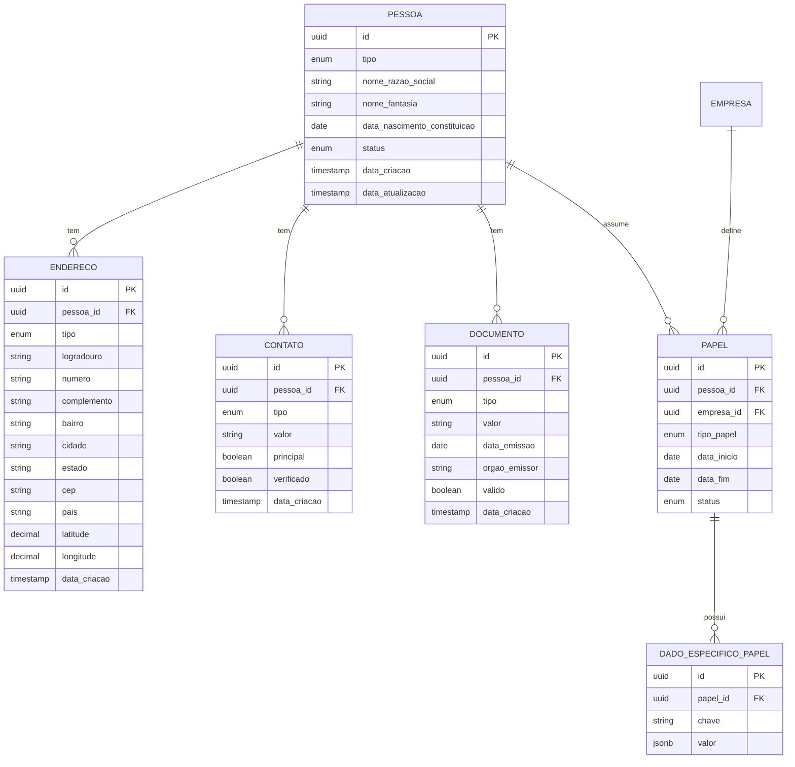

# 1️⃣ DOMÍNIO DE IDENTIDADE E PESSOAS

## 📋 Descrição Geral

Este domínio gerencia a identidade centralizada de entidades, permitindo que uma mesma pessoa física ou jurídica assuma múltiplos papéis de forma dinâmica, sem duplicação de dados. Adota uma abordagem de modelagem rica inspirada em DDD, onde a Pessoa é o agregado raiz, com papéis como entidades subordinadas que encapsulam comportamentos e regras específicas.

## 🎯 Objetivos

- Evitar confusão entre pessoa e papel
- Promover reutilização e escalabilidade em cenários multitenant
- Centralizar validações de documentos e dados pessoais
- Suportar histórico temporal de papéis
- Conformidade LGPD

## 🏗️ Entidades

### Pessoa (Agregado Raiz)

**Descrição**: Abstrai pessoa física e jurídica como entidade central.

| Campo                        | Tipo         | Constraints     | Descrição                       |
| ---------------------------- | ------------ | --------------- | ------------------------------- |
| id                           | UUID         | PK, NOT NULL    | Identificador único             |
| tipo                         | ENUM         | NOT NULL        | FISICA, JURIDICA                |
| nome_razao_social            | VARCHAR(255) | NOT NULL        | Nome ou razão social            |
| nome_fantasia                | VARCHAR(255) | NULL            | Apenas para pessoa jurídica     |
| data_nascimento_constituicao | DATE         | NULL            | Data nascimento ou constituição |
| status                       | ENUM         | DEFAULT 'ATIVO' | ATIVO, INATIVO                  |
| data_criacao                 | TIMESTAMP    | NOT NULL        | Data de criação                 |
| data_atualizacao             | TIMESTAMP    | NOT NULL        | Data última atualização         |

### Endereco

**Descrição**: Múltiplos endereços por pessoa com geolocalização.

| Campo        | Tipo          | Constraints  | Descrição                       |
| ------------ | ------------- | ------------ | ------------------------------- |
| id           | UUID          | PK, NOT NULL | Identificador único             |
| pessoa_id    | UUID          | FK, NOT NULL | Referência à pessoa             |
| tipo         | ENUM          | NOT NULL     | PRINCIPAL, ENTREGA, FATURAMENTO |
| logradouro   | VARCHAR(255)  | NOT NULL     | Rua, avenida, etc               |
| numero       | VARCHAR(20)   | NOT NULL     | Número do imóvel                |
| complemento  | VARCHAR(100)  | NULL         | Apartamento, bloco, etc         |
| bairro       | VARCHAR(100)  | NOT NULL     | Bairro                          |
| cidade       | VARCHAR(100)  | NOT NULL     | Cidade                          |
| estado       | VARCHAR(2)    | NOT NULL     | UF                              |
| cep          | VARCHAR(9)    | NOT NULL     | CEP formatado                   |
| pais         | VARCHAR(2)    | DEFAULT 'BR' | Código do país                  |
| latitude     | DECIMAL(10,8) | NULL         | Coordenada GPS                  |
| longitude    | DECIMAL(11,8) | NULL         | Coordenada GPS                  |
| data_criacao | TIMESTAMP     | NOT NULL     | Data de criação                 |

**Índices**:

- `idx_endereco_pessoa_id` (pessoa_id)
- `idx_endereco_cep` (cep)
- `idx_endereco_cidade_estado` (cidade, estado)

### Contato

**Descrição**: Múltiplos contatos por pessoa com validação e verificação.

| Campo        | Tipo         | Constraints   | Descrição                               |
| ------------ | ------------ | ------------- | --------------------------------------- |
| id           | UUID         | PK, NOT NULL  | Identificador único                     |
| pessoa_id    | UUID         | FK, NOT NULL  | Referência à pessoa                     |
| tipo         | ENUM         | NOT NULL      | EMAIL, TELEFONE_FIXO, CELULAR, WHATSAPP |
| valor        | VARCHAR(255) | NOT NULL      | Valor do contato                        |
| principal    | BOOLEAN      | DEFAULT FALSE | Contato principal                       |
| verificado   | BOOLEAN      | DEFAULT FALSE | Se foi verificado                       |
| data_criacao | TIMESTAMP    | NOT NULL      | Data de criação                         |

**Constraints Únicos**:

- `uk_contato_pessoa_tipo_valor` (pessoa_id, tipo, valor)

**Índices**:

- `idx_contato_pessoa_id` (pessoa_id)
- `idx_contato_valor` (valor)

### Documento

**Descrição**: Múltiplos documentos por pessoa com validação.

| Campo         | Tipo         | Constraints  | Descrição             |
| ------------- | ------------ | ------------ | --------------------- |
| id            | UUID         | PK, NOT NULL | Identificador único   |
| pessoa_id     | UUID         | FK, NOT NULL | Referência à pessoa   |
| tipo          | ENUM         | NOT NULL     | CPF, CNPJ, RG, IE, IM |
| valor         | VARCHAR(50)  | NOT NULL     | Valor do documento    |
| data_emissao  | DATE         | NULL         | Data de emissão       |
| orgao_emissor | VARCHAR(100) | NULL         | Órgão emissor         |
| valido        | BOOLEAN      | DEFAULT TRUE | Se documento é válido |
| data_criacao  | TIMESTAMP    | NOT NULL     | Data de criação       |

**Constraints Únicos**:

- `uk_documento_pessoa_tipo` (pessoa_id, tipo)
- `uk_documento_tipo_valor` (tipo, valor)

**Índices**:

- `idx_documento_pessoa_id` (pessoa_id)
- `idx_documento_tipo_valor` (tipo, valor)

### Papel

**Descrição**: Entidade dinâmica que vincula pessoa a empresa com papel específico.

| Campo       | Tipo | Constraints     | Descrição                                             |
| ----------- | ---- | --------------- | ----------------------------------------------------- |
| id          | UUID | PK, NOT NULL    | Identificador único                                   |
| pessoa_id   | UUID | FK, NOT NULL    | Referência à pessoa                                   |
| empresa_id  | UUID | FK, NOT NULL    | Referência à empresa                                  |
| tipo_papel  | ENUM | NOT NULL        | CLIENTE, PRESTADOR, FUNCIONARIO, FORNECEDOR, CONTADOR |
| data_inicio | DATE | NOT NULL        | Data início do papel                                  |
| data_fim    | DATE | NULL            | Data fim (para histórico)                             |
| status      | ENUM | DEFAULT 'ATIVO' | ATIVO, INATIVO                                        |

**Constraints Únicos**:

- `uk_papel_pessoa_empresa_tipo_ativo` (pessoa_id, empresa_id, tipo_papel) WHERE data_fim IS NULL

**Índices**:

- `idx_papel_pessoa_id` (pessoa_id)
- `idx_papel_empresa_id` (empresa_id)
- `idx_papel_tipo_status` (tipo_papel, status)

### DadoEspecificoPapel

**Descrição**: Extensões EAV para dados específicos por papel.

| Campo    | Tipo         | Constraints  | Descrição           |
| -------- | ------------ | ------------ | ------------------- |
| id       | UUID         | PK, NOT NULL | Identificador único |
| papel_id | UUID         | FK, NOT NULL | Referência ao papel |
| chave    | VARCHAR(100) | NOT NULL     | Nome da propriedade |
| valor    | JSONB        | NOT NULL     | Valor flexível      |

**Constraints Únicos**:

- `uk_dado_papel_chave` (papel_id, chave)

**Índices**:

- `idx_dado_papel_id` (papel_id)
- `idx_dado_chave` (chave)
- `gin_dado_valor` USING GIN (valor)

## 🔗 Relacionamentos

## ⚙️ Regras de Negócio

### Validações Pessoa

- **CPF/CNPJ**: Validação matemática obrigatória
- **Nome**: Mínimo 2 caracteres, máximo 255
- **Tipo**: Coerência entre tipo e documentos (CPF para física, CNPJ para jurídica)

### Validações Endereço

- **CEP**: Formato brasileiro válido (12345-678)
- **Tipo Principal**: Apenas um endereço principal por pessoa
- **Coordenadas**: Opcionais, mas se informadas devem estar dentro do Brasil

### Validações Contato

- **Email**: Formato válido obrigatório
- **Telefone**: Formato brasileiro com DDD
- **Principal**: Apenas um contato principal por tipo
- **Verificação**: Processo assíncrono para emails e telefones

### Validações Documento

- **Unicidade**: Um documento por tipo por pessoa
- **Formato**: Validação específica por tipo (CPF, CNPJ, RG, etc.)
- **Validade**: Verificação em órgãos competentes quando possível

### Validações Papel

- **Temporal**: Data fim deve ser posterior a data início
- **Unicidade**: Uma pessoa não pode ter o mesmo papel ativo na mesma empresa
- **Histórico**: Manter registros inativos para auditoria

## 🔒 Considerações de Segurança

### LGPD

- **Consentimento**: Campo específico para tracking de consentimento
- **Minimização**: Apenas dados necessários para o papel
- **Portabilidade**: Estrutura facilita exportação de dados
- **Exclusão**: Soft delete com anonimização de dados sensíveis

### Criptografia

- **Documentos**: Criptografia no nível de aplicação para CPF/CNPJ
- **Contatos**: Hash de emails para busca sem exposição
- **Logs**: Todos os acessos são logados para auditoria

## 📊 Métricas e Monitoramento

### KPIs

- **Duplicatas**: Monitorar pessoas com mesmo CPF/CNPJ
- **Verificação**: Taxa de contatos verificados
- **Papéis Ativos**: Distribuição por tipo e empresa
- **Qualidade**: Completude de dados por pessoa

### Alertas

- **Documentos Vencidos**: RG e certificados próximos ao vencimento
- **Contatos Não Verificados**: Emails/telefones pendentes
- **Papéis Órfãos**: Papéis sem dados específicos necessários

---

_Documento atualizado em: {{data_atual}}_
