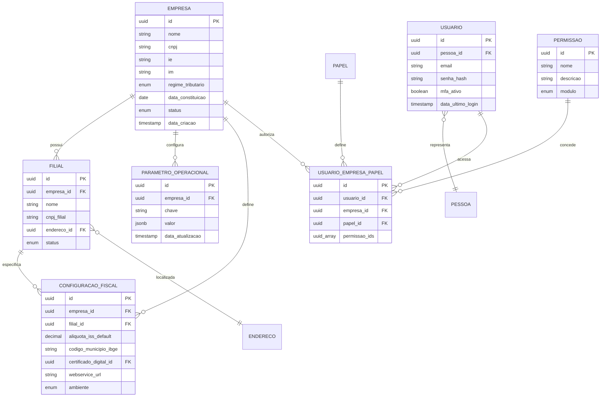

# 2️⃣ DOMÍNIO DE EMPRESA (MULTITENANT)

## 📋 Descrição Geral

Domínio central para multitenancy em SaaS, onde cada Empresa é um tenant isolado logicamente. Adota RBAC (Role-Based Access Control) integrado a papéis de pessoas, com configurações fiscais e operacionais por tenant. Modelagem rica: Empresa como agregado raiz, encapsulando filiais e usuários com regras de acesso.

## 🎯 Objetivos

- Isolamento multitenant completo e seguro
- RBAC granular com controle de permissões
- Configurações flexíveis por empresa/filial
- Escalabilidade para milhares de tenants
- Conformidade fiscal por localização

## 🏗️ Entidades

### Empresa (Tenant Raiz)
**Descrição**: Entidade central do multitenancy, representa cada cliente do SaaS.

| Campo | Tipo | Constraints | Descrição |
|-------|------|-------------|-----------|
| id | UUID | PK, NOT NULL | Identificador único do tenant |
| nome | VARCHAR(255) | NOT NULL | Nome da empresa |
| cnpj | VARCHAR(18) | UNIQUE, NOT NULL | CNPJ formatado |
| ie | VARCHAR(20) | NULL | Inscrição Estadual |
| im | VARCHAR(20) | NULL | Inscrição Municipal |
| regime_tributario | ENUM | NOT NULL | SIMPLES_NACIONAL, LUCRO_PRESUMIDO, LUCRO_REAL |
| data_constituicao | DATE | NULL | Data de constituição |
| status | ENUM | DEFAULT 'ATIVO' | ATIVO, INATIVO, SUSPENSO |
| data_criacao | TIMESTAMP | NOT NULL | Data de criação |

**Índices**:
- `idx_empresa_cnpj` (cnpj)
- `idx_empresa_status` (status)
- `idx_empresa_regime` (regime_tributario)

### Filial
**Descrição**: Subdivisões da empresa com configurações fiscais específicas.

| Campo | Tipo | Constraints | Descrição |
|-------|------|-------------|-----------|
| id | UUID | PK, NOT NULL | Identificador único |
| empresa_id | UUID | FK, NOT NULL | Referência à empresa |
| nome | VARCHAR(255) | NOT NULL | Nome da filial |
| cnpj_filial | VARCHAR(18) | NULL | CNPJ específico da filial |
| endereco_id | UUID | FK, NOT NULL | Endereço da filial |
| status | ENUM | DEFAULT 'ATIVO' | ATIVO, INATIVO |

**Índices**:
- `idx_filial_empresa_id` (empresa_id)
- `idx_filial_cnpj` (cnpj_filial)

### ParametroOperacional
**Descrição**: Configurações extensíveis via EAV por empresa.

| Campo | Tipo | Constraints | Descrição |
|-------|------|-------------|-----------|
| id | UUID | PK, NOT NULL | Identificador único |
| empresa_id | UUID | FK, NOT NULL | Referência à empresa |
| chave | VARCHAR(100) | NOT NULL | Nome do parâmetro |
| valor | JSONB | NOT NULL | Valor flexível |
| data_atualizacao | TIMESTAMP | NOT NULL | Última atualização |

**Constraints Únicos**:
- `uk_parametro_empresa_chave` (empresa_id, chave)

**Índices**:
- `idx_parametro_empresa_id` (empresa_id)
- `idx_parametro_chave` (chave)
- `gin_parametro_valor` USING GIN (valor)

### ConfiguracaoFiscal
**Descrição**: Configurações fiscais por empresa/filial para múltiplas prefeituras.

| Campo | Tipo | Constraints | Descrição |
|-------|------|-------------|-----------|
| id | UUID | PK, NOT NULL | Identificador único |
| empresa_id | UUID | FK, NOT NULL | Referência à empresa |
| filial_id | UUID | FK, NULL | Filial específica (opcional) |
| aliquota_iss_default | DECIMAL(5,2) | NOT NULL | Alíquota padrão ISS |
| codigo_municipio_ibge | VARCHAR(7) | NOT NULL | Código IBGE do município |
| certificado_digital_id | UUID | FK, NULL | Certificado para assinatura |
| webservice_url | VARCHAR(255) | NOT NULL | URL do webservice municipal |
| ambiente | ENUM | DEFAULT 'PRODUCAO' | PRODUCAO, HOMOLOGACAO |

**Índices**:
- `idx_config_fiscal_empresa_id` (empresa_id)
- `idx_config_fiscal_municipio` (codigo_municipio_ibge)
- `idx_config_fiscal_filial_id` (filial_id)

### Usuario
**Descrição**: Usuários do sistema, vinculados a pessoas do domínio de identidade.

| Campo | Tipo | Constraints | Descrição |
|-------|------|-------------|-----------|
| id | UUID | PK, NOT NULL | Identificador único |
| pessoa_id | UUID | FK, UNIQUE, NOT NULL | Referência à pessoa |
| email | VARCHAR(255) | UNIQUE, NOT NULL | Email de login |
| senha_hash | VARCHAR(255) | NOT NULL | Hash da senha |
| mfa_ativo | BOOLEAN | DEFAULT FALSE | Multi-factor auth ativo |
| data_ultimo_login | TIMESTAMP | NULL | Último acesso |

**Índices**:
- `idx_usuario_email` (email)
- `idx_usuario_pessoa_id` (pessoa_id)

### Permissao
**Descrição**: RBAC - permissões granulares do sistema.

| Campo | Tipo | Constraints | Descrição |
|-------|------|-------------|-----------|
| id | UUID | PK, NOT NULL | Identificador único |
| nome | VARCHAR(100) | UNIQUE, NOT NULL | Nome da permissão |
| descricao | VARCHAR(255) | NOT NULL | Descrição da permissão |
| modulo | ENUM | NOT NULL | FATURAMENTO, FISCAL, FINANCEIRO, ORDEM |

**Índices**:
- `idx_permissao_nome` (nome)
- `idx_permissao_modulo` (modulo)

### UsuarioEmpresaPapel
**Descrição**: Vínculo ternário para controle de acesso RBAC.

| Campo | Tipo | Constraints | Descrição |
|-------|------|-------------|-----------|
| id | UUID | PK, NOT NULL | Identificador único |
| usuario_id | UUID | FK, NOT NULL | Referência ao usuário |
| empresa_id | UUID | FK, NOT NULL | Empresa de acesso |
| papel_id | UUID | FK, NOT NULL | Papel na empresa |
| permissao_ids | UUID[] | NOT NULL | Array de permissões |

**Constraints Únicos**:
- `uk_usuario_empresa_papel` (usuario_id, empresa_id, papel_id)

**Índices**:
- `idx_uep_usuario_id` (usuario_id)
- `idx_uep_empresa_id` (empresa_id)
- `idx_uep_papel_id` (papel_id)
- `gin_uep_permissoes` USING GIN (permissao_ids)

## 🔗 Relacionamentos



## ⚙️ Regras de Negócio

### Validações Empresa
- **CNPJ**: Validação matemática obrigatória
- **Regime Tributário**: Coerência com tipo de empresa
- **Status**: Transições controladas (ativo↔inativo, suspensão)

### Validações Filial
- **CNPJ**: Se informado, deve ser diferente da matriz
- **Endereço**: Obrigatório e deve existir no domínio de identidade
- **Unicidade**: Nome único por empresa

### Validações Configuração Fiscal
- **Município**: Código IBGE válido
- **Alíquotas**: Entre 0% e 20% para ISS
- **Ambiente**: Homologação apenas para testes
- **Certificado**: Obrigatório para produção

### Validações RBAC
- **Usuário**: Email único globalmente
- **Papel**: Deve existir no domínio de identidade
- **Permissões**: Validação de array não vazio
- **Contexto**: Usuário só acessa empresas com vínculo ativo

## 🔒 Isolamento Multitenant

### Row Level Security (RLS)
```sql
-- Exemplo de política RLS
CREATE POLICY tenant_isolation ON tabela_qualquer
FOR ALL TO app_role
USING (empresa_id = current_setting('app.tenant_id')::uuid);
```

### Middleware de Tenant
- **Identificação**: Via subdomain ou header
- **Context**: Set session variable com empresa_id
- **Validação**: Usuário autorizado para o tenant

### Cache de Permissões
```json
{
  "user_id": "uuid",
  "tenant_id": "uuid", 
  "role": "ADMIN",
  "permissions": ["emitir_nfse", "criar_ordem"],
  "ttl": 3600
}
```

## 📈 Escalabilidade

### Sharding por Tenant
- **Particionamento**: Grandes tenants em shards dedicados
- **Roteamento**: Via tenant_id para distribuição
- **Backup**: Isolado por tenant para LGPD

### Índices Eficientes
- **Compostos**: (empresa_id, campo_busca) em todas as tabelas
- **Parciais**: WHERE ativo = true para dados ativos
- **GIN**: Para arrays de permissões e JSONBs

### Monitoramento por Tenant
- **Métricas**: Uso de recursos por empresa
- **Alertas**: Limites de API calls, storage
- **SLA**: Tempos de resposta por tenant

## 🔧 Configurações Padrão

### Parâmetros Operacionais
```json
{
  "moeda_padrao": "BRL",
  "timezone": "America/Sao_Paulo",
  "formato_data": "DD/MM/YYYY",
  "casas_decimais": 2,
  "api_rate_limit": 1000,
  "backup_retention_days": 30
}
```

### Permissões por Módulo
- **Faturamento**: emitir_fatura, cancelar_fatura, consultar_fatura
- **Fiscal**: emitir_nfse, cancelar_nfse, consultar_nfse
- **Ordem**: criar_ordem, editar_ordem, finalizar_ordem
- **Financeiro**: criar_conta, pagar_conta, conciliar

## 📊 Métricas e Monitoramento

### KPIs de Tenant
- **Usuários Ativos**: Login nos últimos 30 dias
- **Consumo API**: Calls por tenant por dia
- **Storage**: Tamanho de dados por tenant
- **Performance**: Tempo médio de resposta

### Alertas
- **Limite Atingido**: 90% do plano contratado
- **Performance**: Queries > 2s por tenant
- **Segurança**: Tentativas de acesso não autorizado
- **Backup**: Falhas em backup automático

---

*Documento atualizado em: {{data_atual}}*
