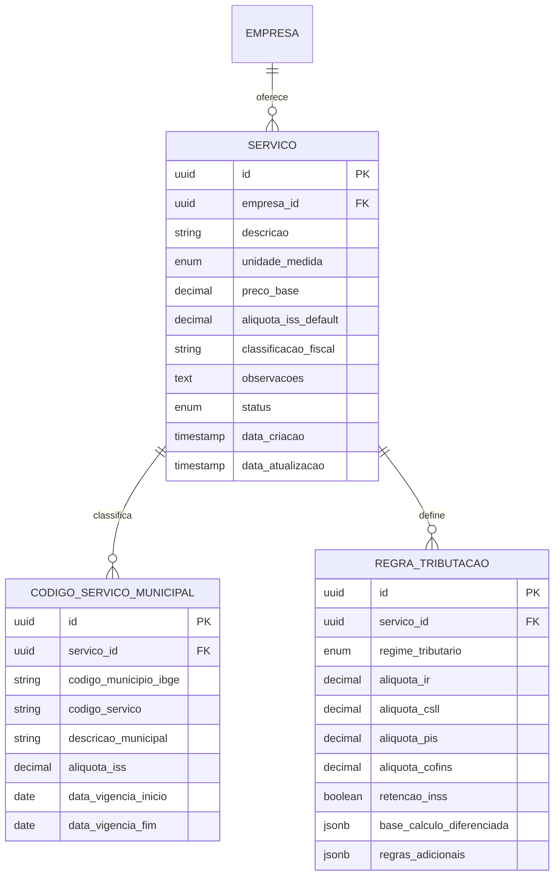

# 3️⃣ DOMÍNIO DE CATÁLOGO DE SERVIÇOS

## 📋 Descrição Geral

Domínio para gerenciamento de serviços prestados, com ênfase em classificação fiscal brasileira. Modelagem rica: Serviço como agregado, encapsulando regras tributárias por município para evitar cálculos anêmicos. Preparado para complexidade da legislação brasileira com múltiplas alíquotas e regimes.

## 🎯 Objetivos

- Catálogo centralizado de serviços por tenant
- Classificação fiscal automatizada
- Regras tributárias dinâmicas por localização
- Integração com códigos municipais
- Cálculo automático de impostos

## 🏗️ Entidades

### Servico (Agregado Raiz)
**Descrição**: Serviço prestado pela empresa com configurações fiscais.

| Campo | Tipo | Constraints | Descrição |
|-------|------|-------------|-----------|
| id | UUID | PK, NOT NULL | Identificador único |
| empresa_id | UUID | FK, NOT NULL | Tenant isolamento |
| descricao | VARCHAR(500) | NOT NULL | Descrição do serviço |
| unidade_medida | ENUM | NOT NULL | HORA, DIA, PROJETO, UNIDADE |
| preco_base | DECIMAL(10,2) | NOT NULL | Preço base sugerido |
| aliquota_iss_default | DECIMAL(5,2) | NOT NULL | Alíquota ISS padrão |
| classificacao_fiscal | VARCHAR(20) | NOT NULL | Código CNAE ou similar |
| observacoes | TEXT | NULL | Observações adicionais |
| status | ENUM | DEFAULT 'ATIVO' | ATIVO, INATIVO |
| data_criacao | TIMESTAMP | NOT NULL | Data de criação |
| data_atualizacao | TIMESTAMP | NOT NULL | Última atualização |

**Índices**:
- `idx_servico_empresa_id` (empresa_id)
- `idx_servico_classificacao` (classificacao_fiscal)
- `idx_servico_status` (status)

### CodigoServicoMunicipal
**Descrição**: Códigos e alíquotas específicas por município.

| Campo | Tipo | Constraints | Descrição |
|-------|------|-------------|-----------|
| id | UUID | PK, NOT NULL | Identificador único |
| servico_id | UUID | FK, NOT NULL | Referência ao serviço |
| codigo_municipio_ibge | VARCHAR(7) | NOT NULL | Código IBGE do município |
| codigo_servico | VARCHAR(20) | NOT NULL | Código do serviço no município |
| descricao_municipal | VARCHAR(255) | NULL | Descrição conforme prefeitura |
| aliquota_iss | DECIMAL(5,2) | NOT NULL | Alíquota específica |
| data_vigencia_inicio | DATE | NOT NULL | Início da vigência |
| data_vigencia_fim | DATE | NULL | Fim da vigência |

**Constraints Únicos**:
- `uk_codigo_servico_municipio_vigencia` (servico_id, codigo_municipio_ibge, data_vigencia_inicio)

**Índices**:
- `idx_codigo_servico_id` (servico_id)
- `idx_codigo_municipio` (codigo_municipio_ibge)
- `idx_codigo_vigencia` (data_vigencia_inicio, data_vigencia_fim)

### RegraTributacao
**Descrição**: Regras tributárias específicas por regime e serviço.

| Campo | Tipo | Constraints | Descrição |
|-------|------|-------------|-----------|
| id | UUID | PK, NOT NULL | Identificador único |
| servico_id | UUID | FK, NOT NULL | Referência ao serviço |
| regime_tributario | ENUM | NOT NULL | SIMPLES_NACIONAL, LUCRO_PRESUMIDO, LUCRO_REAL |
| aliquota_ir | DECIMAL(5,2) | DEFAULT 0 | Alíquota Imposto de Renda |
| aliquota_csll | DECIMAL(5,2) | DEFAULT 0 | Alíquota CSLL |
| aliquota_pis | DECIMAL(5,2) | DEFAULT 0 | Alíquota PIS |
| aliquota_cofins | DECIMAL(5,2) | DEFAULT 0 | Alíquota COFINS |
| retencao_inss | BOOLEAN | DEFAULT FALSE | Se há retenção de INSS |
| base_calculo_diferenciada | JSONB | NULL | Regras especiais de cálculo |
| regras_adicionais | JSONB | NULL | Regras específicas |

**Constraints Únicos**:
- `uk_regra_servico_regime` (servico_id, regime_tributario)

**Índices**:
- `idx_regra_servico_id` (servico_id)
- `idx_regra_regime` (regime_tributario)
- `gin_regra_adicionais` USING GIN (regras_adicionais)

## 🔗 Relacionamentos



## ⚙️ Regras de Negócio

### Validações Serviço
- **Descrição**: Mínimo 10 caracteres, máximo 500
- **Preço Base**: Maior que zero
- **Alíquota ISS**: Entre 2% e 5% (conforme legislação)
- **Classificação Fiscal**: Formato CNAE válido

### Validações Código Municipal
- **Município**: Código IBGE existente
- **Vigência**: Data início <= data fim
- **Sobreposição**: Não permitir códigos sobrepostos no tempo
- **Alíquota**: Dentro dos limites municipais

### Validações Regra Tributação
- **Alíquotas**: Somatório <= 100%
- **Regime**: Coerente com empresa
- **Base Cálculo**: JSON válido com regras
- **INSS**: Apenas para determinados serviços

### Cálculos Automáticos
```typescript
interface CalculoImpostos {
  valorServico: number;
  municipioPrestacao: string;
  regimeTributario: RegimeTributario;
  
  // Retorno
  valorISS: number;
  valorIR: number;
  valorCSLL: number;
  valorPIS: number;
  valorCOFINS: number;
  valorINSS: number;
  valorLiquido: number;
}
```

## 📋 Códigos Municipais Padrão

### Principais Municípios
```sql
-- São Paulo - SP (3550308)
INSERT INTO codigo_servico_municipal VALUES 
('...', '...', '3550308', '01.01', 'Análise e desenvolvimento de sistemas', 2.00, '2024-01-01', NULL);

-- Rio de Janeiro - RJ (3304557) 
INSERT INTO codigo_servico_municipal VALUES
('...', '...', '3304557', '1.01', 'Análise e desenvolvimento de sistemas', 5.00, '2024-01-01', NULL);

-- Brasília - DF (5300108)
INSERT INTO codigo_servico_municipal VALUES
('...', '...', '5300108', '1.01', 'Análise e desenvolvimento de sistemas', 2.00, '2024-01-01', NULL);
```

### Categorias de Serviço Comuns
- **01.01** - Análise e desenvolvimento de sistemas
- **01.02** - Programação
- **01.03** - Processamento de dados
- **01.04** - Elaboração de programas de computadores
- **01.05** - Licenciamento ou cessão de direito de uso de programas

## 🔧 Configurações Fiscais

### Simples Nacional
```json
{
  "anexo": "III",
  "aliquota_unificada": 6.0,
  "faixa_faturamento": "ate_180k",
  "impostos_inclusos": ["IRPJ", "CSLL", "PIS", "COFINS", "ISS"]
}
```

### Lucro Presumido
```json
{
  "base_calculo_ir": 32.0,
  "aliquota_ir": 15.0,
  "adicional_ir": 10.0,
  "base_calculo_csll": 32.0,
  "aliquota_csll": 9.0,
  "aliquota_pis": 0.65,
  "aliquota_cofins": 3.0
}
```

### Lucro Real
```json
{
  "apuracao": "trimestral",
  "aliquota_ir": 15.0,
  "adicional_ir": 10.0,
  "aliquota_csll": 9.0,
  "pis_cofins_cumulativo": false,
  "aliquota_pis": 1.65,
  "aliquota_cofins": 7.6
}
```

## 📊 Relatórios e Análises

### Análise de Margem
- **Custo Total**: Impostos + custos operacionais
- **Margem Bruta**: (Preço - Impostos) / Preço
- **Margem Líquida**: (Preço - Todos Custos) / Preço
- **Competitividade**: Comparação com mercado

### Simulação Tributária
- **Cenários**: Diferentes regimes para mesmo serviço
- **Impacto Municipal**: Análise por localização
- **Otimização**: Sugestões de classificação

### KPIs
- **Serviços Ativos**: Por categoria e município
- **Margem Média**: Por tipo de serviço
- **Compliance**: % serviços com códigos atualizados
- **Performance**: Tempo médio de cálculo

## 🔄 Integração com APIs Externas

### Receita Federal
- **CNAE**: Validação de códigos de atividade
- **Simples Nacional**: Consulta de enquadramento
- **Alíquotas**: Atualizações automáticas

### Prefeituras
- **Códigos de Serviço**: Sincronização periódica
- **Alíquotas**: Monitoramento de mudanças
- **Legislação**: Alertas sobre alterações

### IBGE
- **Códigos Municipais**: Base atualizada
- **Divisões Territoriais**: Mudanças administrativas

---

*Documento atualizado em: {{data_atual}}*
