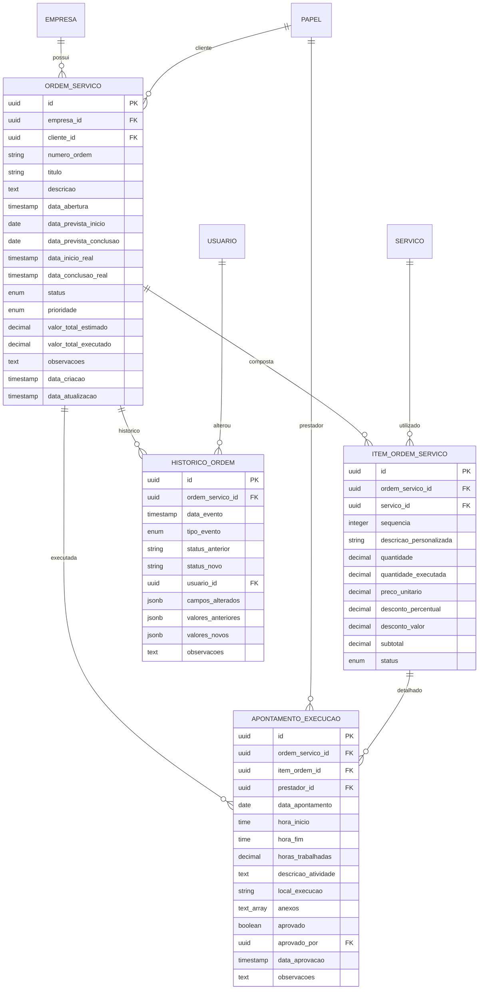
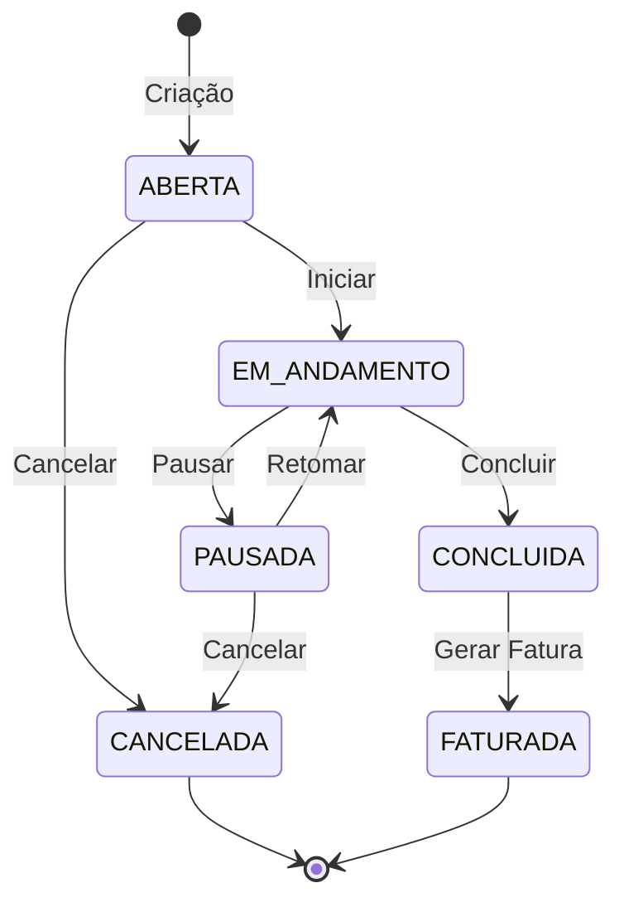

# 4️⃣ DOMÍNIO DE ORDEM DE SERVIÇO

## 📋 Descrição Geral

Domínio para gerenciamento completo de ordens de serviço, desde abertura até faturamento. Modelagem rica: OrdemServico como agregado raiz, encapsulando workflow de estados finitos, apontamentos de execução e histórico completo para auditoria e rastreabilidade.

## 🎯 Objetivos

- Gestão completa do ciclo de vida das ordens
- Controle rigoroso de estados e transições
- Rastreabilidade total de execução
- Integração com faturamento e fiscal
- Apontamento detalhado de horas e atividades

## 🏗️ Entidades

### OrdemServico (Agregado Raiz)
**Descrição**: Ordem de serviço com controle de workflow e estados.

| Campo | Tipo | Constraints | Descrição |
|-------|------|-------------|-----------|
| id | UUID | PK, NOT NULL | Identificador único |
| empresa_id | UUID | FK, NOT NULL | Tenant isolamento |
| cliente_id | UUID | FK, NOT NULL | Cliente (via Papel) |
| numero_ordem | VARCHAR(20) | NOT NULL | Número sequencial por empresa |
| titulo | VARCHAR(255) | NOT NULL | Título resumido da ordem |
| descricao | TEXT | NULL | Descrição detalhada |
| data_abertura | TIMESTAMP | NOT NULL | Data/hora de abertura |
| data_prevista_inicio | DATE | NULL | Previsão de início |
| data_prevista_conclusao | DATE | NULL | Previsão de conclusão |
| data_inicio_real | TIMESTAMP | NULL | Início real da execução |
| data_conclusao_real | TIMESTAMP | NULL | Conclusão real |
| status | ENUM | DEFAULT 'ABERTA' | ABERTA, EM_ANDAMENTO, PAUSADA, CONCLUIDA, FATURADA, CANCELADA |
| prioridade | ENUM | DEFAULT 'NORMAL' | BAIXA, NORMAL, ALTA, CRITICA |
| valor_total_estimado | DECIMAL(10,2) | DEFAULT 0 | Valor estimado total |
| valor_total_executado | DECIMAL(10,2) | DEFAULT 0 | Valor executado (calculado) |
| observacoes | TEXT | NULL | Observações gerais |
| data_criacao | TIMESTAMP | NOT NULL | Data de criação |
| data_atualizacao | TIMESTAMP | NOT NULL | Última atualização |

**Constraints Únicos**:
- `uk_ordem_empresa_numero` (empresa_id, numero_ordem)

**Índices**:
- `idx_ordem_empresa_id` (empresa_id)
- `idx_ordem_cliente_id` (cliente_id)
- `idx_ordem_status` (status)
- `idx_ordem_numero` (numero_ordem)
- `idx_ordem_data_abertura` (data_abertura)

### ItemOrdemServico
**Descrição**: Itens/serviços que compõem a ordem.

| Campo | Tipo | Constraints | Descrição |
|-------|------|-------------|-----------|
| id | UUID | PK, NOT NULL | Identificador único |
| ordem_servico_id | UUID | FK, NOT NULL | Referência à ordem |
| servico_id | UUID | FK, NOT NULL | Serviço do catálogo |
| sequencia | INTEGER | NOT NULL | Ordem dos itens |
| descricao_personalizada | VARCHAR(500) | NULL | Descrição específica |
| quantidade | DECIMAL(10,2) | NOT NULL | Quantidade planejada |
| quantidade_executada | DECIMAL(10,2) | DEFAULT 0 | Quantidade executada |
| preco_unitario | DECIMAL(10,2) | NOT NULL | Preço unitário acordado |
| desconto_percentual | DECIMAL(5,2) | DEFAULT 0 | Desconto em % |
| desconto_valor | DECIMAL(10,2) | DEFAULT 0 | Desconto em valor |
| subtotal | DECIMAL(10,2) | NOT NULL | Subtotal calculado |
| status | ENUM | DEFAULT 'PENDENTE' | PENDENTE, EM_EXECUCAO, CONCLUIDO, CANCELADO |

**Índices**:
- `idx_item_ordem_id` (ordem_servico_id)
- `idx_item_servico_id` (servico_id)
- `idx_item_sequencia` (ordem_servico_id, sequencia)

### ApontamentoExecucao
**Descrição**: Registro detalhado de execução por prestadores.

| Campo | Tipo | Constraints | Descrição |
|-------|------|-------------|-----------|
| id | UUID | PK, NOT NULL | Identificador único |
| ordem_servico_id | UUID | FK, NOT NULL | Referência à ordem |
| item_ordem_id | UUID | FK, NULL | Item específico (opcional) |
| prestador_id | UUID | FK, NOT NULL | Prestador (via Papel) |
| data_apontamento | DATE | NOT NULL | Data do apontamento |
| hora_inicio | TIME | NOT NULL | Hora de início |
| hora_fim | TIME | NOT NULL | Hora de fim |
| horas_trabalhadas | DECIMAL(4,2) | NOT NULL | Horas calculadas |
| descricao_atividade | TEXT | NOT NULL | Descrição da atividade |
| local_execucao | VARCHAR(255) | NULL | Local onde foi executado |
| anexos | TEXT[] | NULL | Array de paths de anexos |
| aprovado | BOOLEAN | DEFAULT FALSE | Se foi aprovado |
| aprovado_por | UUID | FK, NULL | Quem aprovou |
| data_aprovacao | TIMESTAMP | NULL | Quando foi aprovado |
| observacoes | TEXT | NULL | Observações do apontamento |

**Índices**:
- `idx_apontamento_ordem_id` (ordem_servico_id)
- `idx_apontamento_prestador_id` (prestador_id)
- `idx_apontamento_data` (data_apontamento)
- `idx_apontamento_aprovado` (aprovado)

### HistoricoOrdem
**Descrição**: Histórico completo de mudanças para auditoria.

| Campo | Tipo | Constraints | Descrição |
|-------|------|-------------|-----------|
| id | UUID | PK, NOT NULL | Identificador único |
| ordem_servico_id | UUID | FK, NOT NULL | Referência à ordem |
| data_evento | TIMESTAMP | NOT NULL | Data/hora do evento |
| tipo_evento | ENUM | NOT NULL | CRIACAO, ALTERACAO, STATUS_CHANGE, APROVACAO |
| status_anterior | VARCHAR(50) | NULL | Status anterior |
| status_novo | VARCHAR(50) | NULL | Novo status |
| usuario_id | UUID | FK, NOT NULL | Usuário responsável |
| campos_alterados | JSONB | NULL | Campos que foram alterados |
| valores_anteriores | JSONB | NULL | Valores antes da alteração |
| valores_novos | JSONB | NULL | Novos valores |
| observacoes | TEXT | NULL | Observações do evento |

**Índices**:
- `idx_historico_ordem_id` (ordem_servico_id)
- `idx_historico_data_evento` (data_evento)
- `idx_historico_usuario_id` (usuario_id)
- `idx_historico_tipo_evento` (tipo_evento)
- `gin_historico_campos` USING GIN (campos_alterados)

## 🔗 Relacionamentos



## ⚙️ Regras de Negócio

### Máquina de Estados


### Validações Estado
- **ABERTA → EM_ANDAMENTO**: Pelo menos um item deve existir
- **EM_ANDAMENTO → CONCLUIDA**: Todos os itens devem estar concluídos
- **CONCLUIDA → FATURADA**: Não pode voltar atrás
- **CANCELADA**: Estado final, não permite alterações

### Validações Item
- **Quantidade**: Maior que zero
- **Preço**: Maior que zero
- **Desconto**: Entre 0% e 100%
- **Execução**: Quantidade executada <= quantidade planejada

### Validações Apontamento
- **Horas**: Início < fim, máximo 24h por dia
- **Data**: Não pode ser futura
- **Prestador**: Deve ter papel ativo na empresa
- **Aprovação**: Apenas supervisores podem aprovar

### Cálculos Automáticos
```typescript
// Subtotal do item
subtotal = (quantidade * preco_unitario) - desconto_valor - (quantidade * preco_unitario * desconto_percentual / 100)

// Total da ordem
valor_total_estimado = SUM(itens.subtotal)

// Valor executado
valor_total_executado = SUM(apontamentos.horas * preco_hora_prestador)

// Progresso
percentual_conclusao = (quantidade_executada / quantidade) * 100
```

## 📊 Workflow e Aprovações

### Fluxo de Aprovação
1. **Criação**: Ordem criada com status ABERTA
2. **Validação**: Verificação de dados obrigatórios
3. **Aprovação Cliente**: Cliente aprova o orçamento
4. **Execução**: Apontamentos de prestadores
5. **Aprovação Técnica**: Supervisão aprova execução
6. **Conclusão**: Ordem marcada como CONCLUIDA
7. **Faturamento**: Geração automática de fatura

### Notificações
- **Criação**: Cliente e prestadores designados
- **Status Change**: Todos os envolvidos
- **Apontamento**: Supervisores para aprovação
- **Atraso**: Quando passa prazo previsto
- **Conclusão**: Cliente e área comercial

## 📈 Métricas e KPIs

### Operacionais
- **SLA**: % ordens dentro do prazo
- **Eficiência**: Horas estimadas vs executadas
- **Qualidade**: % apontamentos aprovados na primeira
- **Produtividade**: Ordens por prestador por período

### Financeiras
- **Margem**: Valor faturado vs custo execução
- **Faturamento**: Valor médio por ordem
- **Inadimplência**: % ordens não pagas
- **Lucratividade**: Por tipo de serviço

### Clientes
- **Satisfação**: Avaliação pós-conclusão
- **Retenção**: % clientes recorrentes
- **Ticket Médio**: Valor médio por cliente
- **Tempo Resposta**: Velocidade de atendimento

## 🔧 Configurações por Empresa

### Numeração
```json
{
  "formato": "OS-{YYYY}-{MM}-{NNNN}",
  "reinicia_ano": true,
  "prefixo_personalizado": "OS",
  "digitos_sequencia": 4
}
```

### Workflow
```json
{
  "aprovacao_obrigatoria": true,
  "aprovador_automatico": false,
  "notificacoes_ativas": true,
  "prazo_aprovacao_horas": 48,
  "permitir_alteracao_concluida": false
}
```

### Integrações
```json
{
  "faturamento_automatico": true,
  "sincronizar_calendario": true,
  "webhook_url": "https://...",
  "api_terceiros": ["timesheet", "crm"]
}
```

---

*Documento atualizado em: {{data_atual}}*
