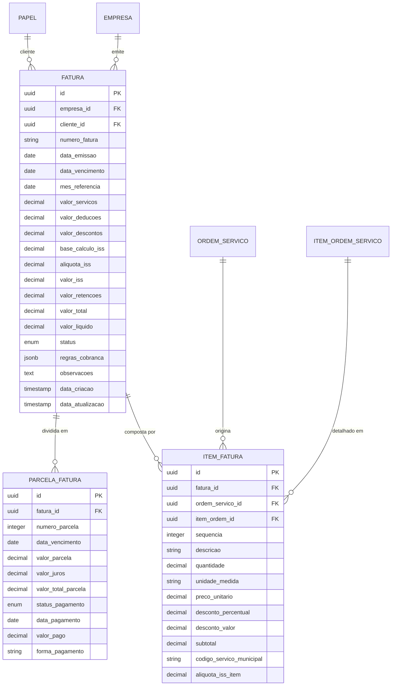
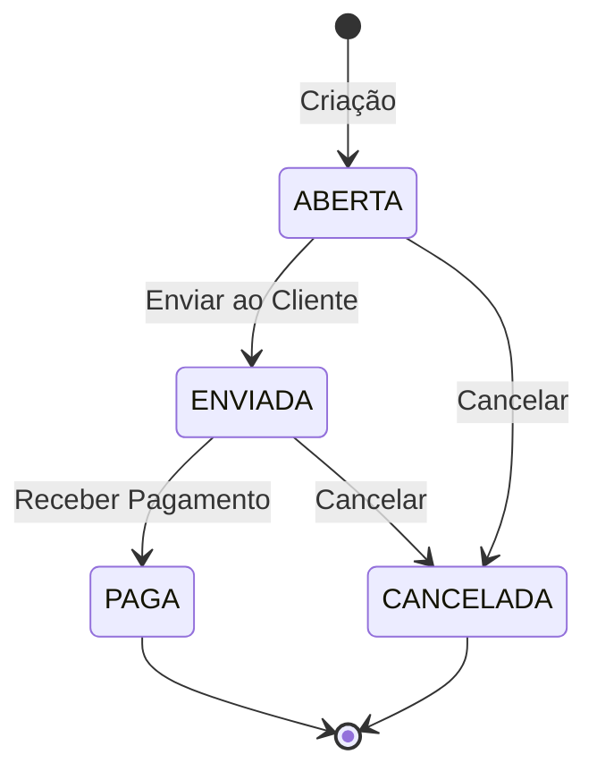

# 5️⃣ DOMÍNIO DE FATURAMENTO

## 📋 Descrição Geral

Domínio para geração de faturas a partir de ordens de serviço, com integração direta ao financeiro e fiscal. Modelagem rica: Fatura como agregado, encapsulando regras de agrupamento, parcelamento e cálculos automáticos de impostos. Preparado para diferentes modelos de cobrança.

## 🎯 Objetivos

- Consolidação automática de ordens em faturas
- Flexibilidade de agrupamento por cliente/período
- Parcelamento dinâmico conforme regras
- Integração seamless com domínio fiscal
- Controle rigoroso de status e workflow

## 🏗️ Entidades

### Fatura (Agregado Raiz)
**Descrição**: Documento de cobrança consolidado com cálculos fiscais integrados.

| Campo | Tipo | Constraints | Descrição |
|-------|------|-------------|-----------|
| id | UUID | PK, NOT NULL | Identificador único |
| empresa_id | UUID | FK, NOT NULL | Tenant isolamento |
| cliente_id | UUID | FK, NOT NULL | Cliente (via Papel) |
| numero_fatura | VARCHAR(20) | NOT NULL | Número sequencial por empresa |
| data_emissao | DATE | NOT NULL | Data de emissão |
| data_vencimento | DATE | NOT NULL | Data de vencimento |
| mes_referencia | DATE | NOT NULL | Mês de referência dos serviços |
| valor_servicos | DECIMAL(10,2) | NOT NULL | Valor bruto dos serviços |
| valor_deducoes | DECIMAL(10,2) | DEFAULT 0 | Deduções aplicáveis |
| valor_descontos | DECIMAL(10,2) | DEFAULT 0 | Descontos comerciais |
| base_calculo_iss | DECIMAL(10,2) | NOT NULL | Base para cálculo ISS |
| aliquota_iss | DECIMAL(5,2) | NOT NULL | Alíquota ISS aplicada |
| valor_iss | DECIMAL(10,2) | NOT NULL | Valor ISS calculado |
| valor_retencoes | DECIMAL(10,2) | DEFAULT 0 | Total de retenções |
| valor_total | DECIMAL(10,2) | NOT NULL | Valor total da fatura |
| valor_liquido | DECIMAL(10,2) | NOT NULL | Valor líquido (após retenções) |
| status | ENUM | DEFAULT 'ABERTA' | ABERTA, ENVIADA, PAGA, CANCELADA |
| regras_cobranca | JSONB | NULL | Regras específicas de cobrança |
| observacoes | TEXT | NULL | Observações da fatura |
| data_criacao | TIMESTAMP | NOT NULL | Data de criação |
| data_atualizacao | TIMESTAMP | NOT NULL | Última atualização |

**Constraints Únicos**:
- `uk_fatura_empresa_numero` (empresa_id, numero_fatura)

**Índices**:
- `idx_fatura_empresa_id` (empresa_id)
- `idx_fatura_cliente_id` (cliente_id)
- `idx_fatura_data_emissao` (data_emissao)
- `idx_fatura_status` (status)
- `idx_fatura_mes_referencia` (mes_referencia)

### ItemFatura
**Descrição**: Itens que compõem a fatura, originados de ordens de serviço.

| Campo | Tipo | Constraints | Descrição |
|-------|------|-------------|-----------|
| id | UUID | PK, NOT NULL | Identificador único |
| fatura_id | UUID | FK, NOT NULL | Referência à fatura |
| ordem_servico_id | UUID | FK, NOT NULL | Ordem de origem |
| item_ordem_id | UUID | FK, NOT NULL | Item específico da ordem |
| sequencia | INTEGER | NOT NULL | Sequência na fatura |
| descricao | VARCHAR(500) | NOT NULL | Descrição do serviço |
| quantidade | DECIMAL(10,2) | NOT NULL | Quantidade faturada |
| unidade_medida | VARCHAR(10) | NOT NULL | Unidade de medida |
| preco_unitario | DECIMAL(10,2) | NOT NULL | Preço unitário |
| desconto_percentual | DECIMAL(5,2) | DEFAULT 0 | Desconto em % |
| desconto_valor | DECIMAL(10,2) | DEFAULT 0 | Desconto em valor |
| subtotal | DECIMAL(10,2) | NOT NULL | Subtotal do item |
| codigo_servico_municipal | VARCHAR(20) | NOT NULL | Código do serviço no município |
| aliquota_iss_item | DECIMAL(5,2) | NOT NULL | Alíquota ISS do item |

**Índices**:
- `idx_item_fatura_id` (fatura_id)
- `idx_item_ordem_servico_id` (ordem_servico_id)
- `idx_item_sequencia` (fatura_id, sequencia)

### ParcelaFatura
**Descrição**: Parcelas para pagamento da fatura.

| Campo | Tipo | Constraints | Descrição |
|-------|------|-------------|-----------|
| id | UUID | PK, NOT NULL | Identificador único |
| fatura_id | UUID | FK, NOT NULL | Referência à fatura |
| numero_parcela | INTEGER | NOT NULL | Número da parcela |
| data_vencimento | DATE | NOT NULL | Data de vencimento |
| valor_parcela | DECIMAL(10,2) | NOT NULL | Valor da parcela |
| valor_juros | DECIMAL(10,2) | DEFAULT 0 | Juros de parcelamento |
| valor_total_parcela | DECIMAL(10,2) | NOT NULL | Valor total da parcela |
| status_pagamento | ENUM | DEFAULT 'PENDENTE' | PENDENTE, PAGO, ATRASADO, CANCELADO |
| data_pagamento | DATE | NULL | Data do pagamento |
| valor_pago | DECIMAL(10,2) | NULL | Valor efetivamente pago |
| forma_pagamento | VARCHAR(50) | NULL | Como foi pago |

**Constraints Únicos**:
- `uk_parcela_fatura_numero` (fatura_id, numero_parcela)

**Índices**:
- `idx_parcela_fatura_id` (fatura_id)
- `idx_parcela_vencimento` (data_vencimento)
- `idx_parcela_status` (status_pagamento)

## 🔗 Relacionamentos



## ⚙️ Regras de Negócio

### Validações Fatura
- **Datas**: Data emissão <= data vencimento
- **Valores**: Soma de itens deve bater com total
- **Cliente**: Deve ter papel ativo de cliente
- **Numeração**: Sequencial por empresa sem gaps

### Cálculos Automáticos
```typescript
interface CalculoFatura {
  // Entrada
  itens: ItemFatura[];
  cliente: Cliente;
  municipio: string;
  
  // Cálculos
  valorServicos: number;        // Soma dos subtotais
  valorDeducoes: number;        // Deduções aplicáveis
  baseCalculoISS: number;       // Base para ISS
  valorISS: number;            // ISS calculado
  valorRetencoes: number;      // Retenções totais
  valorTotal: number;          // Total bruto
  valorLiquido: number;        // Líquido após retenções
}
```

### Regras de Agrupamento
- **Por Cliente**: Uma fatura por cliente por período
- **Por Projeto**: Agrupar ordens do mesmo projeto
- **Por Data**: Ordens concluídas no período
- **Customizado**: Regras específicas via JSONB

### Parcelamento
```json
{
  "tipo": "FIXO",
  "quantidade_parcelas": 3,
  "intervalo_dias": 30,
  "juros_parcelamento": 1.5,
  "primeira_parcela_diferenciada": true,
  "entrada_percentual": 30
}
```

## 🔄 Workflow de Estados

### Máquina de Estados


### Transições Automáticas
- **ABERTA → ENVIADA**: Após geração de RPS
- **ENVIADA → PAGA**: Após confirmação de pagamento
- **Qualquer → CANCELADA**: Apenas se não houver NFS-e emitida

## 📊 Processos de Faturamento

### 1. Faturamento Automático Mensal
```sql
-- Buscar ordens concluídas para faturamento
WITH ordens_para_faturar AS (
    SELECT 
        o.cliente_id,
        o.empresa_id,
        DATE_TRUNC('month', o.data_conclusao_real) as mes_ref,
        COUNT(*) as qtd_ordens,
        SUM(o.valor_total_executado) as valor_total
    FROM ordem_servico o
    WHERE o.status = 'CONCLUIDA'
    AND NOT EXISTS (
        SELECT 1 FROM item_fatura if 
        WHERE if.ordem_servico_id = o.id
    )
    GROUP BY o.cliente_id, o.empresa_id, DATE_TRUNC('month', o.data_conclusao_real)
)
SELECT * FROM ordens_para_faturar;
```

### 2. Geração de Fatura
```sql
-- Criar fatura
INSERT INTO fatura (
    id, empresa_id, cliente_id, numero_fatura,
    data_emissao, data_vencimento, mes_referencia,
    valor_servicos, base_calculo_iss, aliquota_iss,
    valor_iss, valor_total, valor_liquido, status
)
VALUES (
    uuid_generate_v4(), @empresa_id, @cliente_id, 
    (SELECT COALESCE(MAX(numero_fatura::integer), 0) + 1 FROM fatura WHERE empresa_id = @empresa_id),
    CURRENT_DATE, CURRENT_DATE + INTERVAL '30 days', @mes_referencia,
    @valor_servicos, @valor_servicos, @aliquota_iss,
    @valor_servicos * @aliquota_iss / 100,
    @valor_servicos, @valor_servicos - (@valor_servicos * @aliquota_iss / 100),
    'ABERTA'
);

-- Criar itens da fatura
INSERT INTO item_fatura (
    id, fatura_id, ordem_servico_id, item_ordem_id,
    sequencia, descricao, quantidade, unidade_medida,
    preco_unitario, subtotal, codigo_servico_municipal, aliquota_iss_item
)
SELECT 
    uuid_generate_v4(), @fatura_id, ios.ordem_servico_id, ios.id,
    ROW_NUMBER() OVER (ORDER BY ios.id),
    ios.descricao_personalizada COALESCE s.descricao,
    ios.quantidade_executada, s.unidade_medida,
    ios.preco_unitario, ios.subtotal,
    csm.codigo_servico, csm.aliquota_iss
FROM item_ordem_servico ios
JOIN ordem_servico os ON os.id = ios.ordem_servico_id
JOIN servico s ON s.id = ios.servico_id
LEFT JOIN codigo_servico_municipal csm ON csm.servico_id = s.id
WHERE os.cliente_id = @cliente_id
AND os.status = 'CONCLUIDA';
```

### 3. Criação de Parcelas
```sql
-- Gerar parcelas conforme regras
WITH regras AS (
    SELECT 
        (regras_cobranca->>'quantidade_parcelas')::integer as qty_parcelas,
        (regras_cobranca->>'intervalo_dias')::integer as intervalo,
        (regras_cobranca->>'juros_parcelamento')::decimal as juros
    FROM fatura WHERE id = @fatura_id
)
INSERT INTO parcela_fatura (
    id, fatura_id, numero_parcela, data_vencimento,
    valor_parcela, valor_juros, valor_total_parcela, status_pagamento
)
SELECT 
    uuid_generate_v4(), @fatura_id, generate_series(1, r.qty_parcelas),
    f.data_vencimento + (generate_series(0, r.qty_parcelas-1) * INTERVAL '1 day' * r.intervalo),
    f.valor_total / r.qty_parcelas,
    CASE WHEN generate_series(1, r.qty_parcelas) > 1 
         THEN (f.valor_total / r.qty_parcelas) * r.juros / 100 
         ELSE 0 END,
    (f.valor_total / r.qty_parcelas) + 
    CASE WHEN generate_series(1, r.qty_parcelas) > 1 
         THEN (f.valor_total / r.qty_parcelas) * r.juros / 100 
         ELSE 0 END,
    'PENDENTE'
FROM fatura f, regras r
WHERE f.id = @fatura_id;
```

## 📈 Relatórios e Analytics

### Faturamento por Período
```sql
SELECT 
    DATE_TRUNC('month', f.data_emissao) as mes,
    COUNT(*) as qtd_faturas,
    SUM(f.valor_total) as valor_total,
    SUM(f.valor_liquido) as valor_liquido,
    AVG(f.valor_total) as ticket_medio
FROM fatura f
WHERE f.empresa_id = @empresa_id
AND f.status != 'CANCELADA'
AND f.data_emissao >= CURRENT_DATE - INTERVAL '12 months'
GROUP BY DATE_TRUNC('month', f.data_emissao)
ORDER BY mes;
```

### Top Clientes
```sql
SELECT 
    pe.nome_razao_social as cliente,
    COUNT(f.id) as qtd_faturas,
    SUM(f.valor_total) as valor_total,
    AVG(f.valor_total) as ticket_medio
FROM fatura f
JOIN papel pa ON pa.id = f.cliente_id
JOIN pessoa pe ON pe.id = pa.pessoa_id
WHERE f.empresa_id = @empresa_id
AND f.data_emissao >= CURRENT_DATE - INTERVAL '12 months'
GROUP BY pe.id, pe.nome_razao_social
ORDER BY valor_total DESC
LIMIT 10;
```

## ⚡ Performance e Otimização

### Índices Específicos
```sql
-- Para relatórios de faturamento
CREATE INDEX idx_fatura_empresa_emissao_status ON fatura (empresa_id, data_emissao, status);

-- Para consulta de itens
CREATE INDEX idx_item_fatura_ordem ON item_fatura (ordem_servico_id, fatura_id);

-- Para controle de parcelas
CREATE INDEX idx_parcela_vencimento_status ON parcela_fatura (data_vencimento, status_pagamento);
```

### Materialized Views
```sql
-- Resumo mensal de faturamento
CREATE MATERIALIZED VIEW mv_faturamento_mensal AS
SELECT 
    empresa_id,
    DATE_TRUNC('month', data_emissao) as mes,
    COUNT(*) as qtd_faturas,
    SUM(valor_total) as valor_total,
    SUM(valor_liquido) as valor_liquido,
    COUNT(*) FILTER (WHERE status = 'PAGA') as faturas_pagas
FROM fatura
WHERE status != 'CANCELADA'
GROUP BY empresa_id, DATE_TRUNC('month', data_emissao);

-- Refresh automático
CREATE OR REPLACE FUNCTION refresh_faturamento_mensal()
RETURNS void AS $$
BEGIN
    REFRESH MATERIALIZED VIEW CONCURRENTLY mv_faturamento_mensal;
END;
$$ LANGUAGE plpgsql;
```

---

*Documento atualizado em: {{data_atual}}*
