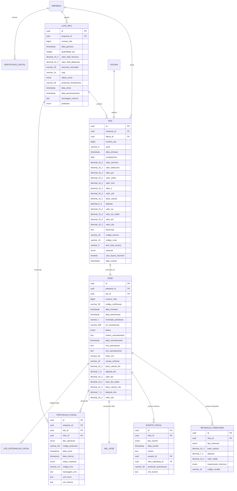

````markdown
# 6️⃣ DOMÍNIO FISCAL (ATUALIZADO FEV/2026 – PADRÃO NACIONAL NFS-e + RTC + INTEGRAÇÃO ACBrLib)

## 📋 Descrição Geral

Domínio crítico para conformidade fiscal brasileira, alinhado ao **padrão nacional NFS-e** (LC 214/2025 + NT 007/2026). NFS-e como raiz do agregado, suportando workflow de **RPS/DPS → envio nacional/municipal → autorização ADN**. Modelagem preparada para transição 2026–2032 (IBS/CBS progressivo), processamento assíncrono, resiliência (retry + fallback) e rastreabilidade total para auditoria. Integração recomendada via **ACBrLibNFSe** (biblioteca open-source do Projeto ACBr), com suporte nativo ao padrão nacional e reforma tributária (IBS/CBS via modelos INI específicos). Para PHP, utilizar extensão ACBrLibPHP ou chamadas via FFI/dl() para emissão, consultas e cancelamentos.

## 🎯 Objetivos Críticos (Atualizados 2026)

- ✅ Conformidade 100% com padrão nacional NFS-e + grupos IBSCBS
- ✅ Suporte híbrido: layout ABRASF legado × Nacional (feature toggle por empresa/município)
- ✅ Workflow state machine: RPS → DPS → NFS-e (nacional ou municipal)
- ✅ Integração resiliente: prioridade ADN → fallback webservice municipal aderente (via ACBrLibNFSe)
- ✅ Cálculo automático de retenções (ISS/INSS/IR/CSLL + IBS/CBS transição)
- ✅ Armazenamento seguro de XMLs (DPS assinado + NFS-e autorizada), certificados e hashes
- ✅ Rastreabilidade completa: protocolos ADN, logs detalhados, eventos
- ✅ Integração em PHP via ACBrLibNFSe: emissão ágil com DLL/SO, exemplos disponíveis

## 🏗️ Entidades Principais (Atualizadas)

### Rps (Recibo Provisório de Serviços – rascunho interno / precursor DPS)

**Descrição**: Documento precursor da NFS-e, gerado a partir de faturas. Preparado para conversão em DPS (Declaração de Prestação de Serviços) no padrão nacional.

| Campo                | Tipo          | Constraints      | Descrição                                    |
| -------------------- | ------------- | ---------------- | -------------------------------------------- |
| id                   | UUID          | PK, NOT NULL     | Identificador único                          |
| empresa_id           | UUID          | FK, NOT NULL     | Tenant isolamento                            |
| fatura_id            | UUID          | FK, NOT NULL     | Fatura de origem                             |
| numero_rps           | BIGINT        | NOT NULL         | Número sequencial por série                  |
| serie                | VARCHAR(5)    | NOT NULL         | Série do RPS                                 |
| data_emissao         | TIMESTAMP     | NOT NULL         | Data/hora de emissão                         |
| competencia          | DATE          | NOT NULL         | Competência fiscal                           |
| valor_servicos       | DECIMAL(15,2) | NOT NULL         | Valor bruto dos serviços                     |
| valor_deducoes       | DECIMAL(15,2) | DEFAULT 0        | Deduções permitidas                          |
| valor_pis            | DECIMAL(15,2) | DEFAULT 0        | PIS retido (transição)                       |
| valor_cofins         | DECIMAL(15,2) | DEFAULT 0        | COFINS retido (transição)                    |
| valor_inss           | DECIMAL(15,2) | DEFAULT 0        | INSS retido                                  |
| valor_ir             | DECIMAL(15,2) | DEFAULT 0        | IR retido                                    |
| valor_csll           | DECIMAL(15,2) | DEFAULT 0        | CSLL retido                                  |
| base_calculo         | DECIMAL(15,2) | NOT NULL         | Base para cálculo ISS/IBS                    |
| aliquota             | DECIMAL(5,4)  | NOT NULL         | Alíquota ISS/IBS em decimal                  |
| valor_iss            | DECIMAL(15,2) | NOT NULL         | ISS calculado                                |
| valor_iss_retido     | DECIMAL(15,2) | DEFAULT 0        | ISS retido pelo tomador                      |
| valor_ibs            | DECIMAL(15,2) | DEFAULT 0        | IBS preliminar (nacional)                    |
| valor_cbs            | DECIMAL(15,2) | DEFAULT 0        | CBS preliminar (nacional)                    |
| descricao            | TEXT          | NOT NULL         | Discriminação dos serviços                   |
| codigo_servico       | VARCHAR(20)   | NOT NULL         | Código do serviço municipal/nacional         |
| codigo_cnae          | VARCHAR(10)   | NULL             | Código CNAE                                  |
| item_lista_servico   | VARCHAR(5)    | NOT NULL         | Item da lista de serviços                    |
| situacao             | ENUM          | DEFAULT 'GERADO' | GERADO, ENVIADO, CONVERTIDO, ERRO            |
| usar_layout_nacional | BOOLEAN       | DEFAULT TRUE     | Preparar para padrão nacional (DPS + IBSCBS) |
| data_criacao         | TIMESTAMP     | NOT NULL         | Data de criação                              |

**Constraints Únicos**:

- `uk_rps_empresa_serie_numero` (empresa_id, serie, numero_rps)

**Índices**:

- `idx_rps_empresa_id` (empresa_id)
- `idx_rps_fatura_id` (fatura_id)
- `idx_rps_data_emissao` (data_emissao)
- `idx_rps_situacao` (situacao)
- `idx_rps_competencia` (competencia)
- `idx_rps_layout_nacional` (usar_layout_nacional)

### LoteRps (Agrupamento de RPS para envio em lote – adaptado para Lote DPS nacional)

**Descrição**: Agrupamento de RPS/DPS para envio em lote ao ADN ou prefeituras.

| Campo                 | Tipo          | Constraints        | Descrição                                      |
| --------------------- | ------------- | ------------------ | ---------------------------------------------- |
| id                    | UUID          | PK, NOT NULL       | Identificador único                            |
| empresa_id            | UUID          | FK, NOT NULL       | Tenant isolamento                              |
| numero_lote           | BIGINT        | NOT NULL           | Número do lote                                 |
| data_geracao          | TIMESTAMP     | NOT NULL           | Data/hora de geração                           |
| quantidade_rps        | INTEGER       | NOT NULL           | Quantidade de RPS no lote                      |
| valor_total_servicos  | DECIMAL(15,2) | NOT NULL           | Valor total dos serviços                       |
| valor_total_deducoes  | DECIMAL(15,2) | DEFAULT 0          | Total de deduções                              |
| inscricao_municipal   | VARCHAR(20)   | NOT NULL           | IM da empresa                                  |
| cnpj                  | VARCHAR(14)   | NOT NULL           | CNPJ da empresa                                |
| status_envio          | ENUM          | DEFAULT 'GERADO'   | GERADO, ENVIADO, PROCESSANDO, PROCESSADO, ERRO |
| protocolo_recebimento | VARCHAR(50)   | NULL               | Protocolo da prefeitura/ADN                    |
| data_envio            | TIMESTAMP     | NULL               | Data/hora do envio                             |
| data_processamento    | TIMESTAMP     | NULL               | Data/hora do processamento                     |
| mensagem_retorno      | TEXT          | NULL               | Mensagem da prefeitura/ADN                     |
| ambiente              | ENUM          | DEFAULT 'NACIONAL' | NACIONAL, MUNICIPAL                            |

**Constraints Únicos**:

- `uk_lote_empresa_numero` (empresa_id, numero_lote)

**Índices**:

- `idx_lote_empresa_id` (empresa_id)
- `idx_lote_data_geracao` (data_geracao)
- `idx_lote_status` (status_envio)

### Nfse (Nota Fiscal de Serviços Eletrônica)

**Descrição**: NFS-e autorizada pela prefeitura/ADN, com suporte a IBS/CBS.

| Campo               | Tipo          | Constraints          | Descrição                                  |
| ------------------- | ------------- | -------------------- | ------------------------------------------ |
| id                  | UUID          | PK, NOT NULL         | Identificador único                        |
| empresa_id          | UUID          | FK, NOT NULL         | Tenant isolamento                          |
| rps_id              | UUID          | FK, NOT NULL         | RPS de origem                              |
| numero_nfse         | BIGINT        | NOT NULL             | Número da NFS-e                            |
| codigo_verificacao  | VARCHAR(20)   | NOT NULL             | Código de verificação                      |
| data_emissao        | TIMESTAMP     | NOT NULL             | Data/hora de emissão                       |
| data_autorizacao    | TIMESTAMP     | NOT NULL             | Data/hora da autorização                   |
| municipio_prestacao | VARCHAR(7)    | NOT NULL             | Código IBGE município                      |
| url_visualizacao    | VARCHAR(500)  | NULL                 | URL para visualizar a nota                 |
| status              | ENUM          | DEFAULT 'AUTORIZADA' | AUTORIZADA, CANCELADA, SUBSTITUIDA         |
| motivo_cancelamento | TEXT          | NULL                 | Motivo do cancelamento                     |
| data_cancelamento   | TIMESTAMP     | NULL                 | Data do cancelamento                       |
| xml_autorizacao     | TEXT          | NULL                 | XML de autorização                         |
| xml_cancelamento    | TEXT          | NULL                 | XML de cancelamento                        |
| hash_xml            | VARCHAR(64)   | NULL                 | Hash do XML para integridade               |
| versao_schema       | VARCHAR(10)   | NOT NULL             | Versão do schema XML (ex: 'NACIONAL_1.00') |
| base_calculo_ibs    | DECIMAL(15,2) | DEFAULT 0            | Base para cálculo IBS                      |
| aliquota_ibs        | DECIMAL(7,4)  | DEFAULT 0            | Alíquota IBS                               |
| valor_ibs           | DECIMAL(15,2) | DEFAULT 0            | Valor IBS                                  |
| valor_ibs_retido    | DECIMAL(15,2) | DEFAULT 0            | IBS retido                                 |
| base_calculo_cbs    | DECIMAL(15,2) | DEFAULT 0            | Base para cálculo CBS                      |
| aliquota_cbs        | DECIMAL(7,4)  | DEFAULT 0            | Alíquota CBS                               |
| valor_cbs           | DECIMAL(15,2) | DEFAULT 0            | Valor CBS                                  |

**Constraints Únicos**:

- `uk_nfse_numero_municipio` (numero_nfse, municipio_prestacao)
- `uk_nfse_rps` (rps_id)

**Índices**:

- `idx_nfse_empresa_id` (empresa_id)
- `idx_nfse_numero` (numero_nfse)
- `idx_nfse_data_emissao` (data_emissao)
- `idx_nfse_status` (status)
- `idx_nfse_codigo_verificacao` (codigo_verificacao)

### RetencaoTributaria

**Descrição**: Detalhe das retenções aplicadas na NFS-e, expandido para IBS/CBS.

| Campo                | Tipo          | Constraints  | Descrição                                          |
| -------------------- | ------------- | ------------ | -------------------------------------------------- |
| id                   | UUID          | PK, NOT NULL | Identificador único                                |
| nfse_id              | UUID          | FK, NOT NULL | Referência à NFS-e                                 |
| tipo_retencao        | ENUM          | NOT NULL     | ISS, INSS, IR, CSLL, PIS, COFINS, IBS_RET, CBS_RET |
| base_calculo         | DECIMAL(15,2) | NOT NULL     | Base para cálculo                                  |
| aliquota             | DECIMAL(7,4)  | NOT NULL     | Alíquota da retenção                               |
| valor_retido         | DECIMAL(15,2) | NOT NULL     | Valor retido                                       |
| responsavel_retencao | ENUM          | NOT NULL     | TOMADOR, PRESTADOR                                 |
| codigo_receita       | VARCHAR(10)   | NULL         | Código da receita federal                          |

**Índices**:

- `idx_retencao_nfse_id` (nfse_id)
- `idx_retencao_tipo` (tipo_retencao)

### ProtocoloFiscal

**Descrição**: Controle de protocolos de integração com webservices/ADN.

| Campo            | Tipo        | Constraints  | Descrição                                              |
| ---------------- | ----------- | ------------ | ------------------------------------------------------ |
| id               | UUID        | PK, NOT NULL | Identificador único                                    |
| empresa_id       | UUID        | FK, NOT NULL | Tenant isolamento                                      |
| lote_id          | UUID        | FK, NULL     | Lote relacionado                                       |
| nfse_id          | UUID        | FK, NULL     | NFS-e relacionada                                      |
| tipo_operacao    | ENUM        | NOT NULL     | ENVIO_LOTE, CONSULTA_LOTE, CONSULTA_NFSE, CANCELAMENTO |
| codigo_protocolo | VARCHAR(50) | NULL         | Protocolo da prefeitura/ADN                            |
| data_envio       | TIMESTAMP   | NOT NULL     | Data/hora do envio                                     |
| data_retorno     | TIMESTAMP   | NULL         | Data/hora do retorno                                   |
| status_resposta  | ENUM        | NOT NULL     | PENDENTE, SUCESSO, ERRO, TIMEOUT                       |
| codigo_erro      | VARCHAR(10) | NULL         | Código de erro                                         |
| mensagem_erro    | TEXT        | NULL         | Mensagem de erro                                       |
| xml_envio        | TEXT        | NOT NULL     | XML enviado                                            |
| xml_retorno      | TEXT        | NULL         | XML de retorno                                         |

**Índices**:

- `idx_protocolo_empresa_id` (empresa_id)
- `idx_protocolo_lote_id` (lote_id)
- `idx_protocolo_nfse_id` (nfse_id)
- `idx_protocolo_data_envio` (data_envio)
- `idx_protocolo_status` (status_resposta)

### EventoFiscal

**Descrição**: Eventos como cancelamento e substituição de NFS-e.

| Campo                 | Tipo        | Constraints  | Descrição                      |
| --------------------- | ----------- | ------------ | ------------------------------ |
| id                    | UUID        | PK, NOT NULL | Identificador único            |
| nfse_id               | UUID        | FK, NOT NULL | NFS-e do evento                |
| tipo_evento           | ENUM        | NOT NULL     | CANCELAMENTO, SUBSTITUICAO     |
| data_evento           | TIMESTAMP   | NOT NULL     | Data/hora do evento            |
| motivo                | TEXT        | NOT NULL     | Motivo do evento               |
| usuario_id            | UUID        | FK, NOT NULL | Usuário responsável            |
| nfse_substituta_id    | UUID        | FK, NULL     | Nova NFS-e (para substituição) |
| protocolo_autorizacao | VARCHAR(50) | NULL         | Protocolo de autorização       |
| xml_evento            | TEXT        | NULL         | XML do evento                  |

**Índices**:

- `idx_evento_nfse_id` (nfse_id)
- `idx_evento_data` (data_evento)
- `idx_evento_tipo` (tipo_evento)

### CertificadoDigital

**Descrição**: Certificados digitais para assinatura de documentos fiscais (integrado com ACBrLib para A1/A3).

| Campo                | Tipo         | Constraints  | Descrição                   |
| -------------------- | ------------ | ------------ | --------------------------- |
| id                   | UUID         | PK, NOT NULL | Identificador único         |
| empresa_id           | UUID         | FK, NOT NULL | Tenant isolamento           |
| alias                | VARCHAR(100) | NOT NULL     | Nome/alias do certificado   |
| arquivo_pfx          | BYTEA        | NOT NULL     | Arquivo .pfx do certificado |
| senha                | VARCHAR(255) | NOT NULL     | Senha criptografada         |
| subject              | VARCHAR(500) | NOT NULL     | Subject do certificado      |
| issuer               | VARCHAR(500) | NOT NULL     | Emissor do certificado      |
| serial_number        | VARCHAR(50)  | NOT NULL     | Número serial               |
| data_validade_inicio | TIMESTAMP    | NOT NULL     | Início da validade          |
| data_validade_fim    | TIMESTAMP    | NOT NULL     | Fim da validade             |
| ativo                | BOOLEAN      | DEFAULT TRUE | Se está ativo               |
| data_criacao         | TIMESTAMP    | NOT NULL     | Data de upload              |

**Índices**:

- `idx_certificado_empresa_id` (empresa_id)
- `idx_certificado_validade` (data_validade_fim)
- `idx_certificado_ativo` (ativo)

### LogIntegracaoFiscal

**Descrição**: Log detalhado de todas as integrações fiscais (incluindo chamadas ACBrLib).

| Campo             | Tipo         | Constraints  | Descrição                 |
| ----------------- | ------------ | ------------ | ------------------------- |
| id                | UUID         | PK, NOT NULL | Identificador único       |
| empresa_id        | UUID         | FK, NOT NULL | Tenant isolamento         |
| nfse_id           | UUID         | FK, NULL     | NFS-e relacionada         |
| lote_id           | UUID         | FK, NULL     | Lote relacionado          |
| data_log          | TIMESTAMP    | NOT NULL     | Data/hora do log          |
| endpoint_url      | VARCHAR(500) | NOT NULL     | URL do webservice/ADN     |
| metodo_http       | VARCHAR(10)  | NOT NULL     | GET, POST, etc            |
| headers_request   | JSONB        | NULL         | Headers da requisição     |
| request_body      | TEXT         | NULL         | Corpo da requisição       |
| status_http       | INTEGER      | NOT NULL     | Status HTTP               |
| headers_response  | JSONB        | NULL         | Headers da resposta       |
| response_body     | TEXT         | NULL         | Corpo da resposta         |
| tempo_resposta_ms | INTEGER      | NULL         | Tempo de resposta em ms   |
| erro_interno      | TEXT         | NULL         | Erro interno da aplicação |

**Índices**:

- `idx_log_empresa_id` (empresa_id)
- `idx_log_data` (data_log)
- `idx_log_nfse_id` (nfse_id)
- `idx_log_status` (status_http)

### XmlNfse

**Descrição**: Armazenamento otimizado de XMLs das NFS-e (incluindo DPS).

| Campo              | Tipo        | Constraints          | Descrição                       |
| ------------------ | ----------- | -------------------- | ------------------------------- |
| id                 | UUID        | PK, NOT NULL         | Identificador único             |
| nfse_id            | UUID        | FK, UNIQUE, NOT NULL | Referência à NFS-e              |
| versao_schema      | VARCHAR(10) | NOT NULL             | Versão do schema XML            |
| xml_assinado       | TEXT        | NOT NULL             | XML assinado digitalmente       |
| xml_original       | TEXT        | NULL                 | XML original (antes assinatura) |
| hash_sha256        | VARCHAR(64) | NOT NULL             | Hash para integridade           |
| tamanho_bytes      | INTEGER     | NOT NULL             | Tamanho do XML                  |
| comprimido         | BOOLEAN     | DEFAULT FALSE        | Se foi comprimido               |
| data_armazenamento | TIMESTAMP   | NOT NULL             | Data do armazenamento           |

**Índices**:

- `idx_xml_nfse_id` (nfse_id)
- `idx_xml_hash` (hash_sha256)

## 🔗 Relacionamentos Complexos


````

## ⚙️ Workflows Críticos (Atualizados com ACBrLib em PHP)

### 1. Geração de RPS a partir de Fatura (PHP Equivalente)

Utilize ACBrLibNFSe para carregar dados via INI e gerar RPS/DPS.

```php
function gerarRPS($faturaId) {
    // 1. Validar fatura (lógica interna)
    $fatura = validarFatura($faturaId);

    // 2. Calcular impostos (usar função calcularRetencoes)
    $impostos = calcularRetencoes($fatura);

    // 3. Obter próximo número RPS (lógica interna ou via ACBrLib)
    $numeroRPS = obterProximoNumeroRPS($fatura['empresaId']);

    // 4. Montar INI para ACBrLib (modelo Padrão Nacional se usar_layout_nacional)
    $iniContent = montarIniRPS($fatura, $impostos, $numeroRPS);

    // 5. Carregar ACBrLibNFSe (via extensão https://github.com/billbarsch/acbrlibphp ou FFI)
    $acbr = new ACBrLibNFSe(); // Inicializar DLL
    $acbr->NFSE_ConfigGravarValor('NFSe', 'Cidade', $fatura['municipio']); // Configurações
    $acbr->NFSE_CarregarINI($iniContent);

    // 6. Gerar RPS/DPS
    $retorno = $acbr->NFSE_GerarLote();
    if (strpos($retorno, 'OK') === false) {
        throw new Exception($acbr->NFSE_UltimoRetorno());
    }

    // 7. Salvar RPS no banco e atualizar fatura
    $rps = criarRPS([...]); // Lógica de persistência
    atualizarStatusFatura($faturaId, 'ENVIADA');

    return $rps;
}
```

### 2. Envio em Lote para Prefeitura/ADN (PHP com ACBrLib)

Priorize nacional; fallback municipal.

```php
function enviarLoteRPS($empresaId) {
    // 1. Buscar RPS pendentes
    $rpssPendentes = buscarRPSPendentes($empresaId);
    if (empty($rpssPendentes)) {
        throw new Exception('Nenhum RPS pendente');
    }

    // 2. Criar lote
    $lote = criarLoteRPS([...]);

    // 3. Vincular RPS ao lote (lógica interna)
    vincularRPSAoLote($lote['id'], array_column($rpssPendentes, 'id'));

    // 4. Gerar XML do lote via ACBrLib
    $acbr = new ACBrLibNFSe();
    $acbr->NFSE_CarregarXML(gerarXmlLoteInterno($lote, $rpssPendentes)); // Ou via INI

    // 5. Assinar XML (ACBrLib faz internamente com certificado configurado)

    // 6. Enviar para webservice/ADN
    $resultado = $acbr->NFSE_Emitir();

    // 7. Atualizar status e agendar consulta
    atualizarLote($lote['id'], ['statusEnvio' => 'ENVIADO', 'protocoloRecebimento' => parseProtocolo($resultado)]);
    agendarConsultaStatus($lote['id'], 30); // 30s

    return $lote;
}
```

### 3. Processamento Assíncrono de Retorno (PHP)

```php
function processarRetornoLote($loteId) {
    $lote = buscarLote($loteId);

    // 1. Consultar status via ACBrLib
    $acbr = new ACBrLibNFSe();
    $statusLote = $acbr->NFSE_ConsultarSituacao($lote['protocoloRecebimento']);

    if (strpos($statusLote, 'PROCESSANDO') !== false) {
        agendarConsultaStatus($loteId, 60); // Reagendar
        return;
    }

    if (strpos($statusLote, 'PROCESSADO_COM_SUCESSO') !== false) {
        // 2. Processar NFS-e geradas
        $nfses = parseNfsesFromRetorno($statusLote);
        foreach ($nfses as $nfseData) {
            processarNFSe($nfseData, $loteId);
        }

        // 3. Atualizar lote
        atualizarLote($loteId, ['statusEnvio' => 'PROCESSADO']);
    } else {
        processarErrosLote($loteId, parseErros($statusLote));
    }
}

function processarNFSe($nfseData, $loteId) {
    // Lógica similar: buscar RPS, criar NFSe, armazenar XML, processar retenções, atualizar RPS
    // Usar ACBrLib para obter XML: $acbr->NFSE_ObterXml();
}
```

## 🧮 Cálculos Fiscais Complexos

### Cálculo de Retenções por Regime (PHP Equivalente)

```php
function calcularRetencoes($dados) {
    $retencoes = [
        'valorPIS' => 0, 'valorCOFINS' => 0, 'valorIR' => 0,
        'valorCSLL' => 0, 'valorINSS' => 0, 'valorISS' => 0,
        'valorIBS' => 0, 'valorCBS' => 0
    ];

    $eh2026 = $dados['dataEmissao'] >= new DateTime('2026-01-01');

    switch ($dados['regimeTributario']) {
        case 'SIMPLES_NACIONAL':
            $retencoes['valorISS'] = calcularISSSimples($dados);
            if ($eh2026) $retencoes['valorIBS'] = calcularIBS($dados);
            break;
        case 'LUCRO_PRESUMIDO':
        case 'LUCRO_REAL':
            if ($dados['tomador']['tipo'] === 'PJ') {
                if (!$eh2026) {
                    $retencoes['valorPIS'] = $dados['valorServicos'] * 0.0065;
                    // ... demais retenções antigas
                } else {
                    $retencoes['valorCBS'] = calcularCBS($dados); // Sem retenção na maioria
                }
            }
            $retencoes['valorISS'] = calcularISS($dados);
            if ($eh2026) $retencoes['valorIBS'] = calcularIBS($dados);
            $retencoes['valorINSS'] = calcularINSS($dados);
            break;
    }

    return $retencoes;
}
```

### Cálculo de ISS/IBS por Município

```php
function calcularISS($dados) {
    $configFiscal = buscarConfiguracaoFiscal($dados['empresaId'], $dados['municipioPrestacao']);
    $servico = buscarDadosServico($dados['codigoServico']);

    if ($servico['isencaoISS']) return 0;

    $baseCalculo = $dados['valorServicos'] - $dados['valorDeducoes'];
    $aliquota = $servico['aliquotaISS'] ?? $configFiscal['aliquotaIssDefault'];

    return $baseCalculo * ($aliquota / 100);
}
```

## 🔐 Assinatura Digital (via ACBrLib)

### Processo de Assinatura (PHP)

ACBrLib cuida da assinatura internamente ao emitir/cancelar.

```php
function assinarXML($xml, $empresaId) {
    $acbr = new ACBrLibNFSe();
    $acbr->NFSE_CarregarXML($xml);
    // Assinatura automática com certificado configurado
    $xmlAssinado = $acbr->NFSE_ObterXml(); // Após emissão
    return $xmlAssinado;
}
```

## 📊 Relatórios Fiscais

### Livro de NFS-e Emitidas

```sql
CREATE VIEW vw_livro_nfse_emitidas AS
SELECT
    n.numero_nfse,
    n.data_emissao,
    n.codigo_verificacao,
    r.valor_servicos,
    r.base_calculo,
    r.aliquota,
    r.valor_iss,
    r.valor_ibs,
    r.valor_cbs,
    r.codigo_servico,
    r.descricao,
    pe.nome_razao_social as nome_tomador,
    pe_doc.valor as cpf_cnpj_tomador,
    n.status
FROM nfse n
JOIN rps r ON r.id = n.rps_id
JOIN fatura f ON f.id = r.fatura_id
JOIN papel pa ON pa.id = f.cliente_id
JOIN pessoa pe ON pe.id = pa.pessoa_id
LEFT JOIN documento pe_doc ON pe_doc.pessoa_id = pe.id
    AND pe_doc.tipo IN ('CPF', 'CNPJ')
WHERE n.empresa_id = @empresa_id
AND n.status != 'CANCELADA'
ORDER BY n.data_emissao, n.numero_nfse;
```

### Relatório de Retenções

```sql
SELECT
    n.numero_nfse,
    n.data_emissao,
    rt.tipo_retencao,
    rt.base_calculo,
    rt.aliquota,
    rt.valor_retido,
    rt.responsavel_retencao
FROM nfse n
JOIN retencao_tributaria rt ON rt.nfse_id = n.id
WHERE n.empresa_id = @empresa_id
AND n.data_emissao BETWEEN @data_inicio AND @data_fim
ORDER BY n.data_emissao, rt.tipo_retencao;
```

## ⚡ Performance e Escalabilidade

### Particionamento por Data

```sql
-- Particionar tabelas grandes por mês
CREATE TABLE rps_2024_01 PARTITION OF rps
FOR VALUES FROM ('2024-01-01') TO ('2024-02-01');

CREATE TABLE rps_2024_02 PARTITION OF rps
FOR VALUES FROM ('2024-02-01') TO ('2024-03-01');

-- Índices específicos por partição
CREATE INDEX idx_rps_2024_01_empresa_situacao
ON rps_2024_01 (empresa_id, situacao);
```

### Jobs de Manutenção

```sql
-- Job para arquivar XMLs antigos
CREATE OR REPLACE FUNCTION arquivar_xmls_antigos()
RETURNS void AS $$
BEGIN
    -- Mover XMLs > 7 anos para storage frio
    UPDATE xml_nfse
    SET comprimido = true,
        xml_original = NULL
    WHERE data_armazenamento < CURRENT_DATE - INTERVAL '7 years'
    AND comprimido = false;
END;
$$ LANGUAGE plpgsql;

-- Agendar execução mensal
SELECT cron.schedule('arquivar-xmls', '0 2 1 * *', 'SELECT arquivar_xmls_antigos()');
```

## 🔌 Integração com ACBrLibNFSe em PHP (Melhores Práticas)

- **Instalação**: Baixe ACBrLibNFSe do Projeto ACBr (https://projetoacbr.com.br/). Use extensão PHP: https://github.com/billbarsch/acbrlibphp ou demos: svn.code.sf.net/p/acbr/code/trunk2/Projetos/ACBrLib/Demos/PHP/NFSe.
- **Configuração**: Configure DLL com certificado digital A1/A3, município e ambiente (produção/homologação). Use NFSE_ConfigGravar para INI de config.
- **Workflow Recomendado**:
    1. Montar INI com dados fiscais (modelos: Padrão Nacional Reforma Tributária para IBS/CBS).
    2. Carregar INI/XML em ACBrLib.
    3. Gerar lote, assinar e emitir (NFSE_Emitir).
    4. Consultar status assincronamente (NFSE_ConsultarSituacao).
    5. Tratar erros via NFSE_UltimoRetorno().
- **Vantagens**: Suporte a 100+ provedores municipais + nacional ADN; assinatura automática; validações fiscais embutidas.
- **Dicas PHP**: Use try-catch para exceções; logue retornos; teste em homologação; atualize lib para NT 007/2026 (suporte IBS/CBS via INI).
- **Exemplo Básico PHP** (adaptado de demos):

```php
require 'acbrlibphp.php'; // Extensão
$acbr = new ACBrLibNFSe('ACBrLibNFSe.dll');
$acbr->NFSE_ConfigGravar('Config.ini'); // Certificado, etc.
$acbr->NFSE_CarregarINI('RPS.ini'); // Dados RPS
$acbr->NFSE_Emitir();
echo $acbr->NFSE_UltimoRetorno(); // Resultado
```

---

_Documento atualizado em: 10/02/2026_

```

```
