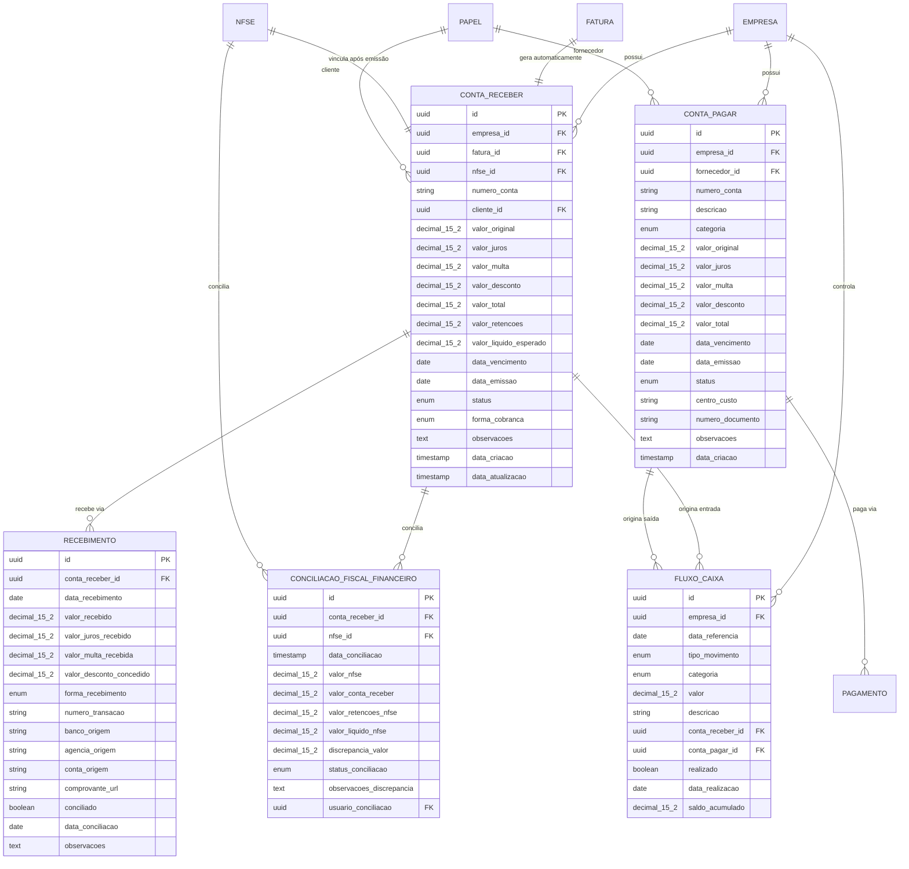

# 7️⃣ DOMÍNIO FINANCEIRO (INTEGRADO AO FISCAL)

## 📋 Descrição Geral

Domínio para gestão completa de fluxos financeiros, integrado seamlessly ao faturamento e fiscal. Modelagem rica: ContaReceber como agregado, com conciliação automática pós-NFS-e e controle preciso de recebimentos, retenções e discrepâncias. Preparado para múltiplas formas de pagamento e reconciliação bancária.

## 🎯 Objetivos

- Controle total de contas a receber/pagar
- Conciliação automática com documentos fiscais  
- Gestão de fluxo de caixa projetado vs realizado
- Controle de inadimplência e cobrança
- Reconciliação bancária automatizada
- Análise de recebimentos e retenções

## 🏗️ Entidades

### ContaReceber (Agregado Raiz)
**Descrição**: Conta a receber gerada automaticamente a partir de faturas.

| Campo | Tipo | Constraints | Descrição |
|-------|------|-------------|-----------|
| id | UUID | PK, NOT NULL | Identificador único |
| empresa_id | UUID | FK, NOT NULL | Tenant isolamento |
| fatura_id | UUID | FK, NOT NULL | Fatura de origem |
| nfse_id | UUID | FK, NULL | NFS-e vinculada (após emissão) |
| numero_conta | VARCHAR(20) | NOT NULL | Número sequencial |
| cliente_id | UUID | FK, NOT NULL | Cliente (via Papel) |
| valor_original | DECIMAL(15,2) | NOT NULL | Valor original da fatura |
| valor_juros | DECIMAL(15,2) | DEFAULT 0 | Juros aplicados |
| valor_multa | DECIMAL(15,2) | DEFAULT 0 | Multa aplicada |
| valor_desconto | DECIMAL(15,2) | DEFAULT 0 | Desconto concedido |
| valor_total | DECIMAL(15,2) | NOT NULL | Valor total atualizado |
| valor_retencoes | DECIMAL(15,2) | DEFAULT 0 | Total de retenções (do fiscal) |
| valor_liquido_esperado | DECIMAL(15,2) | NOT NULL | Valor líquido esperado |
| data_vencimento | DATE | NOT NULL | Data de vencimento |
| data_emissao | DATE | NOT NULL | Data de emissão |
| status | ENUM | DEFAULT 'ABERTA' | ABERTA, PAGA, PARCIAL, ATRASADA, CANCELADA |
| forma_cobranca | ENUM | NOT NULL | BOLETO, PIX, CARTAO, DINHEIRO, TRANSFERENCIA |
| observacoes | TEXT | NULL | Observações da conta |
| data_criacao | TIMESTAMP | NOT NULL | Data de criação |
| data_atualizacao | TIMESTAMP | NOT NULL | Última atualização |

**Constraints Únicos**:
- `uk_conta_receber_empresa_numero` (empresa_id, numero_conta)
- `uk_conta_receber_fatura` (fatura_id)

**Índices**:
- `idx_conta_receber_empresa_id` (empresa_id)
- `idx_conta_receber_cliente_id` (cliente_id)
- `idx_conta_receber_vencimento` (data_vencimento)
- `idx_conta_receber_status` (status)
- `idx_conta_receber_nfse_id` (nfse_id)

### ContaPagar
**Descrição**: Conta a pagar para controle de despesas.

| Campo | Tipo | Constraints | Descrição |
|-------|------|-------------|-----------|
| id | UUID | PK, NOT NULL | Identificador único |
| empresa_id | UUID | FK, NOT NULL | Tenant isolamento |
| fornecedor_id | UUID | FK, NOT NULL | Fornecedor (via Papel) |
| numero_conta | VARCHAR(20) | NOT NULL | Número sequencial |
| descricao | VARCHAR(255) | NOT NULL | Descrição da despesa |
| categoria | ENUM | NOT NULL | FORNECEDOR, FUNCIONARIO, IMPOSTO, DESPESA_GERAL |
| valor_original | DECIMAL(15,2) | NOT NULL | Valor original |
| valor_juros | DECIMAL(15,2) | DEFAULT 0 | Juros aplicados |
| valor_multa | DECIMAL(15,2) | DEFAULT 0 | Multa aplicada |
| valor_desconto | DECIMAL(15,2) | DEFAULT 0 | Desconto obtido |
| valor_total | DECIMAL(15,2) | NOT NULL | Valor total |
| data_vencimento | DATE | NOT NULL | Data de vencimento |
| data_emissao | DATE | NOT NULL | Data de emissão |
| status | ENUM | DEFAULT 'ABERTA' | ABERTA, PAGA, PARCIAL, ATRASADA, CANCELADA |
| centro_custo | VARCHAR(50) | NULL | Centro de custo |
| numero_documento | VARCHAR(50) | NULL | Número do documento (NF, recibo) |
| observacoes | TEXT | NULL | Observações |
| data_criacao | TIMESTAMP | NOT NULL | Data de criação |

**Índices**:
- `idx_conta_pagar_empresa_id` (empresa_id)
- `idx_conta_pagar_fornecedor_id` (fornecedor_id)
- `idx_conta_pagar_vencimento` (data_vencimento)
- `idx_conta_pagar_status` (status)
- `idx_conta_pagar_categoria` (categoria)

### Recebimento
**Descrição**: Registro de recebimentos contra contas a receber.

| Campo | Tipo | Constraints | Descrição |
|-------|------|-------------|-----------|
| id | UUID | PK, NOT NULL | Identificador único |
| conta_receber_id | UUID | FK, NOT NULL | Referência à conta |
| data_recebimento | DATE | NOT NULL | Data do recebimento |
| valor_recebido | DECIMAL(15,2) | NOT NULL | Valor recebido |
| valor_juros_recebido | DECIMAL(15,2) | DEFAULT 0 | Juros recebidos |
| valor_multa_recebida | DECIMAL(15,2) | DEFAULT 0 | Multa recebida |
| valor_desconto_concedido | DECIMAL(15,2) | DEFAULT 0 | Desconto concedido |
| forma_recebimento | ENUM | NOT NULL | DINHEIRO, BOLETO, PIX, CARTAO_CREDITO, CARTAO_DEBITO, TRANSFERENCIA |
| numero_transacao | VARCHAR(100) | NULL | Número da transação/comprovante |
| banco_origem | VARCHAR(10) | NULL | Código do banco |
| agencia_origem | VARCHAR(10) | NULL | Agência |
| conta_origem | VARCHAR(20) | NULL | Conta |
| comprovante_url | VARCHAR(500) | NULL | URL do comprovante |
| conciliado | BOOLEAN | DEFAULT FALSE | Se foi conciliado |
| data_conciliacao | DATE | NULL | Data da conciliação |
| observacoes | TEXT | NULL | Observações do recebimento |

**Índices**:
- `idx_recebimento_conta_id` (conta_receber_id)
- `idx_recebimento_data` (data_recebimento)
- `idx_recebimento_transacao` (numero_transacao)
- `idx_recebimento_conciliado` (conciliado)

### Pagamento
**Descrição**: Registro de pagamentos contra contas a pagar.

| Campo | Tipo | Constraints | Descrição |
|-------|------|-------------|-----------|
| id | UUID | PK, NOT NULL | Identificador único |
| conta_pagar_id | UUID | FK, NOT NULL | Referência à conta |
| data_pagamento | DATE | NOT NULL | Data do pagamento |
| valor_pago | DECIMAL(15,2) | NOT NULL | Valor pago |
| valor_juros_pago | DECIMAL(15,2) | DEFAULT 0 | Juros pagos |
| valor_multa_paga | DECIMAL(15,2) | DEFAULT 0 | Multa paga |
| valor_desconto_obtido | DECIMAL(15,2) | DEFAULT 0 | Desconto obtido |
| forma_pagamento | ENUM | NOT NULL | DINHEIRO, BOLETO, PIX, CARTAO, TRANSFERENCIA, CHEQUE |
| numero_transacao | VARCHAR(100) | NULL | Número da transação |
| banco_destino | VARCHAR(10) | NULL | Código do banco destino |
| agencia_destino | VARCHAR(10) | NULL | Agência destino |
| conta_destino | VARCHAR(20) | NULL | Conta destino |
| comprovante_url | VARCHAR(500) | NULL | URL do comprovante |
| conciliado | BOOLEAN | DEFAULT FALSE | Se foi conciliado |
| observacoes | TEXT | NULL | Observações do pagamento |

**Índices**:
- `idx_pagamento_conta_id` (conta_pagar_id)
- `idx_pagamento_data` (data_pagamento)
- `idx_pagamento_transacao` (numero_transacao)

### ConciliacaoFiscalFinanceiro
**Descrição**: Conciliação entre valores fiscais e financeiros.

| Campo | Tipo | Constraints | Descrição |
|-------|------|-------------|-----------|
| id | UUID | PK, NOT NULL | Identificador único |
| conta_receber_id | UUID | FK, NOT NULL | Conta a receber |
| nfse_id | UUID | FK, NOT NULL | NFS-e relacionada |
| data_conciliacao | TIMESTAMP | NOT NULL | Data da conciliação |
| valor_nfse | DECIMAL(15,2) | NOT NULL | Valor total da NFS-e |
| valor_conta_receber | DECIMAL(15,2) | NOT NULL | Valor da conta a receber |
| valor_retencoes_nfse | DECIMAL(15,2) | NOT NULL | Retenções da NFS-e |
| valor_liquido_nfse | DECIMAL(15,2) | NOT NULL | Líquido da NFS-e |
| discrepancia_valor | DECIMAL(15,2) | DEFAULT 0 | Diferença encontrada |
| status_conciliacao | ENUM | DEFAULT 'PENDENTE' | PENDENTE, CONCILIADO, DISCREPANTE |
| observacoes_discrepancia | TEXT | NULL | Motivo da discrepância |
| usuario_conciliacao | UUID | FK, NOT NULL | Usuário que fez a conciliação |

**Índices**:
- `idx_conciliacao_conta_id` (conta_receber_id)
- `idx_conciliacao_nfse_id` (nfse_id)
- `idx_conciliacao_data` (data_conciliacao)
- `idx_conciliacao_status` (status_conciliacao)

### FluxoCaixa
**Descrição**: Visão consolidada do fluxo de caixa.

| Campo | Tipo | Constraints | Descrição |
|-------|------|-------------|-----------|
| id | UUID | PK, NOT NULL | Identificador único |
| empresa_id | UUID | FK, NOT NULL | Tenant isolamento |
| data_referencia | DATE | NOT NULL | Data de referência |
| tipo_movimento | ENUM | NOT NULL | ENTRADA, SAIDA |
| categoria | ENUM | NOT NULL | RECEBIMENTO, PAGAMENTO, TRANSFERENCIA |
| valor | DECIMAL(15,2) | NOT NULL | Valor do movimento |
| descricao | VARCHAR(255) | NOT NULL | Descrição do movimento |
| conta_receber_id | UUID | FK, NULL | Se originado de recebimento |
| conta_pagar_id | UUID | FK, NULL | Se originado de pagamento |
| realizado | BOOLEAN | DEFAULT FALSE | Se foi realizado |
| data_realizacao | DATE | NULL | Data da realização |
| saldo_acumulado | DECIMAL(15,2) | DEFAULT 0 | Saldo acumulado |

**Constraints Únicos**:
- Apenas uma referência: CHECK ((conta_receber_id IS NULL) OR (conta_pagar_id IS NULL))

**Índices**:
- `idx_fluxo_empresa_data` (empresa_id, data_referencia)
- `idx_fluxo_tipo_categoria` (tipo_movimento, categoria)
- `idx_fluxo_realizado` (realizado)

## 🔗 Relacionamentos



## ⚙️ Processos Financeiros

### 1. Criação Automática de Conta a Receber
```typescript
// Trigger automática após criação de fatura
async function criarContaReceberAposFatura(faturaId: string): Promise<ContaReceber> {
  const fatura = await buscarFatura(faturaId);
  
  const contaReceber = await criarContaReceber({
    empresaId: fatura.empresaId,
    faturaId: fatura.id,
    numeroContaReceber: await obterProximoNumero(fatura.empresaId),
    clienteId: fatura.clienteId,
    valorOriginal: fatura.valorTotal,
    valorLiquidoEsperado: fatura.valorLiquido, // Já descontadas retenções estimadas
    dataVencimento: fatura.dataVencimento,
    dataEmissao: fatura.dataEmissao,
    formaCobranca: fatura.formaCobranca,
    status: 'ABERTA'
  });
  
  // Criar projeção no fluxo de caixa
  await criarMovimentoFluxoCaixa({
    empresaId: fatura.empresaId,
    dataReferencia: fatura.dataVencimento,
    tipoMovimento: 'ENTRADA',
    categoria: 'RECEBIMENTO',
    valor: contaReceber.valorLiquidoEsperado,
    descricao: `Recebimento previsto - Conta ${contaReceber.numeroContaReceber}`,
    contaReceberId: contaReceber.id,
    realizado: false
  });
  
  return contaReceber;
}
```

### 2. Vinculação com NFS-e
```typescript
// Após autorização da NFS-e
async function vincularNFSeAContaReceber(nfseId: string): Promise<void> {
  const nfse = await buscarNFSe(nfseId);
  const fatura = await buscarFaturaPorRPS(nfse.rpsId);
  const contaReceber = await buscarContaReceberPorFatura(fatura.id);
  
  // Buscar retenções da NFS-e
  const retencoes = await buscarRetencoes(nfseId);
  const totalRetencoes = retencoes.reduce((acc, ret) => acc + ret.valorRetido, 0);
  
  // Atualizar conta a receber com dados fiscais
  await atualizarContaReceber(contaReceber.id, {
    nfseId: nfse.id,
    valorRetencoes: totalRetencoes,
    valorLiquidoEsperado: contaReceber.valorOriginal - totalRetencoes
  });
  
  // Criar conciliação fiscal-financeiro
  await criarConciliacaoFiscalFinanceiro({
    contaReceberId: contaReceber.id,
    nfseId: nfse.id,
    dataConciliacao: new Date(),
    valorNfse: nfse.valorTotal,
    valorContaReceber: contaReceber.valorOriginal,
    valorRetencoesNfse: totalRetencoes,
    valorLiquidoNfse: nfse.valorTotal - totalRetencoes,
    statusConciliacao: 'CONCILIADO',
    usuarioConciliacao: 'SISTEMA'
  });
}
```

### 3. Registro de Recebimento
```typescript
async function registrarRecebimento(dados: DadosRecebimento): Promise<Recebimento> {
  const contaReceber = await buscarContaReceber(dados.contaReceberId);
  
  // Validar valores
  const totalRecebido = await calcularTotalRecebido(contaReceber.id);
  if (totalRecebido + dados.valorRecebido > contaReceber.valorTotal) {
    throw new Error('Valor recebido excede o valor da conta');
  }
  
  // Registrar recebimento
  const recebimento = await criarRecebimento({
    contaReceberId: dados.contaReceberId,
    dataRecebimento: dados.dataRecebimento,
    valorRecebido: dados.valorRecebido,
    formaRecebimento: dados.formaRecebimento,
    numeroTransacao: dados.numeroTransacao,
    comprovantUrl: dados.comprovantUrl,
    observacoes: dados.observacoes
  });
  
  // Atualizar status da conta
  const novoTotalRecebido = totalRecebido + dados.valorRecebido;
  let novoStatus: StatusConta;
  
  if (novoTotalRecebido >= contaReceber.valorTotal) {
    novoStatus = 'PAGA';
  } else if (novoTotalRecebido > 0) {
    novoStatus = 'PARCIAL';
  } else {
    novoStatus = contaReceber.status; // Mantém status atual
  }
  
  await atualizarContaReceber(contaReceber.id, {
    status: novoStatus,
    dataAtualizacao: new Date()
  });
  
  // Atualizar fluxo de caixa
  await atualizarFluxoCaixaRealizado({
    contaReceberId: contaReceber.id,
    dataRealizacao: dados.dataRecebimento,
    valorRealizado: dados.valorRecebido
  });
  
  // Se pagamento completo, verificar discrepâncias
  if (novoStatus === 'PAGA') {
    await verificarDiscrepanciasConciliacao(contaReceber.id);
  }
  
  return recebimento;
}
```

### 4. Conciliação Bancária
```typescript
interface MovimentoBancario {
  data: Date;
  valor: number;
  historico: string;
  numeroDocumento?: string;
}

async function conciliarMovimentosBancarios(
  empresaId: string,
  movimentos: MovimentoBancario[]
): Promise<ResultadoConciliacao> {
  const resultado: ResultadoConciliacao = {
    conciliados: [],
    naoIdentificados: [],
    discrepancias: []
  };
  
  for (const movimento of movimentos) {
    // Buscar recebimento candidato
    const candidatos = await buscarCandidatosConciliacao(
      empresaId,
      movimento.valor,
      movimento.data,
      movimento.numeroDocumento
    );
    
    if (candidatos.length === 1) {
      // Conciliação automática
      await conciliarRecebimento(candidatos[0].id, movimento);
      resultado.conciliados.push({
        movimento,
        recebimento: candidatos[0]
      });
    } else if (candidatos.length === 0) {
      // Movimento não identificado
      resultado.naoIdentificados.push(movimento);
    } else {
      // Múltiplos candidatos - necessita intervenção manual
      resultado.discrepancias.push({
        movimento,
        candidatos
      });
    }
  }
  
  return resultado;
}

async function buscarCandidatosConciliacao(
  empresaId: string,
  valor: number,
  data: Date,
  numeroDoc?: string
): Promise<Recebimento[]> {
  return await queryRecebimentos({
    empresaId,
    valorRecebido: valor,
    dataRecebimento: {
      inicio: addDays(data, -3), // ±3 dias de tolerância
      fim: addDays(data, 3)
    },
    conciliado: false,
    numeroTransacao: numeroDoc
  });
}
```

## 📊 Relatórios Financeiros

### Fluxo de Caixa Realizado vs Projetado
```sql
WITH fluxo_comparativo AS (
    SELECT 
        fc.data_referencia,
        fc.tipo_movimento,
        SUM(CASE WHEN fc.realizado THEN fc.valor ELSE 0 END) as valor_realizado,
        SUM(CASE WHEN NOT fc.realizado THEN fc.valor ELSE 0 END) as valor_projetado,
        SUM(fc.valor) as valor_total
    FROM fluxo_caixa fc
    WHERE fc.empresa_id = @empresa_id
    AND fc.data_referencia BETWEEN @data_inicio AND @data_fim
    GROUP BY fc.data_referencia, fc.tipo_movimento
)
SELECT 
    data_referencia,
    -- Entradas
    COALESCE(SUM(CASE WHEN tipo_movimento = 'ENTRADA' THEN valor_realizado END), 0) as entradas_realizadas,
    COALESCE(SUM(CASE WHEN tipo_movimento = 'ENTRADA' THEN valor_projetado END), 0) as entradas_projetadas,
    -- Saídas  
    COALESCE(SUM(CASE WHEN tipo_movimento = 'SAIDA' THEN valor_realizado END), 0) as saidas_realizadas,
    COALESCE(SUM(CASE WHEN tipo_movimento = 'SAIDA' THEN valor_projetado END), 0) as saidas_projetadas,
    -- Saldo
    COALESCE(SUM(CASE WHEN tipo_movimento = 'ENTRADA' THEN valor_realizado END), 0) - 
    COALESCE(SUM(CASE WHEN tipo_movimento = 'SAIDA' THEN valor_realizado END), 0) as saldo_realizado
FROM fluxo_comparativo
GROUP BY data_referencia
ORDER BY data_referencia;
```

### Análise de Inadimplência
```sql
SELECT 
    pa.tipo_papel,
    pe.nome_razao_social as cliente,
    COUNT(cr.id) as contas_em_atraso,
    SUM(cr.valor_total) as valor_total_atraso,
    MIN(cr.data_vencimento) as vencimento_mais_antigo,
    MAX(cr.data_vencimento) as vencimento_mais_recente,
    AVG(CURRENT_DATE - cr.data_vencimento) as dias_atraso_medio
FROM conta_receber cr
JOIN papel pa ON pa.id = cr.cliente_id
JOIN pessoa pe ON pe.id = pa.pessoa_id
WHERE cr.empresa_id = @empresa_id
AND cr.status IN ('ABERTA', 'PARCIAL')
AND cr.data_vencimento < CURRENT_DATE
GROUP BY pa.tipo_papel, pe.nome_razao_social
ORDER BY valor_total_atraso DESC;
```

### Controle de Retenções
```sql
SELECT 
    DATE_TRUNC('month', cr.data_emissao) as mes,
    COUNT(cr.id) as qtd_contas,
    SUM(cr.valor_original) as valor_bruto,
    SUM(cr.valor_retencoes) as valor_retencoes,
    SUM(cr.valor_liquido_esperado) as valor_liquido,
    (SUM(cr.valor_retencoes) / SUM(cr.valor_original) * 100) as percentual_retencao
FROM conta_receber cr
WHERE cr.empresa_id = @empresa_id
AND cr.nfse_id IS NOT NULL
AND cr.data_emissao >= CURRENT_DATE - INTERVAL '12 months'
GROUP BY DATE_TRUNC('month', cr.data_emissao)
ORDER BY mes;
```

## ⚡ Performance e Jobs

### Atualização Automática de Status
```sql
-- Job para marcar contas em atraso
CREATE OR REPLACE FUNCTION atualizar_status_contas_atraso()
RETURNS void AS $$
BEGIN
    UPDATE conta_receber 
    SET status = 'ATRASADA',
        data_atualizacao = CURRENT_TIMESTAMP
    WHERE status IN ('ABERTA', 'PARCIAL')
    AND data_vencimento < CURRENT_DATE;
    
    UPDATE conta_pagar
    SET status = 'ATRASADA'
    WHERE status IN ('ABERTA', 'PARCIAL')  
    AND data_vencimento < CURRENT_DATE;
END;
$$ LANGUAGE plpgsql;

-- Executar diariamente às 6h
SELECT cron.schedule('atualizar-atraso', '0 6 * * *', 'SELECT atualizar_status_contas_atraso()');
```

### Cálculo de Saldo Acumulado
```sql
-- Recalcular saldos do fluxo de caixa
CREATE OR REPLACE FUNCTION recalcular_saldo_fluxo_caixa(p_empresa_id UUID)
RETURNS void AS $$
DECLARE
    rec RECORD;
    saldo_atual DECIMAL(15,2) := 0;
BEGIN
    -- Buscar movimentos ordenados por data
    FOR rec IN 
        SELECT id, valor, tipo_movimento 
        FROM fluxo_caixa 
        WHERE empresa_id = p_empresa_id 
        AND realizado = true
        ORDER BY data_referencia, data_criacao
    LOOP
        IF rec.tipo_movimento = 'ENTRADA' THEN
            saldo_atual := saldo_atual + rec.valor;
        ELSE
            saldo_atual := saldo_atual - rec.valor;
        END IF;
        
        UPDATE fluxo_caixa 
        SET saldo_acumulado = saldo_atual 
        WHERE id = rec.id;
    END LOOP;
END;
$$ LANGUAGE plpgsql;
```

---

*Documento atualizado em: {{data_atual}}*
