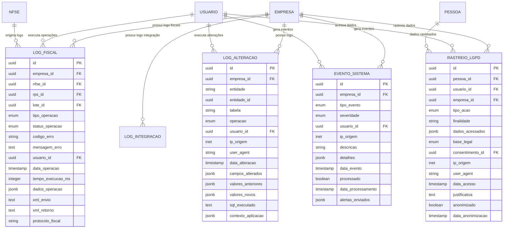

# 8️⃣ DOMÍNIO DE AUDITORIA E LOGS

## 📋 Descrição Geral

Domínio transversal para rastreabilidade completa, conformidade LGPD e auditoria fiscal. Modelagem rica: eventos como entidades imutáveis com estratégias de retenção e purge seletivo. Preparado para alta volumetria com particionamento temporal e índices otimizados.

## 🎯 Objetivos Críticos

- 📝 Rastreabilidade total de todas as operações
- 🔒 Conformidade LGPD com controle de acesso a dados pessoais
- ⚖️ Auditoria fiscal com retenção de 5+ anos
- 🚀 Performance otimizada para alta volumetria
- 🔍 Busca eficiente em históricos extensos
- 📊 Analytics para detecção de padrões

## 🏗️ Entidades

### LogAlteracao
**Descrição**: Log imutável de todas as alterações em entidades do sistema.

| Campo | Tipo | Constraints | Descrição |
|-------|------|-------------|-----------|
| id | UUID | PK, NOT NULL | Identificador único |
| empresa_id | UUID | FK, NOT NULL | Tenant isolamento |
| entidade | VARCHAR(100) | NOT NULL | Nome da entidade alterada |
| entidade_id | UUID | NOT NULL | ID da entidade alterada |
| tabela | VARCHAR(100) | NOT NULL | Nome da tabela |
| operacao | ENUM | NOT NULL | INSERT, UPDATE, DELETE |
| usuario_id | UUID | FK, NULL | Usuário responsável (NULL para sistema) |
| ip_origem | INET | NULL | IP de origem da operação |
| user_agent | VARCHAR(500) | NULL | User agent do navegador |
| data_alteracao | TIMESTAMP | NOT NULL | Data/hora da alteração |
| campos_alterados | JSONB | NULL | Campos que foram alterados |
| valores_anteriores | JSONB | NULL | Valores antes da alteração |
| valores_novos | JSONB | NULL | Novos valores |
| sql_executado | TEXT | NULL | SQL executado (se aplicável) |
| contexto_aplicacao | JSONB | NULL | Contexto da aplicação |

**Índices**:
- `idx_log_alteracao_empresa_data` (empresa_id, data_alteracao) - Multitenant + temporal
- `idx_log_alteracao_entidade` (entidade, entidade_id) - Busca por entidade
- `idx_log_alteracao_usuario` (usuario_id) - Busca por usuário
- `idx_log_alteracao_tabela` (tabela) - Busca por tabela
- `gin_log_campos_alterados` USING GIN (campos_alterados) - Busca em JSON
- `idx_log_ip_data` (ip_origem, data_alteracao) - Análise de segurança

### LogFiscal
**Descrição**: Log específico de operações fiscais críticas.

| Campo | Tipo | Constraints | Descrição |
|-------|------|-------------|-----------|
| id | UUID | PK, NOT NULL | Identificador único |
| empresa_id | UUID | FK, NOT NULL | Tenant isolamento |
| nfse_id | UUID | FK, NULL | NFS-e relacionada |
| rps_id | UUID | FK, NULL | RPS relacionado |
| lote_id | UUID | FK, NULL | Lote relacionado |
| tipo_operacao | ENUM | NOT NULL | GERACAO_RPS, ENVIO_LOTE, AUTORIZACAO_NFSE, CANCELAMENTO |
| status_operacao | ENUM | NOT NULL | SUCESSO, ERRO, PENDENTE |
| codigo_erro | VARCHAR(20) | NULL | Código de erro |
| mensagem_erro | TEXT | NULL | Mensagem de erro |
| usuario_id | UUID | FK, NULL | Usuário responsável |
| data_operacao | TIMESTAMP | NOT NULL | Data/hora da operação |
| tempo_execucao_ms | INTEGER | NULL | Tempo de execução em ms |
| dados_operacao | JSONB | NOT NULL | Dados da operação |
| xml_envio | TEXT | NULL | XML enviado |
| xml_retorno | TEXT | NULL | XML de retorno |
| protocolo_fiscal | VARCHAR(50) | NULL | Protocolo da prefeitura |

**Índices**:
- `idx_log_fiscal_empresa_data` (empresa_id, data_operacao)
- `idx_log_fiscal_nfse` (nfse_id)
- `idx_log_fiscal_tipo_status` (tipo_operacao, status_operacao)
- `idx_log_fiscal_protocolo` (protocolo_fiscal)
- `gin_log_fiscal_dados` USING GIN (dados_operacao)

### LogIntegracao
**Descrição**: Log de integrações com APIs externas.

| Campo | Tipo | Constraints | Descrição |
|-------|------|-------------|-----------|
| id | UUID | PK, NOT NULL | Identificador único |
| empresa_id | UUID | FK, NULL | Tenant (NULL para APIs globais) |
| servico_externo | VARCHAR(100) | NOT NULL | Nome do serviço (ex: SEFAZ_SP) |
| endpoint | VARCHAR(500) | NOT NULL | URL do endpoint |
| metodo_http | VARCHAR(10) | NOT NULL | GET, POST, PUT, DELETE |
| status_http | INTEGER | NOT NULL | Status HTTP da resposta |
| tempo_resposta_ms | INTEGER | NOT NULL | Tempo de resposta |
| data_request | TIMESTAMP | NOT NULL | Data/hora da requisição |
| request_headers | JSONB | NULL | Headers da requisição |
| request_body | TEXT | NULL | Corpo da requisição |
| response_headers | JSONB | NULL | Headers da resposta |
| response_body | TEXT | NULL | Corpo da resposta |
| erro_interno | TEXT | NULL | Erro interno da aplicação |
| retry_attempt | INTEGER | DEFAULT 0 | Tentativa de retry |
| correlation_id | UUID | NOT NULL | ID para correlação de requests |

**Índices**:
- `idx_log_integracao_empresa_data` (empresa_id, data_request)
- `idx_log_integracao_servico` (servico_externo)
- `idx_log_integracao_status_data` (status_http, data_request)
- `idx_log_integracao_correlation` (correlation_id)
- `idx_log_integracao_endpoint` (endpoint)

### RastreioLgpd
**Descrição**: Rastreamento de acesso e manipulação de dados pessoais (LGPD).

| Campo | Tipo | Constraints | Descrição |
|-------|------|-------------|-----------|
| id | UUID | PK, NOT NULL | Identificador único |
| pessoa_id | UUID | FK, NOT NULL | Pessoa cujos dados foram acessados |
| usuario_id | UUID | FK, NOT NULL | Usuário que acessou |
| empresa_id | UUID | FK, NOT NULL | Empresa context |
| tipo_acao | ENUM | NOT NULL | VISUALIZACAO, EDICAO, EXPORTACAO, EXCLUSAO |
| finalidade | VARCHAR(255) | NOT NULL | Finalidade do acesso |
| dados_acessados | JSONB | NOT NULL | Campos/dados específicos |
| base_legal | ENUM | NOT NULL | CONSENTIMENTO, LEGITIMO_INTERESSE, CUMPRIMENTO_LEGAL |
| consentimento_id | UUID | FK, NULL | ID do consentimento (se aplicável) |
| ip_origem | INET | NOT NULL | IP de origem |
| user_agent | VARCHAR(500) | NULL | User agent |
| data_acesso | TIMESTAMP | NOT NULL | Data/hora do acesso |
| justificativa | TEXT | NULL | Justificativa para o acesso |
| anonimizado | BOOLEAN | DEFAULT FALSE | Se dados foram anonimizados |
| data_anonimizacao | TIMESTAMP | NULL | Data da anonimização |

**Índices**:
- `idx_rastreio_pessoa_data` (pessoa_id, data_acesso)
- `idx_rastreio_usuario` (usuario_id)
- `idx_rastreio_empresa` (empresa_id)
- `idx_rastreio_tipo_acao` (tipo_acao)
- `idx_rastreio_base_legal` (base_legal)
- `gin_rastreio_dados` USING GIN (dados_acessados)

### EventoSistema
**Descrição**: Eventos de sistema para monitoring e alertas.

| Campo | Tipo | Constraints | Descrição |
|-------|------|-------------|-----------|
| id | UUID | PK, NOT NULL | Identificador único |
| empresa_id | UUID | FK, NULL | Empresa (NULL para eventos globais) |
| tipo_evento | ENUM | NOT NULL | LOGIN, LOGOUT, ERRO_SISTEMA, LIMITE_ATINGIDO |
| severidade | ENUM | NOT NULL | INFO, WARNING, ERROR, CRITICAL |
| usuario_id | UUID | FK, NULL | Usuário relacionado |
| ip_origem | INET | NULL | IP de origem |
| descricao | VARCHAR(500) | NOT NULL | Descrição do evento |
| detalhes | JSONB | NULL | Detalhes técnicos |
| data_evento | TIMESTAMP | NOT NULL | Data/hora do evento |
| processado | BOOLEAN | DEFAULT FALSE | Se foi processado |
| data_processamento | TIMESTAMP | NULL | Data do processamento |
| alertas_enviados | JSONB | NULL | Alertas enviados |

**Índices**:
- `idx_evento_data_severidade` (data_evento, severidade)
- `idx_evento_tipo` (tipo_evento)
- `idx_evento_usuario` (usuario_id)
- `idx_evento_processado` (processado)

## 🔗 Relacionamentos



## ⚙️ Triggers e Automação

### Trigger para Log de Alterações
```sql
-- Função genérica para logging
CREATE OR REPLACE FUNCTION log_alteracao_trigger()
RETURNS trigger AS $$
DECLARE
    empresa_uuid UUID;
    usuario_uuid UUID;
    campos_alterados JSONB := '{}';
    valores_antigos JSONB := '{}';
    valores_novos JSONB := '{}';
    rec RECORD;
BEGIN
    -- Obter empresa_id e usuario_id do contexto
    empresa_uuid := NULLIF(current_setting('app.tenant_id', true), '')::UUID;
    usuario_uuid := NULLIF(current_setting('app.user_id', true), '')::UUID;
    
    -- Determinar operação e montar dados
    IF TG_OP = 'DELETE' THEN
        rec := OLD;
        valores_antigos := to_jsonb(OLD);
    ELSIF TG_OP = 'UPDATE' THEN
        rec := NEW;
        valores_antigos := to_jsonb(OLD);
        valores_novos := to_jsonb(NEW);
        
        -- Identificar campos alterados
        SELECT jsonb_object_agg(key, value) INTO campos_alterados
        FROM jsonb_each(valores_novos)
        WHERE key NOT IN ('data_atualizacao', 'updated_at') -- Ignorar campos de timestamp automático
        AND valores_antigos->>key IS DISTINCT FROM value::text;
        
    ELSIF TG_OP = 'INSERT' THEN
        rec := NEW;
        valores_novos := to_jsonb(NEW);
    END IF;
    
    -- Inserir log apenas se houve alterações significativas
    IF TG_OP != 'UPDATE' OR campos_alterados != '{}' THEN
        INSERT INTO log_alteracao (
            id, empresa_id, entidade, entidade_id, tabela, operacao,
            usuario_id, ip_origem, data_alteracao,
            campos_alterados, valores_anteriores, valores_novos
        ) VALUES (
            uuid_generate_v4(), 
            COALESCE(empresa_uuid, (rec.*)::JSONB->>'empresa_id'::text)::UUID,
            TG_TABLE_NAME,
            (rec.*)::JSONB->>'id'::text)::UUID,
            TG_TABLE_NAME,
            TG_OP::log_operacao,
            usuario_uuid,
            inet_client_addr(),
            CURRENT_TIMESTAMP,
            campos_alterados,
            valores_antigos,
            valores_novos
        );
    END IF;
    
    RETURN CASE TG_OP
        WHEN 'DELETE' THEN OLD
        ELSE NEW
    END;
END;
$$ LANGUAGE plpgsql SECURITY DEFINER;

-- Aplicar trigger em tabelas importantes
CREATE TRIGGER log_alteracao_pessoa 
    AFTER INSERT OR UPDATE OR DELETE ON pessoa
    FOR EACH ROW EXECUTE FUNCTION log_alteracao_trigger();

CREATE TRIGGER log_alteracao_ordem_servico 
    AFTER INSERT OR UPDATE OR DELETE ON ordem_servico
    FOR EACH ROW EXECUTE FUNCTION log_alteracao_trigger();
```

### Função para Log LGPD
```typescript
async function registrarAcessoLGPD(dados: AcessoLGPD): Promise<void> {
  await inserirRastreioLgpd({
    pessoaId: dados.pessoaId,
    usuarioId: dados.usuarioId,
    empresaId: dados.empresaId,
    tipoAcao: dados.tipoAcao,
    finalidade: dados.finalidade,
    dadosAcessados: dados.camposAcessados,
    baseLegal: dados.baseLegal,
    consentimentoId: dados.consentimentoId,
    ipOrigem: dados.ipOrigem,
    userAgent: dados.userAgent,
    dataAcesso: new Date(),
    justificativa: dados.justificativa
  });
}

// Middleware para interceptar acesso a dados pessoais
const lgpdMiddleware = (req: Request, res: Response, next: NextFunction) => {
  const originalSend = res.send;
  
  res.send = function(body) {
    // Analisar resposta para detectar dados pessoais
    const dadosPessoais = extrairDadosPessoais(body);
    
    if (dadosPessoais.length > 0) {
      registrarAcessoLGPD({
        pessoaId: dadosPessoais[0].pessoaId,
        usuarioId: req.user.id,
        empresaId: req.tenant.id,
        tipoAcao: 'VISUALIZACAO',
        finalidade: req.route.path,
        camposAcessados: dadosPessoais.map(d => d.campos),
        baseLegal: 'LEGITIMO_INTERESSE',
        ipOrigem: req.ip,
        userAgent: req.get('User-Agent')
      });
    }
    
    return originalSend.call(this, body);
  };
  
  next();
};
```

## 📊 Analytics e Relatórios

### Relatório de Atividade por Usuário
```sql
SELECT 
    u.email,
    pe.nome_razao_social,
    COUNT(*) as total_operacoes,
    COUNT(*) FILTER (WHERE la.operacao = 'INSERT') as inserts,
    COUNT(*) FILTER (WHERE la.operacao = 'UPDATE') as updates,
    COUNT(*) FILTER (WHERE la.operacao = 'DELETE') as deletes,
    COUNT(DISTINCT la.entidade) as entidades_diferentes,
    MIN(la.data_alteracao) as primeira_atividade,
    MAX(la.data_alteracao) as ultima_atividade
FROM log_alteracao la
JOIN usuario u ON u.id = la.usuario_id
JOIN pessoa pe ON pe.id = u.pessoa_id
WHERE la.empresa_id = @empresa_id
AND la.data_alteracao >= CURRENT_DATE - INTERVAL '30 days'
GROUP BY u.id, u.email, pe.nome_razao_social
ORDER BY total_operacoes DESC;
```

### Análise de Performance de Integrações
```sql
WITH stats_integracao AS (
    SELECT 
        servico_externo,
        DATE_TRUNC('hour', data_request) as hora,
        COUNT(*) as total_requests,
        AVG(tempo_resposta_ms) as tempo_medio,
        PERCENTILE_CONT(0.95) WITHIN GROUP (ORDER BY tempo_resposta_ms) as p95,
        COUNT(*) FILTER (WHERE status_http >= 400) as erros,
        COUNT(*) FILTER (WHERE status_http >= 500) as erros_servidor
    FROM log_integracao
    WHERE data_request >= CURRENT_DATE - INTERVAL '24 hours'
    GROUP BY servico_externo, DATE_TRUNC('hour', data_request)
)
SELECT 
    servico_externo,
    SUM(total_requests) as requests_24h,
    ROUND(AVG(tempo_medio), 2) as tempo_medio_ms,
    ROUND(AVG(p95), 2) as p95_ms,
    SUM(erros) as total_erros,
    ROUND((SUM(erros)::float / SUM(total_requests) * 100), 2) as taxa_erro_percent
FROM stats_integracao
GROUP BY servico_externo
ORDER BY requests_24h DESC;
```

### Compliance LGPD
```sql
-- Relatório de acessos a dados pessoais por base legal
SELECT 
    rl.base_legal,
    COUNT(*) as total_acessos,
    COUNT(DISTINCT rl.pessoa_id) as pessoas_afetadas,
    COUNT(DISTINCT rl.usuario_id) as usuarios_envolvidos,
    MIN(rl.data_acesso) as primeiro_acesso,
    MAX(rl.data_acesso) as ultimo_acesso
FROM rastreio_lgpd rl
WHERE rl.empresa_id = @empresa_id
AND rl.data_acesso >= CURRENT_DATE - INTERVAL '12 months'
GROUP BY rl.base_legal
ORDER BY total_acessos DESC;

-- Pessoas com direito ao esquecimento (LGPD Art. 18)
SELECT 
    pe.nome_razao_social,
    COUNT(*) as total_acessos,
    MAX(rl.data_acesso) as ultimo_acesso,
    CURRENT_DATE - MAX(rl.data_acesso::date) as dias_sem_acesso
FROM pessoa pe
LEFT JOIN rastreio_lgpd rl ON rl.pessoa_id = pe.id
WHERE NOT EXISTS (
    SELECT 1 FROM papel pa 
    WHERE pa.pessoa_id = pe.id 
    AND pa.status = 'ATIVO'
)
AND (rl.data_acesso IS NULL OR rl.data_acesso < CURRENT_DATE - INTERVAL '2 years')
GROUP BY pe.id, pe.nome_razao_social
ORDER BY dias_sem_acesso DESC;
```

## 🔧 Particionamento e Retenção

### Particionamento Temporal
```sql
-- Criar tabela particionada por mês
CREATE TABLE log_alteracao (
    id UUID DEFAULT uuid_generate_v4(),
    empresa_id UUID NOT NULL,
    data_alteracao TIMESTAMP NOT NULL,
    -- outros campos...
) PARTITION BY RANGE (data_alteracao);

-- Criar partições mensais
CREATE TABLE log_alteracao_2024_01 PARTITION OF log_alteracao
FOR VALUES FROM ('2024-01-01') TO ('2024-02-01');

-- Automatizar criação de partições futuras
CREATE OR REPLACE FUNCTION criar_particoes_log_alteracao()
RETURNS void AS $$
DECLARE
    start_date DATE;
    end_date DATE;
    partition_name TEXT;
BEGIN
    -- Criar partições para próximos 3 meses
    FOR i IN 0..2 LOOP
        start_date := DATE_TRUNC('month', CURRENT_DATE) + (i || ' months')::INTERVAL;
        end_date := start_date + INTERVAL '1 month';
        partition_name := 'log_alteracao_' || TO_CHAR(start_date, 'YYYY_MM');
        
        -- Verificar se partição já existe
        IF NOT EXISTS (
            SELECT 1 FROM pg_tables 
            WHERE tablename = partition_name
        ) THEN
            EXECUTE format('CREATE TABLE %I PARTITION OF log_alteracao
                           FOR VALUES FROM (%L) TO (%L)',
                          partition_name, start_date, end_date);
        END IF;
    END LOOP;
END;
$$ LANGUAGE plpgsql;

-- Agendar criação automática
SELECT cron.schedule('criar-particoes', '0 0 1 * *', 'SELECT criar_particoes_log_alteracao()');
```

### Política de Retenção
```sql
CREATE OR REPLACE FUNCTION purgar_logs_antigos()
RETURNS void AS $$
BEGIN
    -- Logs de alteração: 5 anos para fiscal, 2 anos para demais
    DELETE FROM log_alteracao 
    WHERE data_alteracao < CURRENT_DATE - INTERVAL '2 years'
    AND entidade NOT IN ('rps', 'nfse', 'lote_rps', 'retencao_tributaria');
    
    DELETE FROM log_alteracao
    WHERE data_alteracao < CURRENT_DATE - INTERVAL '5 years'
    AND entidade IN ('rps', 'nfse', 'lote_rps', 'retencao_tributaria');
    
    -- Logs de integração: 1 ano
    DELETE FROM log_integracao
    WHERE data_request < CURRENT_DATE - INTERVAL '1 year';
    
    -- Eventos de sistema: 6 meses (exceto críticos)
    DELETE FROM evento_sistema
    WHERE data_evento < CURRENT_DATE - INTERVAL '6 months'
    AND severidade != 'CRITICAL';
    
    -- Rastreio LGPD: conforme política de privacidade
    UPDATE rastreio_lgpd
    SET anonimizado = true,
        dados_acessados = '{"anonimizado": true}',
        data_anonimizacao = CURRENT_TIMESTAMP
    WHERE data_acesso < CURRENT_DATE - INTERVAL '3 years'
    AND NOT anonimizado;
END;
$$ LANGUAGE plpgsql;

-- Executar mensalmente
SELECT cron.schedule('purgar-logs', '0 2 1 * *', 'SELECT purgar_logs_antigos()');
```

## 🚨 Alertas e Monitoring

### Sistema de Alertas
```typescript
interface ConfigAlerta {
  tipo: TipoEvento;
  severidade: Severidade;
  threshold: number;
  periodo: string; // ex: '5 minutes'
  destinatarios: string[];
}

const alertas: ConfigAlerta[] = [
  {
    tipo: 'ERRO_SISTEMA',
    severidade: 'ERROR',
    threshold: 10,
    periodo: '5 minutes',
    destinatarios: ['dev@empresa.com']
  },
  {
    tipo: 'LOGIN',
    severidade: 'WARNING',
    threshold: 5, // 5 logins falhados
    periodo: '1 minute',
    destinatarios: ['security@empresa.com']
  }
];

async function verificarAlertas(): Promise<void> {
  for (const alerta of alertas) {
    const count = await contarEventos({
      tipoEvento: alerta.tipo,
      severidade: alerta.severidade,
      periodo: alerta.periodo
    });
    
    if (count >= alerta.threshold) {
      await enviarAlerta({
        tipo: alerta.tipo,
        count,
        threshold: alerta.threshold,
        destinatarios: alerta.destinatarios
      });
    }
  }
}
```

### Detecção de Anomalias
```sql
-- Detectar atividade suspeita de usuários
WITH atividade_normal AS (
    SELECT 
        usuario_id,
        AVG(operacoes_por_hora) as media_operacoes,
        STDDEV(operacoes_por_hora) as desvio_operacoes
    FROM (
        SELECT 
            usuario_id,
            DATE_TRUNC('hour', data_alteracao) as hora,
            COUNT(*) as operacoes_por_hora
        FROM log_alteracao
        WHERE data_alteracao >= CURRENT_DATE - INTERVAL '30 days'
        GROUP BY usuario_id, DATE_TRUNC('hour', data_alteracao)
    ) subq
    GROUP BY usuario_id
),
atividade_atual AS (
    SELECT 
        usuario_id,
        COUNT(*) as operacoes_ultima_hora
    FROM log_alteracao
    WHERE data_alteracao >= CURRENT_TIMESTAMP - INTERVAL '1 hour'
    GROUP BY usuario_id
)
SELECT 
    ac.usuario_id,
    u.email,
    ac.operacoes_ultima_hora,
    an.media_operacoes,
    (ac.operacoes_ultima_hora - an.media_operacoes) / NULLIF(an.desvio_operacoes, 0) as z_score
FROM atividade_atual ac
JOIN atividade_normal an ON an.usuario_id = ac.usuario_id
JOIN usuario u ON u.id = ac.usuario_id
WHERE (ac.operacoes_ultima_hora - an.media_operacoes) / NULLIF(an.desvio_operacoes, 0) > 3 -- Z-score > 3
ORDER BY z_score DESC;
```

---

*Documento atualizado em: {{data_atual}}*
