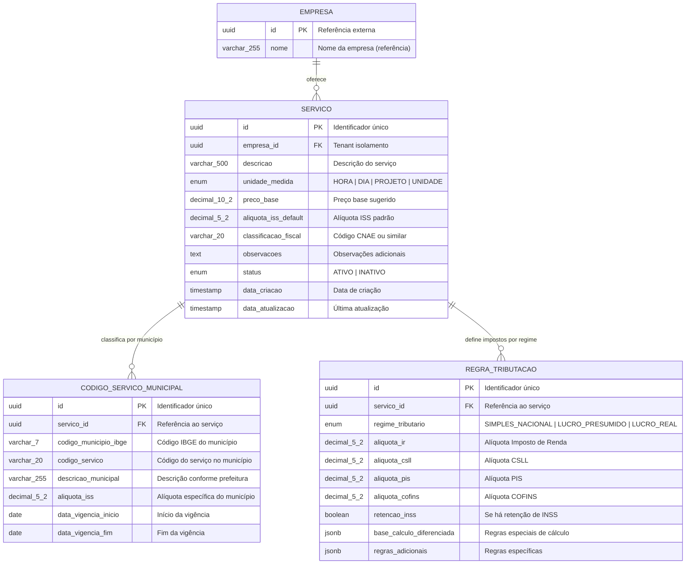

# Diagrama ER - Domínio de Catálogo de Serviços

## 📊 Visão Geral

Este diagrama representa o catálogo de serviços com classificação fiscal brasileira, regras tributárias dinâmicas e códigos municipais para conformidade com múltiplas prefeituras.

## 🗂️ Diagrama Completo



## 🔍 Detalhamento dos Relacionamentos

### Empresa → Servico (1:N)
- **Cardinalidade**: Uma empresa oferece múltiplos serviços
- **Isolamento**: Catálogo específico por tenant
- **Customização**: Preços e descrições personalizadas
- **Versionamento**: Controle de alterações via data_atualizacao

### Servico → CodigoServicoMunicipal (1:N)
- **Cardinalidade**: Um serviço tem códigos diferentes por município
- **Finalidade**: Conformidade com legislação municipal
- **Vigência**: Controle temporal para mudanças legislativas
- **Alíquotas**: ISS específico por localização

### Servico → RegraTributacao (1:N)
- **Cardinalidade**: Um serviço tem regras por regime tributário
- **Flexibilidade**: Suporte a todos os regimes brasileiros
- **Cálculos**: Base para impostos federais
- **Extensibilidade**: JSONB para regras complexas

## 📋 Constraints e Validações

### Unique Constraints
```sql
-- Um serviço por código municipal e período
UNIQUE (servico_id, codigo_municipio_ibge, data_vigencia_inicio) ON codigo_servico_municipal

-- Uma regra por serviço e regime
UNIQUE (servico_id, regime_tributario) ON regra_tributacao
```

### Check Constraints
```sql
-- Alíquotas válidas
CHECK (aliquota_iss_default >= 0 AND aliquota_iss_default <= 20) ON servico
CHECK (aliquota_iss >= 0 AND aliquota_iss <= 20) ON codigo_servico_municipal
CHECK (aliquota_ir >= 0 AND aliquota_ir <= 50) ON regra_tributacao

-- Vigência válida
CHECK (data_vigencia_fim IS NULL OR data_vigencia_fim >= data_vigencia_inicio) ON codigo_servico_municipal

-- Preço positivo
CHECK (preco_base > 0) ON servico
```

## ⚙️ Consultas Típicas

### Buscar Serviços Ativos de uma Empresa
```sql
SELECT 
    s.id,
    s.descricao,
    s.preco_base,
    s.unidade_medida,
    s.aliquota_iss_default
FROM servico s
WHERE s.empresa_id = @empresa_id
AND s.status = 'ATIVO'
ORDER BY s.descricao;
```

### Calcular Impostos por Município e Regime
```sql
WITH impostos_calculados AS (
    SELECT 
        s.id as servico_id,
        s.descricao,
        @valor_servico as valor_base,
        
        -- ISS específico do município ou padrão
        COALESCE(csm.aliquota_iss, s.aliquota_iss_default) as aliquota_iss,
        @valor_servico * COALESCE(csm.aliquota_iss, s.aliquota_iss_default) / 100 as valor_iss,
        
        -- Impostos federais conforme regime
        CASE WHEN @regime = 'SIMPLES_NACIONAL' THEN 0 
             ELSE @valor_servico * COALESCE(rt.aliquota_ir, 0) / 100 END as valor_ir,
        CASE WHEN @regime = 'SIMPLES_NACIONAL' THEN 0 
             ELSE @valor_servico * COALESCE(rt.aliquota_csll, 0) / 100 END as valor_csll,
        CASE WHEN @regime = 'SIMPLES_NACIONAL' THEN 0 
             ELSE @valor_servico * COALESCE(rt.aliquota_pis, 0) / 100 END as valor_pis,
        CASE WHEN @regime = 'SIMPLES_NACIONAL' THEN 0 
             ELSE @valor_servico * COALESCE(rt.aliquota_cofins, 0) / 100 END as valor_cofins
        
    FROM servico s
    LEFT JOIN codigo_servico_municipal csm ON csm.servico_id = s.id
        AND csm.codigo_municipio_ibge = @codigo_municipio
        AND CURRENT_DATE BETWEEN csm.data_vigencia_inicio 
        AND COALESCE(csm.data_vigencia_fim, '2999-12-31')
    LEFT JOIN regra_tributacao rt ON rt.servico_id = s.id
        AND rt.regime_tributario = @regime
    WHERE s.id = @servico_id
)
SELECT 
    *,
    (valor_iss + valor_ir + valor_csll + valor_pis + valor_cofins) as total_impostos,
    (valor_base - valor_iss - valor_ir - valor_csll - valor_pis - valor_cofins) as valor_liquido
FROM impostos_calculados;
```

### Códigos Municipais por Região
```sql
SELECT 
    s.descricao as servico,
    csm.codigo_municipio_ibge,
    m.nome as municipio,
    m.uf,
    csm.codigo_servico,
    csm.aliquota_iss,
    csm.data_vigencia_inicio,
    csm.data_vigencia_fim
FROM servico s
JOIN codigo_servico_municipal csm ON csm.servico_id = s.id
JOIN municipio_ibge m ON m.codigo = csm.codigo_municipio_ibge
WHERE s.empresa_id = @empresa_id
AND m.uf = @uf
AND CURRENT_DATE BETWEEN csm.data_vigencia_inicio 
    AND COALESCE(csm.data_vigencia_fim, '2999-12-31')
ORDER BY m.nome, s.descricao;
```

## 🔧 Funções de Apoio

### Função para Calcular ISS
```sql
CREATE OR REPLACE FUNCTION calcular_iss_servico(
    p_servico_id UUID,
    p_codigo_municipio VARCHAR(7),
    p_valor_base DECIMAL(10,2)
) RETURNS DECIMAL(10,2) AS $$
DECLARE
    v_aliquota DECIMAL(5,2);
BEGIN
    -- Buscar alíquota específica do município ou padrão
    SELECT COALESCE(csm.aliquota_iss, s.aliquota_iss_default)
    INTO v_aliquota
    FROM servico s
    LEFT JOIN codigo_servico_municipal csm ON csm.servico_id = s.id
        AND csm.codigo_municipio_ibge = p_codigo_municipio
        AND CURRENT_DATE BETWEEN csm.data_vigencia_inicio 
        AND COALESCE(csm.data_vigencia_fim, '2999-12-31')
    WHERE s.id = p_servico_id;
    
    IF v_aliquota IS NULL THEN
        RAISE EXCEPTION 'Serviço não encontrado: %', p_servico_id;
    END IF;
    
    RETURN p_valor_base * v_aliquota / 100;
END;
$$ LANGUAGE plpgsql;
```

### Função para Obter Código Municipal
```sql
CREATE OR REPLACE FUNCTION obter_codigo_municipal(
    p_servico_id UUID,
    p_codigo_municipio VARCHAR(7),
    p_data_referencia DATE DEFAULT CURRENT_DATE
) RETURNS VARCHAR(20) AS $$
DECLARE
    v_codigo VARCHAR(20);
BEGIN
    SELECT csm.codigo_servico
    INTO v_codigo
    FROM codigo_servico_municipal csm
    WHERE csm.servico_id = p_servico_id
    AND csm.codigo_municipio_ibge = p_codigo_municipio
    AND p_data_referencia BETWEEN csm.data_vigencia_inicio 
        AND COALESCE(csm.data_vigencia_fim, '2999-12-31')
    ORDER BY csm.data_vigencia_inicio DESC
    LIMIT 1;
    
    IF v_codigo IS NULL THEN
        RAISE EXCEPTION 'Código municipal não encontrado para serviço % no município %', 
                       p_servico_id, p_codigo_municipio;
    END IF;
    
    RETURN v_codigo;
END;
$$ LANGUAGE plpgsql;
```

## 📊 Dados de Exemplo

### Principais Códigos de Serviço (São Paulo)
```sql
-- Inserir códigos padrão de São Paulo
INSERT INTO codigo_servico_municipal (id, servico_id, codigo_municipio_ibge, codigo_servico, descricao_municipal, aliquota_iss, data_vigencia_inicio) VALUES
(uuid_generate_v4(), @servico_desenvolvimento_id, '3550308', '01.01', 'Análise e desenvolvimento de sistemas', 2.00, '2024-01-01'),
(uuid_generate_v4(), @servico_programacao_id, '3550308', '01.02', 'Programação', 2.00, '2024-01-01'),
(uuid_generate_v4(), @servico_consultoria_id, '3550308', '01.03', 'Consultoria em tecnologia da informação', 2.00, '2024-01-01'),
(uuid_generate_v4(), @servico_suporte_id, '3550308', '01.04', 'Suporte técnico em informática', 2.00, '2024-01-01');
```

### Regras Tributárias por Regime
```sql
-- Simples Nacional (sem impostos federais retidos)
INSERT INTO regra_tributacao (id, servico_id, regime_tributario, aliquota_ir, aliquota_csll, aliquota_pis, aliquota_cofins, retencao_inss) VALUES
(uuid_generate_v4(), @servico_id, 'SIMPLES_NACIONAL', 0, 0, 0, 0, false);

-- Lucro Presumido
INSERT INTO regra_tributacao (id, servico_id, regime_tributario, aliquota_ir, aliquota_csll, aliquota_pis, aliquota_cofins, retencao_inss) VALUES
(uuid_generate_v4(), @servico_id, 'LUCRO_PRESUMIDO', 1.5, 1.0, 0.65, 3.0, true);

-- Lucro Real  
INSERT INTO regra_tributacao (id, servico_id, regime_tributario, aliquota_ir, aliquota_csll, aliquota_pis, aliquota_cofins, retencao_inss) VALUES
(uuid_generate_v4(), @servico_id, 'LUCRO_REAL', 1.5, 1.0, 1.65, 7.6, true);
```

## ⚡ Otimizações de Performance

### Índices Específicos
```sql
-- Busca por empresa e status
CREATE INDEX idx_servico_empresa_status ON servico (empresa_id, status);

-- Busca por município e vigência
CREATE INDEX idx_codigo_municipio_vigencia ON codigo_servico_municipal 
(codigo_municipio_ibge, data_vigencia_inicio, data_vigencia_fim);

-- Busca por regime tributário
CREATE INDEX idx_regra_regime ON regra_tributacao (regime_tributario);

-- Classificação fiscal
CREATE INDEX idx_servico_classificacao ON servico (classificacao_fiscal);
```

### View para Facilitar Consultas
```sql
CREATE VIEW vw_servico_completo AS
SELECT 
    s.id,
    s.empresa_id,
    s.descricao,
    s.unidade_medida,
    s.preco_base,
    s.aliquota_iss_default,
    s.classificacao_fiscal,
    s.status,
    
    -- Códigos municipais (apenas vigentes)
    json_agg(
        DISTINCT jsonb_build_object(
            'codigo_municipio', csm.codigo_municipio_ibge,
            'codigo_servico', csm.codigo_servico,
            'aliquota_iss', csm.aliquota_iss
        ) ORDER BY csm.codigo_municipio_ibge
    ) FILTER (WHERE csm.id IS NOT NULL) as codigos_municipais,
    
    -- Regras tributárias
    json_agg(
        DISTINCT jsonb_build_object(
            'regime', rt.regime_tributario,
            'ir', rt.aliquota_ir,
            'csll', rt.aliquota_csll,
            'pis', rt.aliquota_pis,
            'cofins', rt.aliquota_cofins,
            'inss', rt.retencao_inss
        ) ORDER BY rt.regime_tributario
    ) FILTER (WHERE rt.id IS NOT NULL) as regras_tributarias
    
FROM servico s
LEFT JOIN codigo_servico_municipal csm ON csm.servico_id = s.id
    AND CURRENT_DATE BETWEEN csm.data_vigencia_inicio 
    AND COALESCE(csm.data_vigencia_fim, '2999-12-31')
LEFT JOIN regra_tributacao rt ON rt.servico_id = s.id
GROUP BY s.id;
```

---

*Última atualização: {{data_atual}}*
