# Diagrama ER - Visão Completa Integrada

## 📊 Visão Geral do Sistema

Este diagrama apresenta a visão integrada de todos os 8 domínios do sistema ERP, mostrando como as entidades se relacionam entre si para formar um ecossistema coeso e escalável.

## 🗂️ Diagrama Arquitetural Completo

```mermaid
erDiagram
    %% DOMÍNIO DE IDENTIDADE E PESSOAS
    PESSOA ||--o{ ENDERECO : "possui"
    PESSOA ||--o{ CONTATO : "possui"
    PESSOA ||--o{ DOCUMENTO : "possui"
    PESSOA ||--o{ PAPEL : "assume"
    PAPEL ||--o{ DADO_ESPECIFICO_PAPEL : "extensões"
    
    %% DOMÍNIO DE EMPRESA (MULTITENANT)
    EMPRESA ||--o{ FILIAL : "possui"
    EMPRESA ||--o{ PARAMETRO_OPERACIONAL : "configura"
    EMPRESA ||--o{ CONFIGURACAO_FISCAL : "define"
    EMPRESA ||--o{ CERTIFICADO_DIGITAL : "utiliza"
    EMPRESA ||--o{ PAPEL : "define contexto"
    USUARIO }o--|| PESSOA : "representa"
    USUARIO ||--o{ USUARIO_EMPRESA_PAPEL : "acessa"
    PAPEL ||--o{ USUARIO_EMPRESA_PAPEL : "autoriza"
    PERMISSAO ||--o{ USUARIO_EMPRESA_PAPEL : "concede"
    
    %% DOMÍNIO DE CATÁLOGO DE SERVIÇOS
    EMPRESA ||--o{ SERVICO : "oferece"
    SERVICO ||--o{ CODIGO_SERVICO_MUNICIPAL : "classifica"
    SERVICO ||--o{ REGRA_TRIBUTACAO : "define impostos"
    
    %% DOMÍNIO DE ORDEM DE SERVIÇO
    EMPRESA ||--o{ ORDEM_SERVICO : "gerencia"
    PAPEL ||--o{ ORDEM_SERVICO : "cliente"
    ORDEM_SERVICO ||--o{ ITEM_ORDEM_SERVICO : "composta"
    SERVICO ||--o{ ITEM_ORDEM_SERVICO : "utilizado"
    ORDEM_SERVICO ||--o{ APONTAMENTO_EXECUCAO : "executada"
    PAPEL ||--o{ APONTAMENTO_EXECUCAO : "prestador"
    ORDEM_SERVICO ||--o{ HISTORICO_ORDEM : "rastreada"
    
    %% DOMÍNIO DE FATURAMENTO
    EMPRESA ||--o{ FATURA : "emite"
    PAPEL ||--o{ FATURA : "cliente"
    FATURA ||--o{ ITEM_FATURA : "composta"
    ORDEM_SERVICO ||--o{ ITEM_FATURA : "origina"
    FATURA ||--o{ PARCELA_FATURA : "parcelada"
    
    %% DOMÍNIO FISCAL
    EMPRESA ||--o{ RPS : "gera"
    FATURA ||--|| RPS : "origina"
    RPS ||--|| NFSE : "converte"
    EMPRESA ||--o{ LOTE_RPS : "envia"
    NFSE ||--o{ RETENCAO_TRIBUTARIA : "possui"
    NFSE ||--o{ EVENTO_FISCAL : "eventos"
    NFSE ||--|| XML_NFSE : "armazena"
    
    %% DOMÍNIO FINANCEIRO
    EMPRESA ||--o{ CONTA_RECEBER : "controla"
    EMPRESA ||--o{ CONTA_PAGAR : "controla"
    FATURA ||--|| CONTA_RECEBER : "gera"
    NFSE ||--|| CONTA_RECEBER : "vincula"
    CONTA_RECEBER ||--o{ RECEBIMENTO : "recebe"
    CONTA_PAGAR ||--o{ PAGAMENTO : "paga"
    CONTA_RECEBER ||--o{ CONCILIACAO_FISCAL_FINANCEIRO : "concilia"
    EMPRESA ||--o{ FLUXO_CAIXA : "projeta"
    
    %% DOMÍNIO DE AUDITORIA
    EMPRESA ||--o{ LOG_ALTERACAO : "audita"
    EMPRESA ||--o{ LOG_FISCAL : "rastreia fiscal"
    EMPRESA ||--o{ LOG_INTEGRACAO : "monitora APIs"
    PESSOA ||--o{ RASTREIO_LGPD : "protege dados"
    USUARIO ||--o{ EVENTO_SISTEMA : "gera eventos"
    
    %% ENTIDADES PRINCIPAIS COM CAMPOS CRÍTICOS
    PESSOA {
        uuid id PK
        enum tipo "FISICA | JURIDICA"
        string nome_razao_social
        string nome_fantasia
        date data_nascimento_constituicao
        enum status
        timestamp data_criacao
        timestamp data_atualizacao
    }
    
    EMPRESA {
        uuid id PK
        string nome
        string cnpj
        string ie
        string im
        enum regime_tributario
        date data_constituicao
        enum status
        timestamp data_criacao
    }
    
    PAPEL {
        uuid id PK
        uuid pessoa_id FK
        uuid empresa_id FK
        enum tipo_papel
        date data_inicio
        date data_fim
        enum status
    }
    
    SERVICO {
        uuid id PK
        uuid empresa_id FK
        string descricao
        enum unidade_medida
        decimal_10_2 preco_base
        decimal_5_2 aliquota_iss_default
        string classificacao_fiscal
        enum status
        timestamp data_criacao
        timestamp data_atualizacao
    }
    
    ORDEM_SERVICO {
        uuid id PK
        uuid empresa_id FK
        uuid cliente_id FK
        string numero_ordem
        string titulo
        timestamp data_abertura
        date data_prevista_conclusao
        timestamp data_conclusao_real
        enum status
        enum prioridade
        decimal_10_2 valor_total_estimado
        decimal_10_2 valor_total_executado
        timestamp data_criacao
        timestamp data_atualizacao
    }
    
    FATURA {
        uuid id PK
        uuid empresa_id FK
        uuid cliente_id FK
        string numero_fatura
        date data_emissao
        date data_vencimento
        date mes_referencia
        decimal_10_2 valor_servicos
        decimal_10_2 base_calculo_iss
        decimal_5_2 aliquota_iss
        decimal_10_2 valor_iss
        decimal_10_2 valor_retencoes
        decimal_10_2 valor_total
        decimal_10_2 valor_liquido
        enum status
        jsonb regras_cobranca
        timestamp data_criacao
        timestamp data_atualizacao
    }
    
    RPS {
        uuid id PK
        uuid empresa_id FK
        uuid fatura_id FK
        bigint numero_rps
        string serie
        timestamp data_emissao
        date competencia
        decimal_15_2 valor_servicos
        decimal_15_2 valor_deducoes
        decimal_15_2 base_calculo
        decimal_5_4 aliquota
        decimal_15_2 valor_iss
        text descricao
        string codigo_servico
        string item_lista_servico
        enum situacao
        timestamp data_criacao
    }
    
    NFSE {
        uuid id PK
        uuid empresa_id FK
        uuid rps_id FK
        bigint numero_nfse
        string codigo_verificacao
        timestamp data_emissao
        timestamp data_autorizacao
        string municipio_prestacao
        string url_visualizacao
        enum status
        text motivo_cancelamento
        timestamp data_cancelamento
    }
    
    CONTA_RECEBER {
        uuid id PK
        uuid empresa_id FK
        uuid fatura_id FK
        uuid nfse_id FK
        string numero_conta
        uuid cliente_id FK
        decimal_15_2 valor_original
        decimal_15_2 valor_total
        decimal_15_2 valor_retencoes
        decimal_15_2 valor_liquido_esperado
        date data_vencimento
        date data_emissao
        enum status
        enum forma_cobranca
        timestamp data_criacao
        timestamp data_atualizacao
    }
    
    LOG_ALTERACAO {
        uuid id PK
        uuid empresa_id FK
        string entidade
        uuid entidade_id
        string tabela
        enum operacao
        uuid usuario_id FK
        inet ip_origem
        timestamp data_alteracao
        jsonb campos_alterados
        jsonb valores_anteriores
        jsonb valores_novos
    }
    
    RASTREIO_LGPD {
        uuid id PK
        uuid pessoa_id FK
        uuid usuario_id FK
        uuid empresa_id FK
        enum tipo_acao
        string finalidade
        jsonb dados_acessados
        enum base_legal
        uuid consentimento_id FK
        inet ip_origem
        timestamp data_acesso
        text justificativa
        boolean anonimizado
    }
```



## 🔄 Fluxos de Dados Principais

### 1. Fluxo Comercial Completo
```
PESSOA → PAPEL(Cliente) → ORDEM_SERVICO → FATURA → RPS → NFSE → CONTA_RECEBER → RECEBIMENTO
```

### 2. Fluxo Fiscal
```
FATURA → RPS → LOTE_RPS → WEBSERVICE_MUNICIPAL → NFSE → RETENCOES → XML_NFSE
```

### 3. Fluxo Financeiro
```
FATURA → CONTA_RECEBER ← NFSE(retenções) → RECEBIMENTO → FLUXO_CAIXA
```

### 4. Fluxo de Auditoria
```
QUALQUER_OPERAÇÃO → LOG_ALTERACAO → RASTREIO_LGPD → EVENTO_SISTEMA → ALERTAS
```

## 📋 Relacionamentos Críticos Inter-Domínios

### Chaves Estrangeiras Principais
```sql
-- Multitenant (todas as tabelas principais)
empresa_id → empresa.id

-- Identidade
pessoa_id → pessoa.id
papel_id → papel.id
usuario_id → usuario.id

-- Comercial
ordem_servico_id → ordem_servico.id
fatura_id → fatura.id
servico_id → servico.id

-- Fiscal
rps_id → rps.id
nfse_id → nfse.id
lote_id → lote_rps.id

-- Financeiro
conta_receber_id → conta_receber.id
conta_pagar_id → conta_pagar.id

-- Geográfico
endereco_id → endereco.id
codigo_municipio_ibge (referência IBGE)
```

## ⚙️ Índices Compostos Críticos

### Performance Multitenant
```sql
-- Todas as consultas filtram por empresa primeiro
CREATE INDEX idx_compostos_multitenant_ordem ON ordem_servico (empresa_id, status, data_abertura);
CREATE INDEX idx_compostos_multitenant_fatura ON fatura (empresa_id, status, data_emissao);
CREATE INDEX idx_compostos_multitenant_nfse ON nfse (empresa_id, status, data_emissao);
CREATE INDEX idx_compostos_multitenant_conta ON conta_receber (empresa_id, status, data_vencimento);

-- Logs com volume alto
CREATE INDEX idx_log_empresa_data_entidade ON log_alteracao (empresa_id, data_alteracao, entidade);
CREATE INDEX idx_rastreio_empresa_pessoa_data ON rastreio_lgpd (empresa_id, pessoa_id, data_acesso);
```

### Relacionamentos Frequentes
```sql
-- Busca de documentos por pessoa
CREATE INDEX idx_documento_pessoa_tipo ON documento (pessoa_id, tipo);

-- Busca de itens por ordem
CREATE INDEX idx_item_ordem_sequencia ON item_ordem_servico (ordem_servico_id, sequencia);

-- Busca de retenções por NFS-e
CREATE INDEX idx_retencao_nfse_tipo ON retencao_tributaria (nfse_id, tipo_retencao);

-- Busca de recebimentos por conta
CREATE INDEX idx_recebimento_conta_data ON recebimento (conta_receber_id, data_recebimento);
```

## 🔐 Políticas de Segurança (RLS)

### Isolamento Multitenant Global
```sql
-- Política padrão para isolamento por empresa
CREATE POLICY tenant_isolation ON {tabela}
FOR ALL TO app_role
USING (empresa_id = current_setting('app.tenant_id')::uuid);

-- Aplicar em todas as tabelas principais
ALTER TABLE ordem_servico ENABLE ROW LEVEL SECURITY;
ALTER TABLE fatura ENABLE ROW LEVEL SECURITY;
ALTER TABLE rps ENABLE ROW LEVEL SECURITY;
ALTER TABLE nfse ENABLE ROW LEVEL SECURITY;
ALTER TABLE conta_receber ENABLE ROW LEVEL SECURITY;
-- ... outras tabelas
```

### Proteção de Dados Pessoais (LGPD)
```sql
-- Política para acessar dados pessoais apenas com justificativa
CREATE POLICY lgpd_data_access ON pessoa
FOR SELECT TO app_role
USING (
    -- Admin sempre pode acessar
    current_setting('app.user_role') = 'ADMIN'
    OR
    -- Ou existe registro de justificativa de acesso
    EXISTS (
        SELECT 1 FROM rastreio_lgpd rl
        WHERE rl.pessoa_id = pessoa.id
        AND rl.usuario_id = current_setting('app.user_id')::uuid
        AND rl.data_acesso >= CURRENT_TIMESTAMP - INTERVAL '1 hour'
    )
);
```

## 📊 Views Materialized para Performance

### Resumos Gerenciais
```sql
-- Resumo de faturamento mensal
CREATE MATERIALIZED VIEW mv_faturamento_resumo AS
SELECT 
    empresa_id,
    DATE_TRUNC('month', data_emissao) as mes,
    COUNT(*) as qtd_faturas,
    SUM(valor_total) as valor_total,
    SUM(valor_liquido) as valor_liquido,
    AVG(valor_total) as ticket_medio,
    COUNT(*) FILTER (WHERE status = 'PAGA') as faturas_pagas
FROM fatura
WHERE status != 'CANCELADA'
GROUP BY empresa_id, DATE_TRUNC('month', data_emissao);

-- Refresh diário automático
CREATE OR REPLACE FUNCTION refresh_resumos()
RETURNS void AS $$
BEGIN
    REFRESH MATERIALIZED VIEW CONCURRENTLY mv_faturamento_resumo;
    REFRESH MATERIALIZED VIEW CONCURRENTLY mv_fiscal_resumo;
    REFRESH MATERIALIZED VIEW CONCURRENTLY mv_financeiro_resumo;
END;
$$ LANGUAGE plpgsql;

SELECT cron.schedule('refresh-resumos', '0 1 * * *', 'SELECT refresh_resumos()');
```

### Dashboard Executivo
```sql
-- Métricas consolidadas para dashboard
CREATE MATERIALIZED VIEW mv_dashboard_executivo AS
SELECT 
    e.id as empresa_id,
    e.nome as empresa_nome,
    
    -- Comercial
    COUNT(DISTINCT os.id) as ordens_ativas,
    COUNT(DISTINCT CASE WHEN os.status = 'EM_ANDAMENTO' THEN os.id END) as ordens_em_andamento,
    
    -- Faturamento
    COUNT(DISTINCT f.id) as faturas_mes_atual,
    SUM(f.valor_total) as valor_faturado_mes,
    
    -- Fiscal
    COUNT(DISTINCT n.id) as nfses_emitidas_mes,
    COUNT(DISTINCT CASE WHEN n.status = 'AUTORIZADA' THEN n.id END) as nfses_autorizadas,
    
    -- Financeiro
    COUNT(DISTINCT cr.id) as contas_receber_abertas,
    SUM(CASE WHEN cr.data_vencimento < CURRENT_DATE THEN cr.valor_total ELSE 0 END) as valor_em_atraso,
    
    -- Última atualização
    CURRENT_TIMESTAMP as ultima_atualizacao

FROM empresa e
LEFT JOIN ordem_servico os ON os.empresa_id = e.id 
    AND os.data_abertura >= DATE_TRUNC('month', CURRENT_DATE)
LEFT JOIN fatura f ON f.empresa_id = e.id 
    AND f.data_emissao >= DATE_TRUNC('month', CURRENT_DATE)
LEFT JOIN nfse n ON n.empresa_id = e.id 
    AND n.data_emissao >= DATE_TRUNC('month', CURRENT_DATE)
LEFT JOIN conta_receber cr ON cr.empresa_id = e.id 
    AND cr.status IN ('ABERTA', 'PARCIAL')
GROUP BY e.id, e.nome;
```

## 🎯 Considerações de Arquitetura

### Escalabilidade Horizontal
- **Sharding por empresa_id** para grandes volumes
- **Read replicas** para consultas analíticas
- **Particionamento temporal** em tabelas de logs
- **Cache distribuído** para dados de configuração

### Disponibilidade
- **Backup contínuo** com PITR (Point-in-Time Recovery)
- **Replicação multi-região** para disaster recovery
- **Health checks** automatizados em todos os componentes
- **Circuit breakers** para integrações externas

### Monitoramento
- **Métricas por tenant** para billing e limits
- **Alertas automáticos** para anomalias
- **Performance tracking** de queries críticas
- **Compliance monitoring** para LGPD e fiscal

---

*Última atualização: {{data_atual}}*

*Esta documentação representa a arquitetura completa do sistema ERP com todos os 8 domínios integrados, seguindo princípios de DDD, multitenancy e conformidade fiscal brasileira.*
