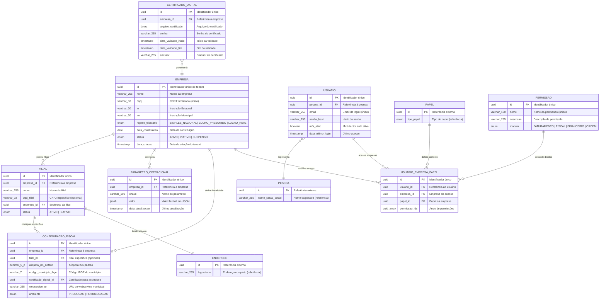

# Diagrama ER - Domínio de Empresa (Multitenant)

## 📊 Visão Geral

Este diagrama representa o núcleo do multitenancy, onde cada empresa é um tenant isolado com configurações específicas, filiais, usuários e sistema RBAC integrado para controle granular de permissões.

## 🗂️ Diagrama Completo



## 🔍 Detalhamento dos Relacionamentos

### Empresa → Filial (1:N)
- **Cardinalidade**: Uma empresa pode ter múltiplas filiais
- **Finalidade**: Suporte a operação multi-localização
- **Fiscalidade**: Cada filial pode ter configurações fiscais específicas
- **Endereçamento**: Cada filial tem endereço próprio

### Empresa → ParametroOperacional (1:N)
- **Pattern EAV**: Configurações extensíveis sem mudança de schema
- **Flexibilidade**: Permite personalização por tenant
- **Versionamento**: Controle de histórico de mudanças
- **Performance**: Índice GIN para busca em JSONB

### Empresa → ConfiguracaoFiscal (1:N)
- **Multimunicipal**: Suporte a múltiplas prefeituras
- **Por Filial**: Configurações específicas por localização
- **Certificados**: Vinculação de certificados digitais
- **Ambientes**: Separação produção/homologação

### Usuario → UsuarioEmpresaPapel (1:N)
- **Multitenant**: Um usuário acessa múltiplas empresas
- **Contexto**: Papel específico em cada empresa
- **RBAC**: Permissões granulares por contexto
- **Auditoria**: Rastreamento de acessos

### Papel → UsuarioEmpresaPapel (1:N)
- **Integração**: Reutiliza papéis do domínio de identidade
- **Contextualização**: Papel específico para acesso ao sistema
- **Flexibilidade**: Permite múltiplos papéis por usuário/empresa

## 📋 Constraints e Índices Importantes

### Unique Constraints
```sql
-- CNPJ único globalmente
UNIQUE (cnpj) ON empresa

-- Email único globalmente
UNIQUE (email) ON usuario

-- Usuário único por pessoa
UNIQUE (pessoa_id) ON usuario

-- Nome de permissão único
UNIQUE (nome) ON permissao

-- Parâmetro único por empresa
UNIQUE (empresa_id, chave) ON parametro_operacional

-- Usuário/empresa/papel único
UNIQUE (usuario_id, empresa_id, papel_id) ON usuario_empresa_papel
```

### Índices de Performance
```sql
-- Isolation multitenant
CREATE INDEX idx_filial_empresa_id ON filial (empresa_id);
CREATE INDEX idx_parametro_empresa_id ON parametro_operacional (empresa_id);
CREATE INDEX idx_config_fiscal_empresa_id ON configuracao_fiscal (empresa_id);
CREATE INDEX idx_uep_empresa_id ON usuario_empresa_papel (empresa_id);

-- Busca por usuário
CREATE INDEX idx_usuario_email ON usuario (email);
CREATE INDEX idx_usuario_pessoa_id ON usuario (pessoa_id);
CREATE INDEX idx_uep_usuario_id ON usuario_empresa_papel (usuario_id);

-- Busca por localização
CREATE INDEX idx_config_fiscal_municipio ON configuracao_fiscal (codigo_municipio_ibge);
CREATE INDEX idx_filial_cnpj ON filial (cnpj_filial);

-- RBAC performance
CREATE INDEX idx_permissao_modulo ON permissao (modulo);
CREATE INDEX gin_uep_permissoes ON usuario_empresa_papel USING GIN (permissao_ids);

-- Configurações
CREATE INDEX idx_parametro_chave ON parametro_operacional (chave);
CREATE INDEX gin_parametro_valor ON parametro_operacional USING GIN (valor);
```

## 🔐 Row Level Security (RLS)

### Políticas de Isolamento
```sql
-- Isolamento por tenant em todas as tabelas
CREATE POLICY tenant_isolation_filial ON filial
FOR ALL TO app_role
USING (empresa_id = current_setting('app.tenant_id')::uuid);

CREATE POLICY tenant_isolation_parametro ON parametro_operacional
FOR ALL TO app_role  
USING (empresa_id = current_setting('app.tenant_id')::uuid);

CREATE POLICY tenant_isolation_config_fiscal ON configuracao_fiscal
FOR ALL TO app_role
USING (empresa_id = current_setting('app.tenant_id')::uuid);

-- Isolamento de usuário para seus próprios dados
CREATE POLICY user_isolation_usuario ON usuario
FOR ALL TO app_role
USING (id = current_setting('app.user_id')::uuid);

-- Acesso apenas a empresas autorizadas
CREATE POLICY authorized_companies_uep ON usuario_empresa_papel
FOR ALL TO app_role
USING (usuario_id = current_setting('app.user_id')::uuid);
```

### Context Setting
```sql
-- Definir contexto da sessão
SELECT set_config('app.tenant_id', @empresa_id::text, true);
SELECT set_config('app.user_id', @usuario_id::text, true);
```

## 🔄 Fluxos de Dados Principais

### 1. Onboarding de Nova Empresa
```sql
-- 1. Criar empresa (tenant)
INSERT INTO empresa (id, nome, cnpj, regime_tributario, status)
VALUES (uuid_generate_v4(), 'Empresa ABC Ltda', '12.345.678/0001-99', 'SIMPLES_NACIONAL', 'ATIVO');

-- 2. Configurar parâmetros operacionais
INSERT INTO parametro_operacional (id, empresa_id, chave, valor)
VALUES 
    (uuid_generate_v4(), @empresa_id, 'moeda_padrao', '"BRL"'),
    (uuid_generate_v4(), @empresa_id, 'timezone', '"America/Sao_Paulo"'),
    (uuid_generate_v4(), @empresa_id, 'casas_decimais', '2');

-- 3. Configurar fiscalidade
INSERT INTO configuracao_fiscal (id, empresa_id, codigo_municipio_ibge, aliquota_iss_default, webservice_url, ambiente)
VALUES (uuid_generate_v4(), @empresa_id, '3550308', 2.00, 'https://nfse.prefeitura.sp.gov.br/ws', 'PRODUCAO');
```

### 2. Cadastro de Usuário
```sql
-- 1. Criar usuário vinculado à pessoa
INSERT INTO usuario (id, pessoa_id, email, senha_hash, mfa_ativo)
VALUES (uuid_generate_v4(), @pessoa_id, 'admin@empresa.com', @senha_hash, false);

-- 2. Vincular usuário à empresa com papel
INSERT INTO usuario_empresa_papel (id, usuario_id, empresa_id, papel_id, permissao_ids)
VALUES (uuid_generate_v4(), @usuario_id, @empresa_id, @papel_admin_id, ARRAY[@perm1, @perm2, @perm3]);
```

### 3. Verificação de Permissões
```sql
-- Verificar se usuário tem permissão específica na empresa
SELECT EXISTS (
    SELECT 1 FROM usuario_empresa_papel uep
    WHERE uep.usuario_id = @usuario_id
    AND uep.empresa_id = @empresa_id
    AND @permissao_id = ANY(uep.permissao_ids)
) as tem_permissao;

-- Listar todas as permissões do usuário na empresa
SELECT p.nome, p.descricao, p.modulo
FROM usuario_empresa_papel uep
JOIN permissao p ON p.id = ANY(uep.permissao_ids)
WHERE uep.usuario_id = @usuario_id
AND uep.empresa_id = @empresa_id;
```

## ⚙️ Cache e Performance

### Cache de Permissões (Redis)
```json
{
  "key": "user_permissions:{user_id}:{empresa_id}",
  "value": {
    "user_id": "uuid",
    "empresa_id": "uuid",
    "papel": "ADMIN",
    "permissions": [
      "emitir_nfse",
      "cancelar_nfse", 
      "criar_ordem",
      "aprovar_fatura"
    ],
    "ttl": 3600
  }
}
```

### Cache de Configurações (Redis)
```json
{
  "key": "tenant_config:{empresa_id}",
  "value": {
    "nome": "Empresa ABC",
    "regime_tributario": "SIMPLES_NACIONAL",
    "parametros": {
      "moeda_padrao": "BRL",
      "timezone": "America/Sao_Paulo",
      "casas_decimais": 2
    },
    "fiscal": {
      "municipio_principal": "3550308",
      "aliquota_iss_default": 2.0,
      "ambiente": "PRODUCAO"
    },
    "ttl": 7200
  }
}
```

## 📊 Métricas e Monitoramento

### KPIs por Tenant
```sql
-- Usuários ativos por empresa nos últimos 30 dias
SELECT 
    e.nome as empresa,
    COUNT(DISTINCT u.id) as usuarios_ativos
FROM empresa e
JOIN usuario_empresa_papel uep ON uep.empresa_id = e.id
JOIN usuario u ON u.id = uep.usuario_id
WHERE u.data_ultimo_login >= CURRENT_DATE - INTERVAL '30 days'
GROUP BY e.id, e.nome;

-- Distribuição de papéis por empresa
SELECT 
    e.nome as empresa,
    pa.tipo_papel,
    COUNT(*) as quantidade
FROM empresa e
JOIN usuario_empresa_papel uep ON uep.empresa_id = e.id
JOIN papel pa ON pa.id = uep.papel_id
GROUP BY e.id, e.nome, pa.tipo_papel;
```

### Alertas de Segurança
- **Tentativas de Login Falhadas**: > 5 em 15 minutos
- **Certificados Vencendo**: < 30 dias para expirar
- **Usuários Inativos**: > 90 dias sem login
- **Permissões Órfãs**: Permissões não utilizadas

---

*Última atualização: {{data_atual}}*
