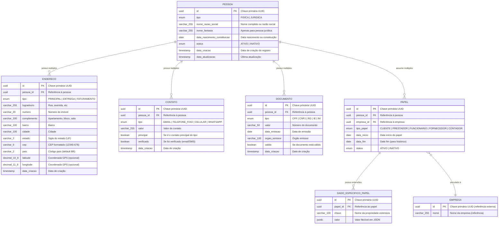

# Diagrama ER - Domínio de Identidade e Pessoas

## 📊 Visão Geral

Este diagrama representa o domínio central de identidade, onde pessoas (físicas e jurídicas) assumem múltiplos papéis dinâmicos em diferentes empresas, evitando duplicação de dados e promovendo escalabilidade.

## 🗂️ Diagrama Completo



## 🔍 Detalhamento dos Relacionamentos

### Pessoa → Endereço (1:N)
- **Cardinalidade**: Uma pessoa pode ter múltiplos endereços
- **Tipos**: Principal, Entrega, Faturamento
- **Constraint**: Apenas um endereço principal por tipo
- **Geolocalização**: Coordenadas opcionais para logística

### Pessoa → Contato (1:N)
- **Cardinalidade**: Uma pessoa pode ter múltiplos contatos
- **Tipos**: Email, telefone fixo, celular, WhatsApp
- **Validação**: Formato específico por tipo
- **Verificação**: Processo assíncrono para confirmação

### Pessoa → Documento (1:N)
- **Cardinalidade**: Uma pessoa pode ter múltiplos documentos
- **Constraint**: Um documento por tipo por pessoa
- **Unicidade Global**: CPF/CNPJ únicos no sistema
- **Validação**: Algoritmos matemáticos aplicados

### Pessoa → Papel (1:N)
- **Cardinalidade**: Uma pessoa pode assumir múltiplos papéis
- **Temporal**: Controle de vigência com histórico
- **Multitenant**: Papéis vinculados a empresas específicas
- **Dinamismo**: Permite ativação/desativação sem perder dados

### Papel → DadoEspecificoPapel (1:N)
- **Pattern EAV**: Entity-Attribute-Value para extensibilidade
- **Flexibilidade**: Dados específicos por tipo de papel
- **Performance**: Índice GIN para busca em JSONB
- **Exemplos**: Salário (funcionário), limite de crédito (cliente)

## 📋 Constraints e Índices Importantes

### Unique Constraints
```sql
-- Um documento por tipo por pessoa
UNIQUE (pessoa_id, tipo) ON documento

-- Documento único globalmente por tipo
UNIQUE (tipo, valor) ON documento  

-- Um contato por tipo e valor por pessoa
UNIQUE (pessoa_id, tipo, valor) ON contato

-- Um papel ativo por pessoa/empresa/tipo
UNIQUE (pessoa_id, empresa_id, tipo_papel) WHERE data_fim IS NULL ON papel

-- Uma propriedade por papel
UNIQUE (papel_id, chave) ON dado_especifico_papel
```

### Índices de Performance
```sql
-- Busca por pessoa
CREATE INDEX idx_endereco_pessoa_id ON endereco (pessoa_id);
CREATE INDEX idx_contato_pessoa_id ON contato (pessoa_id);
CREATE INDEX idx_documento_pessoa_id ON documento (pessoa_id);

-- Busca por valores
CREATE INDEX idx_documento_tipo_valor ON documento (tipo, valor);
CREATE INDEX idx_contato_valor ON contato (valor);

-- Busca geográfica
CREATE INDEX idx_endereco_cidade_estado ON endereco (cidade, estado);
CREATE INDEX idx_endereco_cep ON endereco (cep);

-- Busca por papéis
CREATE INDEX idx_papel_pessoa_id ON papel (pessoa_id);
CREATE INDEX idx_papel_empresa_id ON papel (empresa_id);
CREATE INDEX idx_papel_tipo_status ON papel (tipo_papel, status);

-- Busca em dados específicos
CREATE INDEX gin_dado_valor ON dado_especifico_papel USING GIN (valor);
```

## 🔄 Fluxos de Dados Principais

### 1. Cadastro de Pessoa Física
```sql
-- 1. Criar pessoa
INSERT INTO pessoa (id, tipo, nome_razao_social, status)
VALUES (uuid_generate_v4(), 'FISICA', 'João Silva', 'ATIVO');

-- 2. Adicionar CPF
INSERT INTO documento (id, pessoa_id, tipo, valor, valido)
VALUES (uuid_generate_v4(), @pessoa_id, 'CPF', '12345678901', true);

-- 3. Adicionar endereço principal
INSERT INTO endereco (id, pessoa_id, tipo, logradouro, numero, cidade, estado, cep)
VALUES (uuid_generate_v4(), @pessoa_id, 'PRINCIPAL', 'Rua A', '123', 'São Paulo', 'SP', '01234-567');

-- 4. Adicionar contato
INSERT INTO contato (id, pessoa_id, tipo, valor, principal)
VALUES (uuid_generate_v4(), @pessoa_id, 'EMAIL', 'joao@email.com', true);
```

### 2. Atribuição de Papel
```sql
-- Vincular pessoa como cliente de uma empresa
INSERT INTO papel (id, pessoa_id, empresa_id, tipo_papel, data_inicio, status)
VALUES (uuid_generate_v4(), @pessoa_id, @empresa_id, 'CLIENTE', CURRENT_DATE, 'ATIVO');

-- Adicionar dados específicos do cliente
INSERT INTO dado_especifico_papel (id, papel_id, chave, valor)
VALUES (uuid_generate_v4(), @papel_id, 'limite_credito', '{"valor": 10000, "moeda": "BRL"}');
```

### 3. Consulta Completa de Pessoa
```sql
SELECT 
    p.id,
    p.nome_razao_social,
    p.tipo,
    -- Documentos
    d.tipo as doc_tipo,
    d.valor as doc_valor,
    -- Endereços
    e.tipo as end_tipo,
    e.logradouro,
    e.cidade,
    e.estado,
    -- Contatos
    c.tipo as cont_tipo,
    c.valor as cont_valor,
    c.verificado,
    -- Papéis
    pa.tipo_papel,
    pa.status as papel_status,
    emp.nome as empresa_nome
FROM pessoa p
LEFT JOIN documento d ON d.pessoa_id = p.id
LEFT JOIN endereco e ON e.pessoa_id = p.id
LEFT JOIN contato c ON c.pessoa_id = p.id
LEFT JOIN papel pa ON pa.pessoa_id = p.id
LEFT JOIN empresa emp ON emp.id = pa.empresa_id
WHERE p.id = @pessoa_id;
```

## ⚠️ Considerações de Performance

### Estratégias de Otimização
1. **Particionamento**: Por empresa_id em tabelas grandes
2. **Índices Compostos**: (empresa_id, campo_busca) para multitenant
3. **Cache**: Dados de papéis ativos em Redis
4. **Materialização**: Views para consultas complexas frequentes

### Monitoramento
- **Queries Lentas**: > 500ms em tabelas de pessoa
- **Duplicatas**: Alertas para documentos duplicados
- **Crescimento**: Monitoring de volume por tenant
- **Integridade**: Jobs para validação de constraints

---

*Última atualização: {{data_atual}}*
